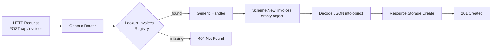
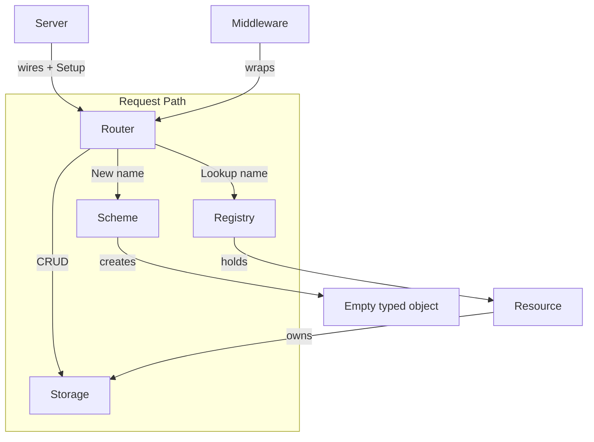
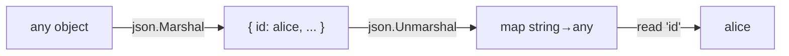
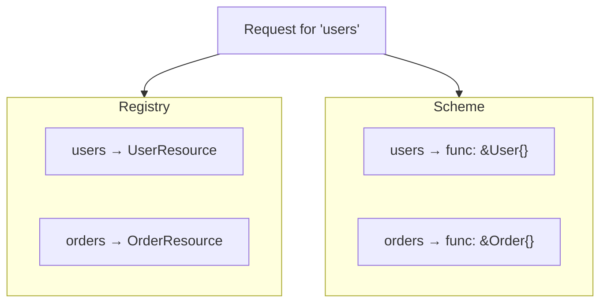
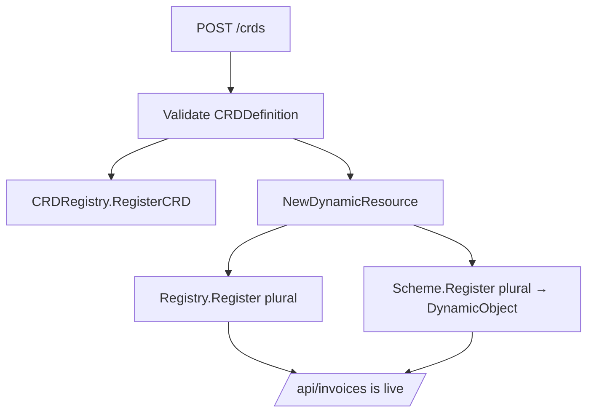
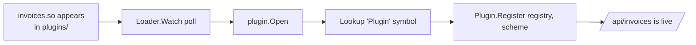
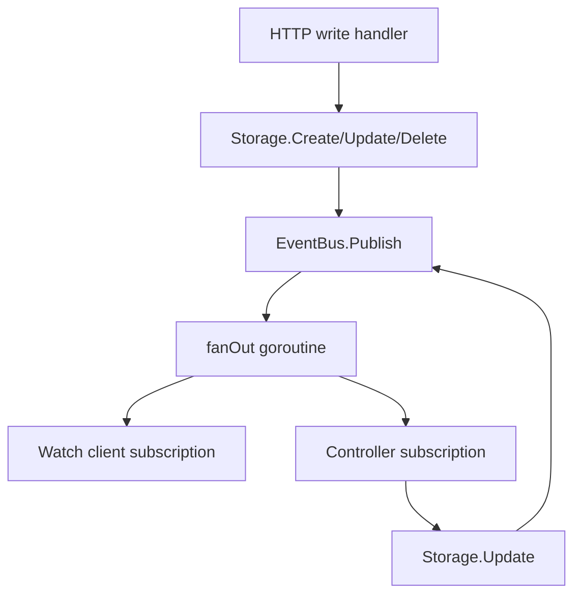
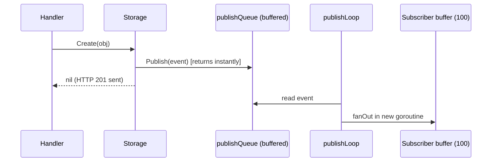
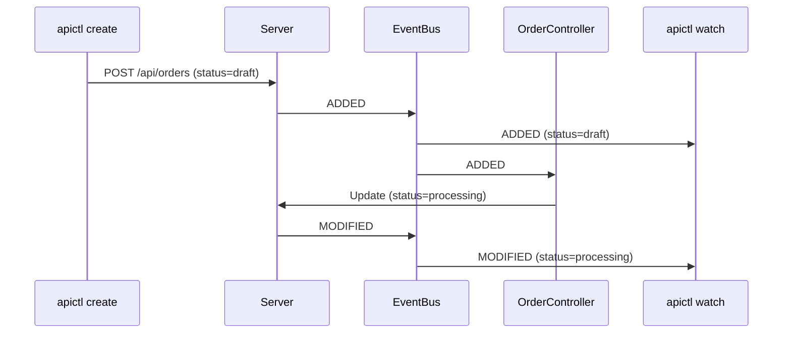

# Building a Dynamic API Server in Go

### Design and implement a runtime-extensible REST platform and its CLI, one working step at a time

---

## Preface

Most REST servers are frozen at compile time. You declare your routes, wire them to
handlers, build a binary, and ship it. Adding a new resource means editing code,
recompiling, and restarting. That is fine for many systems — but it is not how
platforms like Kubernetes work. Kubernetes lets you invent brand-new resource types
at *runtime*, and the moment you register one, the whole API surface knows about it:
no restart, no recompile, no router rebuild.

This book teaches you how to build such a system in Go. You will build two programs:

- **`api-server`** — a dynamic REST server where resources can appear and disappear
  while it runs.
- **`apictl`** — a command-line client that *discovers* what the server can do,
  instead of hardcoding it.

The style of this book is deliberately hands-on and incremental. Every chapter adds 
one idea, shows you the complete code for it, and ends with a **Checkpoint**: 
a command you can run to prove the program works so far. If you type in the code as 
you read, you will always have a running program at the end of every chapter.

You do **not** need access to any repository to follow along. Every file you need is
printed in full inside these pages.

### Who should read this

You should be comfortable with Go basics: structs, interfaces, goroutines, channels,
and the standard `net/http` package. You do not need prior experience with
Kubernetes, plugins, or event-driven systems — we build all of that from scratch.

### What you will learn

- How to make an HTTP router *generic* so it never changes when resources change.
- How to use a **registry** and a **type scheme** to decouple handlers from concrete types.
- How to abstract persistence behind a **storage** interface.
- How to add **Custom Resource Definitions (CRDs)** so users define new types at runtime.
- How to load compiled **Go plugins** (`.so`) into a running server.
- How to stream changes with a **watch API** built on Server-Sent Events.
- How to run **controllers** that react to events and reconcile state.
- How to build a **discovery-driven CLI** that adapts automatically to new resources.

---

## Table of Contents

**Part I — Foundations**
- [Chapter 1: The Problem with Static Servers](#chapter-1-the-problem-with-static-servers)
- [Chapter 2: Project Setup](#chapter-2-project-setup)

**Part II — The Core Framework**
- [Chapter 3: Resources and Storage](#chapter-3-resources-and-storage)
- [Chapter 4: The Registry and the Scheme](#chapter-4-the-registry-and-the-scheme)
- [Chapter 5: The Generic Router](#chapter-5-the-generic-router)
- [Chapter 6: Middleware and the Server](#chapter-6-middleware-and-the-server)
- [Chapter 7: Built-In Resources and main()](#chapter-7-built-in-resources-and-main)

**Part III — The Client**
- [Chapter 8: The apictl Client Library](#chapter-8-the-apictl-client-library)
- [Chapter 9: apictl Commands](#chapter-9-apictl-commands)

**Part IV — Runtime Extensibility**
- [Chapter 10: Custom Resource Definitions](#chapter-10-custom-resource-definitions)
- [Chapter 11: API Discovery](#chapter-11-api-discovery)
- [Chapter 12: Go Plugins](#chapter-12-go-plugins)

**Part V — Event-Driven Architecture**
- [Chapter 13: Events and the Event Bus](#chapter-13-events-and-the-event-bus)
- [Chapter 14: The Watch API](#chapter-14-the-watch-api)
- [Chapter 15: Controllers](#chapter-15-controllers)

**Part VI — Finishing Touches**
- [Chapter 16: Testing the System](#chapter-16-testing-the-system)
- [Chapter 17: From Demo to Production](#chapter-17-from-demo-to-production)

**Appendices**
- [Appendix A: Complete File Map](#appendix-a-complete-file-map)
- [Appendix B: The Full Demo Script](#appendix-b-the-full-demo-script)

---

# Part I — Foundations

## Chapter 1: The Problem with Static Servers

### The usual way

Here is how nearly every REST tutorial wires up routes:

```go
// The traditional approach — NOT what we will build
mux.HandleFunc("GET /users", listUsers)
mux.HandleFunc("POST /users", createUser)
mux.HandleFunc("GET /users/{id}", getUser)
mux.HandleFunc("PUT /users/{id}", updateUser)
mux.HandleFunc("DELETE /users/{id}", deleteUser)
// ... repeat all five lines for products, orders, invoices, ...
```

Every resource needs five near-identical routes and five handlers that all do the
same thing except for the concrete type they unmarshal into. Worse, the set of
routes is fixed when `main()` runs. To add `invoices`, you must edit this file,
recompile, and restart.

### The idea we will build

What if the router only ever registered a handful of *generic* routes, and figured
out the target resource on each request?

```go
// The dynamic approach — what we WILL build
mux.HandleFunc("/api", discovery)  // list all resources
mux.HandleFunc("/", route)         // handle everything else generically
```

Every request then follows three steps:

1. Extract the resource name from the URL (`/api/users/alice` → `users`).
2. Look it up in a **registry** that can be modified while the server runs.
3. Dispatch to one generic handler that uses interfaces, never concrete types.

Because the registry can change at runtime, **new resources become available the
instant they are registered** — no router rebuild, no restart.

**Figure 1.1 — Request flow through the dynamic server**



Notice what the handler never says `if resource == "users"`.
It never imports `User` or `Invoice`. It works entirely through three interfaces we
will design in the coming chapters: `Resource`, `Storage`, and `Scheme`.

### The four pillars

The whole framework rests on four small abstractions:

| Pillar | Responsibility |
| --- | --- |
| `Resource` | Ties a name to an object factory and a storage backend |
| `Storage` | Persists objects, hiding *how* and *where* |
| `Registry` | Tracks which resources exist; consulted on every request |
| `Scheme` | Creates empty typed objects by name, so handlers stay generic |

Master these four and everything else — CRDs, plugins, watch, controllers — is a
natural extension. Let us set up the project.

### Checkpoint

You understand the goal: a server whose router never changes while its capabilities
grow at runtime. No code yet — that starts in Chapter 2.

---

## Chapter 2: Project Setup

### Goal

Create the module and directory layout we will fill in throughout the book.

### The layout

We will build this structure. Do not create the files' contents yet; just make the
folders and the module. Each file is filled in by a later chapter.

```
api-server/
├── go.mod
├── cmd/
│   ├── api-server/
│   │   └── main.go          # server entrypoint (Chapter 7, 12, 15)
│   └── apictl/
│       ├── main.go          # CLI entrypoint (Chapter 8)
│       ├── client.go        # HTTP client library (Chapter 8, 14)
│       └── commands.go      # CLI commands (Chapter 9)
├── pkg/
│   ├── api/
│   │   ├── resource.go      # Resource interface (Chapter 3)
│   │   ├── storage.go       # Storage interface + memory impl (Chapter 3, 13)
│   │   ├── registry.go      # Resource registry (Chapter 4)
│   │   ├── scheme.go        # Type factory (Chapter 4)
│   │   ├── types.go         # response envelopes (Chapter 5)
│   │   ├── router.go        # generic router (Chapter 5, 10, 11, 14)
│   │   ├── middleware.go    # HTTP middleware (Chapter 6)
│   │   ├── server.go        # server lifecycle (Chapter 6)
│   │   ├── crd.go           # CRD registry (Chapter 10)
│   │   ├── dynamic.go       # dynamic objects (Chapter 10)
│   │   ├── event.go         # event model (Chapter 13)
│   │   └── eventbus.go      # pub/sub event bus (Chapter 13)
│   ├── resources/
│   │   ├── users.go         # built-in resource (Chapter 7)
│   │   ├── products.go      # built-in resource (Chapter 7)
│   │   └── orders.go        # built-in resource (Chapter 7)
│   ├── plugins/
│   │   ├── interface.go     # Plugin interface (Chapter 12)
│   │   └── loader.go        # plugin loader (Chapter 12)
│   └── controllers/
│       ├── controller.go    # Controller interface (Chapter 15)
│       ├── manager.go       # controller manager (Chapter 15)
│       └── orders.go        # example controller (Chapter 15)
├── plugins/
│   ├── build.sh             # plugin build script (Chapter 12)
│   └── invoices/
│       └── main.go          # example plugin (Chapter 12)
└── examples/                # sample JSON/YAML payloads
```

### Create the module

Pick any module path you like; this book uses `github.com/pergus/api-server`. If you
choose a different path, substitute it everywhere you see that import prefix.

```bash
mkdir api-server && cd api-server
go mod init github.com/pergus/api-server
```

We need exactly one third-party dependency — a YAML parser for the CLI's `apply`
command. Add it now:

```bash
go get gopkg.in/yaml.v2@v2.4.0
```

Your `go.mod` should look like this:

**Listing 2.1 — `go.mod`**

```go
module github.com/pergus/api-server

go 1.21

require gopkg.in/yaml.v2 v2.4.0
```

> **Platform note:** Chapter 12 uses Go's `plugin` package, which builds shared
> objects (`.so`). That works on Linux and macOS but not Windows. Everything else in
> the book is cross-platform. If you are on Windows, you can skip Chapter 12 and the
> rest still works.

### Create the directories

```bash
mkdir -p cmd/api-server cmd/apictl \
         pkg/api pkg/resources pkg/plugins pkg/controllers \
         plugins/invoices examples
```

### Checkpoint

```bash
go build ./...
```

This succeeds (it compiles zero packages so far) and confirms your module is set up.
You now have a skeleton ready to fill in.

---

# Part II — The Core Framework

All core framework code lives in package `api` under `pkg/api/`. We build it bottom
up: first the contracts (`Resource`, `Storage`), then the runtime registries
(`Registry`, `Scheme`), then the router and server on top.

**Figure 2.1 — How the core pieces fit together**



## Chapter 3: Resources and Storage

### Goal

Define the two most fundamental contracts: what a *resource* is, and how it *persists*
its objects. Then provide a thread-safe in-memory storage implementation.

### The Resource interface

A `Resource` is the framework's abstraction for a type of object. It defines the 
resource name (used in the URL), provides a factory for creating empty instances, 
and specifies the storage backend. The framework doesn't know about concrete 
types such as `User` or `Order`; it only interacts with `Resource`.


**Listing 3.1 — `pkg/api/resource.go`**

```go
package api

// Resource defines the interface that all API resources must implement.
//
// This is the contract between the generic framework and concrete resources.
// The framework never knows about specific types like User or Product—it only
// knows about resources through this interface.
type Resource interface {
	// Name returns the singular path name of this resource: /api/{name}
	// Examples: "users", "products", "orders", "invoices"
	Name() string

	// NewObject returns a new, zero-value instance of this resource type.
	// Called by generic handlers to create empty objects for JSON unmarshalling.
	NewObject() any

	// Storage returns the persistence layer for this resource.
	// Each resource has its own storage instance.
	Storage() Storage
}
```

### The Storage interface

Persistence is abstracted behind a `Storage` interface, allowing the framework to 
remain completely independent of where data is stored. Whether objects are kept 
in memory, persisted in Postgres, written to S3, or managed by etcd makes no 
difference to the rest of the framework. As long as the storage backend 
implements the interface, it can be used interchangeably. 
The interface consists of five methods that together cover the complete 
CRUD lifecycle.


**Listing 3.2 — `pkg/api/storage.go` (interface + type)**

```go
package api

import (
	"encoding/json"
	"fmt"
	"sync"
)

// Storage defines the persistence interface for all resources.
//
// By depending on this interface rather than a concrete backend, the framework
// is agnostic to HOW data is stored: memory, SQL, NoSQL, cloud, etc.
type Storage interface {
	// List returns all stored objects.
	List() ([]any, error)
	// Get retrieves a single object by its ID.
	Get(id string) (any, error)
	// Create stores a new object. The object must have an "id" JSON field.
	Create(obj any) error
	// Update modifies an existing object.
	Update(id string, obj any) error
	// Delete removes an object by ID.
	Delete(id string) error
}

// MemoryStorage is a simple, thread-safe in-memory storage implementation.
//
// All objects are stored in a map protected by a sync.RWMutex.
// For production, you would replace this with a real database.
type MemoryStorage struct {
	mu       sync.RWMutex
	items    map[string]any
}

// NewMemoryStorage creates a new in-memory storage instance.
func NewMemoryStorage() Storage {
	return &MemoryStorage{
		items:    make(map[string]any),
	}
}
```

Now let's look at the five methods that make up the storage interface. Each
method that modifies data—creating, updating, or deleting an object—publishes an
event after the operation has completed successfully. Event publication is
optional, however. If an event bus has been attached to the storage backend, the
corresponding event is emitted; otherwise nothing happens. Early in the book no
event bus has been configured, so these event-publishing blocks are effectively
inactive. They are included from the beginning to show where notifications
naturally belong without complicating the initial implementation. 

**Listing 3.3 — `pkg/api/storage.go` (methods)**

```go
// List returns a copy of all stored items.
func (s *MemoryStorage) List() ([]any, error) {
	s.mu.RLock()
	defer s.mu.RUnlock()

	items := make([]any, 0, len(s.items))
	for _, item := range s.items {
		items = append(items, item)
	}
	return items, nil
}

// Get retrieves an item by ID.
func (s *MemoryStorage) Get(id string) (any, error) {
	s.mu.RLock()
	defer s.mu.RUnlock()

	item, exists := s.items[id]
	if !exists {
		return nil, fmt.Errorf("not found: %s", id)
	}
	return item, nil
}

// Create stores a new item and publishes an ADDED event.
func (s *MemoryStorage) Create(obj any) error {
	s.mu.Lock()
	defer s.mu.Unlock()

	id, err := extractID(obj)
	if err != nil {
		return err
	}
	if _, exists := s.items[id]; exists {
		return fmt.Errorf("already exists: %s", id)
	}
	s.items[id] = obj

	return nil
}

// Update modifies an existing item and publishes a MODIFIED event.
func (s *MemoryStorage) Update(id string, obj any) error {
	s.mu.Lock()
	defer s.mu.Unlock()

	if _, exists := s.items[id]; !exists {
		return fmt.Errorf("not found: %s", id)
	}
	s.items[id] = obj

	return nil
}

// Delete removes an item by ID and publishes a DELETED event with the last state.
func (s *MemoryStorage) Delete(id string) error {
	s.mu.Lock()
	defer s.mu.Unlock()

	_, exists := s.items[id]
	if !exists {
		return fmt.Errorf("not found: %s", id)
	}
	delete(s.items, id)

	return nil
}

// extractID pulls the "id" field from any object by round-tripping through JSON.
// This works for any type that has an "id" JSON tag.
func extractID(obj any) (string, error) {
	data, err := json.Marshal(obj)
	if err != nil {
		return "", fmt.Errorf("marshal error: %w", err)
	}
	var m map[string]interface{}
	if err := json.Unmarshal(data, &m); err != nil {
		return "", fmt.Errorf("unmarshal error: %w", err)
	}
	idVal, exists := m["id"]
	if !exists {
		return "", fmt.Errorf("object missing 'id' field")
	}
	id := fmt.Sprintf("%v", idVal)
	if id == "" || id == "<nil>" {
		return "", fmt.Errorf("id field is empty or nil")
	}
	return id, nil
}
```

The `extractID` helper is worth a closer look. Because the storage layer
operates on values of type `any`, it has no knowledge of the concrete object
type and therefore cannot simply access an `ID` field or method. Instead, it
marshals the object to JSON, unmarshals it into a generic map, and retrieves the
value associated with the `id` key.

Although this approach is not the most efficient, it keeps the storage layer
completely type-agnostic. The same implementation can store `User` objects,
`Order` objects, or entirely new resource types that have not even been defined
when the framework itself is written. This flexibility is one of the key design
goals of the framework: the storage layer works with the serialized
representation of an object rather than its concrete Go type. 

**Figure 3.1 — Type-agnostic ID extraction**



### Checkpoint

You cannot run a server yet, but you can compile the two files and even exercise
storage from a tiny test:

```go
// pkg/api/storage_smoke_test.go
package api

import "testing"

func TestMemorySmoke(t *testing.T) {
	s := NewMemoryStorage()
	if err := s.Create(map[string]any{"id": "a", "v": 1}); err != nil {
		t.Fatal(err)
	}
	got, err := s.Get("a")
	if err != nil {
		t.Fatal(err)
	}
	if got.(map[string]any)["v"] != 1 {
		t.Fatalf("unexpected: %v", got)
	}
}
```

```bash
go test ./pkg/api -run Smoke -v
```

Green means your storage foundation works.

---

## Chapter 4: The Registry and the Scheme

### Goal

Build the two runtime tables that make the router generic: the **Registry** (which
resources exist) and the **Scheme** (how to build an empty object for a resource by
name). Both are consulted on every request, so both use `sync.RWMutex` for cheap
concurrent reads.

### The Registry

The registry is the beating heart of runtime extensibility. It maps names to
`Resource` values and can be modified while requests are flowing.

**Listing 4.1 — `pkg/api/registry.go`**

```go
package api

import (
	"fmt"
	"sort"
	"sync"
)

// Registry manages all known API resources.
//
// It is consulted on every request to determine if a resource exists, supports
// registration/unregistration at runtime, and is thread-safe. Registering a CRD
// or loading a plugin simply adds an entry here; the next request to /api sees it.
type Registry interface {
	Register(resource Resource) error
	Unregister(name string) error
	Lookup(name string) (Resource, bool)
	List() []Resource
	Names() []string
	Count() int
}

// SimpleRegistry implements Registry with a map guarded by an RWMutex.
// Many readers (HTTP requests) can Lookup concurrently; writes are rare.
type SimpleRegistry struct {
	mu        sync.RWMutex
	resources map[string]Resource
}

// NewRegistry creates a new resource registry.
func NewRegistry() Registry {
	return &SimpleRegistry{resources: make(map[string]Resource)}
}

func (r *SimpleRegistry) Register(resource Resource) error {
	r.mu.Lock()
	defer r.mu.Unlock()

	name := resource.Name()
	if _, exists := r.resources[name]; exists {
		return fmt.Errorf("resource %q already registered", name)
	}
	r.resources[name] = resource
	return nil
}

func (r *SimpleRegistry) Unregister(name string) error {
	r.mu.Lock()
	defer r.mu.Unlock()

	if _, exists := r.resources[name]; !exists {
		return fmt.Errorf("resource %q not found", name)
	}
	delete(r.resources, name)
	return nil
}

// Lookup runs on EVERY request, so it uses a read lock for speed.
func (r *SimpleRegistry) Lookup(name string) (Resource, bool) {
	r.mu.RLock()
	defer r.mu.RUnlock()

	resource, exists := r.resources[name]
	return resource, exists
}

func (r *SimpleRegistry) List() []Resource {
	r.mu.RLock()
	defer r.mu.RUnlock()

	resources := make([]Resource, 0, len(r.resources))
	for _, resource := range r.resources {
		resources = append(resources, resource)
	}
	sort.Slice(resources, func(i, j int) bool {
		return resources[i].Name() < resources[j].Name()
	})
	return resources
}

func (r *SimpleRegistry) Names() []string {
	r.mu.RLock()
	defer r.mu.RUnlock()

	names := make([]string, 0, len(r.resources))
	for name := range r.resources {
		names = append(names, name)
	}
	sort.Strings(names)
	return names
}

func (r *SimpleRegistry) Count() int {
	r.mu.RLock()
	defer r.mu.RUnlock()
	return len(r.resources)
}
```

### The Scheme

Generic handlers face a problem: to decode incoming JSON they need a concrete
destination object, but they must not import `User` or `Order`. The **Scheme** solves
this by mapping a name to a factory function that returns a fresh, empty object.

**Listing 4.2 — `pkg/api/scheme.go`**

```go
package api

import (
	"fmt"
	"sync"
)

// ObjectFactory creates a new, empty instance of an object type.
type ObjectFactory func() any

// Scheme maps type names to constructor functions so generic handlers can create
// objects without importing concrete types. When a request arrives for /api/users,
// the handler calls scheme.New("users") and gets back &User{} — without knowing it.
type Scheme interface {
	Register(name string, factory ObjectFactory) error
	Unregister(name string) error
	New(name string) (any, error)
	Has(name string) bool
}

// SimpleScheme implements Scheme with a map guarded by an RWMutex.
type SimpleScheme struct {
	mu        sync.RWMutex
	factories map[string]ObjectFactory
}

// NewScheme creates a new Scheme.
func NewScheme() Scheme {
	return &SimpleScheme{factories: make(map[string]ObjectFactory)}
}

func (s *SimpleScheme) Register(name string, factory ObjectFactory) error {
	s.mu.Lock()
	defer s.mu.Unlock()

	if _, exists := s.factories[name]; exists {
		return fmt.Errorf("type %q already registered", name)
	}
	s.factories[name] = factory
	return nil
}

func (s *SimpleScheme) Unregister(name string) error {
	s.mu.Lock()
	defer s.mu.Unlock()

	if _, exists := s.factories[name]; !exists {
		return fmt.Errorf("type %q not registered", name)
	}
	delete(s.factories, name)
	return nil
}

// New runs on every create/update request, so it uses a read lock.
func (s *SimpleScheme) New(name string) (any, error) {
	s.mu.RLock()
	defer s.mu.RUnlock()

	factory, exists := s.factories[name]
	if !exists {
		return nil, fmt.Errorf("unknown type: %q", name)
	}
	return factory(), nil
}

func (s *SimpleScheme) Has(name string) bool {
	s.mu.RLock()
	defer s.mu.RUnlock()
	_, exists := s.factories[name]
	return exists
}
```

**Figure 4.1 — Registry and Scheme, side by side**



The registry answers "does `users` exist and where is its storage?" The scheme
answers "give me an empty `users` object to decode into." Together they let one
handler serve every resource.

### Checkpoint

```bash
go test ./pkg/api -run 'Registry|Scheme' -v
go build ./...
```

Write a quick test if you like: register a resource, look it up, register a factory,
call `New`. Both tables should behave. The dynamic core is now in place.

---

## Chapter 5: The Generic Router

### Goal

Write the single most important file in the project: the router that turns every HTTP
request into a registry lookup plus one generic handler. We also define the JSON
response envelopes it returns.

### Response envelopes

Keeping response shapes consistent makes the CLI simpler later.

**Listing 5.1 — `pkg/api/types.go`**

```go
package api

import "time"

// ListResponse wraps a list of objects.
type ListResponse struct {
	Items []any `json:"items"`
	Count int   `json:"count"`
}

// ErrorResponse represents an API error.
type ErrorResponse struct {
	Error  string `json:"error"`
	Status int    `json:"status"`
}

// CreatedResponse confirms object creation.
type CreatedResponse struct {
	Message string `json:"message"`
	ID      string `json:"id"`
}

// UpdatedResponse confirms object update.
type UpdatedResponse struct {
	Message string `json:"message"`
}

// DeletedResponse confirms object deletion.
type DeletedResponse struct {
	Message string `json:"message"`
}

// DiscoveryResponse lists available resources.
type DiscoveryResponse struct {
	Resources []string `json:"resources"`
	Time      string   `json:"timestamp"`
}
```

### The router skeleton

The router holds references to the registry, scheme, and (later) the CRD registry and
event bus. It owns a standard `http.ServeMux` but registers only generic routes on it.

**Listing 5.2 — `pkg/api/router.go` (type, constructor, Setup, ServeHTTP)**

```go
package api

import (
	"encoding/json"
	"fmt"
	"io"
	"log"
	"net/http"
	"strings"
	"time"
)

// Router is the HTTP request dispatcher and the key to dynamic extensibility.
//
// Unlike servers that register per-resource routes at startup, this router
// registers only generic routes and determines the resource at request time.
type Router struct {
	registry    Registry
	scheme      Scheme
	crdRegistry CRDRegistry // added in Chapter 10
	eventBus    EventBus    // added in Chapter 13
	mux         *http.ServeMux
}

// NewRouter creates a new router. (crdRegistry and eventBus may be nil until
// Chapters 10 and 13; the CRUD paths below do not use them.)
func NewRouter(registry Registry, scheme Scheme, crdRegistry CRDRegistry, eventBus EventBus) *Router {
	return &Router{
		registry:    registry,
		scheme:      scheme,
		crdRegistry: crdRegistry,
		eventBus:    eventBus,
		mux:         http.NewServeMux(),
	}
}

// Setup registers the generic routes ONCE. They never change, even as resources
// are added or removed at runtime.
func (r *Router) Setup() {
	r.mux.HandleFunc("/api", r.discovery)         // list resources
	r.mux.HandleFunc("/apis", r.discoverAPIs)     // API groups (Chapter 11)
	r.mux.HandleFunc("/apis/", r.discoverAPIPath) // group/version (Chapter 11)
	r.mux.HandleFunc("/plugins", r.listPlugins)   // plugin info (Chapter 12)
	r.mux.HandleFunc("/", r.route)                // everything else
}

// ServeHTTP makes Router satisfy http.Handler.
func (r *Router) ServeHTTP(w http.ResponseWriter, req *http.Request) {
	r.mux.ServeHTTP(w, req)
}
```

> If you are building strictly chapter by chapter, temporarily remove the
> `/apis`, `/apis/`, and `/plugins` lines from `Setup` (and the `crdRegistry`/
> `eventBus` fields) until you reach the chapters that add them. The full listing is
> shown here so the file matches its final form.

### Discovery and routing

`discovery` answers `GET /api` with the current resource names. Because it reads the
registry live, it reflects runtime changes automatically.

**Listing 5.3 — `pkg/api/router.go` (discovery + route)**

```go
// discovery handles GET /api and lists all registered resources.
func (r *Router) discovery(w http.ResponseWriter, req *http.Request) {
	if req.Method != http.MethodGet {
		http.Error(w, "method not allowed", http.StatusMethodNotAllowed)
		return
	}
	response := DiscoveryResponse{
		Resources: r.registry.Names(),
		Time:      time.Now().UTC().Format(time.RFC3339),
	}
	w.Header().Set("Content-Type", "application/json")
	json.NewEncoder(w).Encode(response)
}

// route is the single dispatcher for all resource (and CRD) requests.
func (r *Router) route(w http.ResponseWriter, req *http.Request) {
	path := req.URL.Path

	// /crds endpoints are handled separately (Chapter 10).
	if strings.HasPrefix(path, "/crds") {
		r.routeCRD(w, req)
		return
	}

	if !strings.HasPrefix(path, "/api/") {
		http.Error(w, "not found", http.StatusNotFound)
		return
	}

	// Split the path after /api/ : "users/alice" -> ["users", "alice"].
	parts := strings.Split(strings.TrimPrefix(path, "/api/"), "/")
	if len(parts) < 1 || parts[0] == "" {
		http.Error(w, "not found", http.StatusNotFound)
		return
	}
	resourceName := parts[0]

	// The heart of the design: a live registry lookup on every request.
	resource, ok := r.registry.Lookup(resourceName)
	if !ok {
		http.Error(w, fmt.Sprintf("resource %q not found", resourceName), http.StatusNotFound)
		return
	}

	if len(parts) == 1 {
		r.routeListOrCreate(w, req, resource) // /api/{resource}
	} else if len(parts) == 2 && parts[1] != "" {
		r.routeItemOp(w, req, resource, parts[1]) // /api/{resource}/{id}
	} else {
		http.Error(w, "not found", http.StatusNotFound)
	}
}

func (r *Router) routeListOrCreate(w http.ResponseWriter, req *http.Request, resource Resource) {
	switch req.Method {
	case http.MethodGet:
		r.list(w, req, resource)
	case http.MethodPost:
		r.create(w, req, resource)
	default:
		http.Error(w, "method not allowed", http.StatusMethodNotAllowed)
	}
}

func (r *Router) routeItemOp(w http.ResponseWriter, req *http.Request, resource Resource, id string) {
	switch req.Method {
	case http.MethodGet:
		r.get(w, req, resource, id)
	case http.MethodPut:
		r.update(w, req, resource, id)
	case http.MethodDelete:
		r.delete(w, req, resource, id)
	default:
		http.Error(w, "method not allowed", http.StatusMethodNotAllowed)
	}
}
```

### The five generic handlers

Here is the payoff. These five handlers serve *every* resource. None of them mentions
a concrete type; they use `resource.Storage()` and `r.scheme.New(...)`.

**Listing 5.4 — `pkg/api/router.go` (CRUD handlers)**

```go
// list handles GET /api/{resource}. The ?watch=true branch is added in Chapter 14.
func (r *Router) list(w http.ResponseWriter, req *http.Request, resource Resource) {
	if req.URL.Query().Get("watch") == "true" {
		r.watch(w, req, resource) // Chapter 14
		return
	}
	objects, err := resource.Storage().List()
	if err != nil {
		http.Error(w, err.Error(), http.StatusInternalServerError)
		return
	}
	w.Header().Set("Content-Type", "application/json")
	json.NewEncoder(w).Encode(ListResponse{Items: objects, Count: len(objects)})
}

// get handles GET /api/{resource}/{id}.
func (r *Router) get(w http.ResponseWriter, _ *http.Request, resource Resource, id string) {
	object, err := resource.Storage().Get(id)
	if err != nil {
		http.Error(w, err.Error(), http.StatusNotFound)
		return
	}
	w.Header().Set("Content-Type", "application/json")
	json.NewEncoder(w).Encode(object)
}

// create handles POST /api/{resource}. The scheme creates an empty object so this
// handler never needs to know the concrete type.
func (r *Router) create(w http.ResponseWriter, req *http.Request, resource Resource) {
	body := io.LimitReader(req.Body, 1024*1024)
	defer req.Body.Close()

	obj, err := r.scheme.New(resource.Name())
	if err != nil {
		http.Error(w, err.Error(), http.StatusInternalServerError)
		return
	}
	if err := json.NewDecoder(body).Decode(obj); err != nil {
		http.Error(w, fmt.Sprintf("invalid JSON: %v", err), http.StatusBadRequest)
		return
	}
	if err := resource.Storage().Create(obj); err != nil {
		http.Error(w, err.Error(), http.StatusBadRequest)
		return
	}
	w.Header().Set("Content-Type", "application/json")
	w.WriteHeader(http.StatusCreated)
	json.NewEncoder(w).Encode(CreatedResponse{
		Message: fmt.Sprintf("%s created", resource.Name()),
		ID:      extractIDFromObject(obj),
	})
}

// update handles PUT /api/{resource}/{id}.
func (r *Router) update(w http.ResponseWriter, req *http.Request, resource Resource, id string) {
	body := io.LimitReader(req.Body, 1024*1024)
	defer req.Body.Close()

	obj, err := r.scheme.New(resource.Name())
	if err != nil {
		http.Error(w, err.Error(), http.StatusInternalServerError)
		return
	}
	if err := json.NewDecoder(body).Decode(obj); err != nil {
		http.Error(w, fmt.Sprintf("invalid JSON: %v", err), http.StatusBadRequest)
		return
	}
	if err := resource.Storage().Update(id, obj); err != nil {
		http.Error(w, err.Error(), http.StatusNotFound)
		return
	}
	w.Header().Set("Content-Type", "application/json")
	json.NewEncoder(w).Encode(UpdatedResponse{Message: fmt.Sprintf("%s updated", resource.Name())})
}

// delete handles DELETE /api/{resource}/{id}.
func (r *Router) delete(w http.ResponseWriter, _ *http.Request, resource Resource, id string) {
	if err := resource.Storage().Delete(id); err != nil {
		http.Error(w, err.Error(), http.StatusNotFound)
		return
	}
	w.Header().Set("Content-Type", "application/json")
	json.NewEncoder(w).Encode(DeletedResponse{Message: fmt.Sprintf("%s deleted", resource.Name())})
}

// extractIDFromObject reads the "id" field from any object via JSON.
func extractIDFromObject(obj any) string {
	data, err := json.Marshal(obj)
	if err != nil {
		log.Printf("error marshalling object: %v", err)
		return ""
	}
	var m map[string]interface{}
	if err := json.Unmarshal(data, &m); err != nil {
		log.Printf("error unmarshalling object: %v", err)
		return ""
	}
	if id, ok := m["id"]; ok {
		return fmt.Sprintf("%v", id)
	}
	return ""
}
```

We will add the `watch`, `routeCRD`, `discoverAPIs`, `discoverAPIPath`, and
`listPlugins` methods in later chapters. For a chapter-5-only build, stub them out or
omit their route registrations.

### Checkpoint

You still need the server shell (next chapter) to listen, but the routing logic is
complete. If you write a `httptest`-based test, a `GET /api` returns your registered
names and `POST /api/{resource}` stores an object — all through generic handlers.

---

## Chapter 6: Middleware and the Server

### Goal

Wrap the router in cross-cutting middleware and give it a real lifecycle: start,
serve with timeouts, and shut down gracefully.

### Middleware

Middleware are functions that wrap an `http.Handler`. We add logging, panic recovery,
request timing, and CORS. A small `responseWriter` wrapper captures the status code
for logging and, importantly, forwards `Flush()` so Server-Sent Events work later.

**Listing 6.1 — `pkg/api/middleware.go`**

```go
package api

import (
	"log"
	"net/http"
	"time"
)

// Middleware wraps an HTTP handler.
type Middleware func(http.Handler) http.Handler

// LoggingMiddleware logs each request and its outcome.
func LoggingMiddleware(next http.Handler) http.Handler {
	return http.HandlerFunc(func(w http.ResponseWriter, r *http.Request) {
		start := time.Now()
		wrapped := &responseWriter{ResponseWriter: w, statusCode: http.StatusOK}
		log.Printf("[%s] %s %s", r.Method, r.URL.Path, r.RemoteAddr)
		next.ServeHTTP(wrapped, r)
		log.Printf("[%s] %s completed: %d in %v", r.Method, r.URL.Path, wrapped.statusCode, time.Since(start))
	})
}

// RecoveryMiddleware converts panics into 500 responses.
func RecoveryMiddleware(next http.Handler) http.Handler {
	return http.HandlerFunc(func(w http.ResponseWriter, r *http.Request) {
		defer func() {
			if err := recover(); err != nil {
				log.Printf("PANIC: %v", err)
				http.Error(w, "Internal server error", http.StatusInternalServerError)
			}
		}()
		next.ServeHTTP(w, r)
	})
}

// TimingMiddleware logs request duration.
func TimingMiddleware(next http.Handler) http.Handler {
	return http.HandlerFunc(func(w http.ResponseWriter, r *http.Request) {
		start := time.Now()
		next.ServeHTTP(w, r)
		log.Printf("Timing: %v for %s %s", time.Since(start), r.Method, r.URL.Path)
	})
}

// CORSMiddleware adds permissive CORS headers.
func CORSMiddleware(next http.Handler) http.Handler {
	return http.HandlerFunc(func(w http.ResponseWriter, r *http.Request) {
		w.Header().Set("Access-Control-Allow-Origin", "*")
		w.Header().Set("Access-Control-Allow-Methods", "GET, POST, PUT, DELETE, OPTIONS")
		w.Header().Set("Access-Control-Allow-Headers", "Content-Type, Authorization")
		if r.Method == http.MethodOptions {
			w.WriteHeader(http.StatusOK)
			return
		}
		next.ServeHTTP(w, r)
	})
}

// Chain applies middleware right-to-left so they execute in listed order.
func Chain(h http.Handler, middleware ...Middleware) http.Handler {
	for i := len(middleware) - 1; i >= 0; i-- {
		h = middleware[i](h)
	}
	return h
}

// responseWriter captures the status code and forwards Flush for SSE.
type responseWriter struct {
	http.ResponseWriter
	statusCode int
}

func (rw *responseWriter) WriteHeader(code int) {
	rw.statusCode = code
	rw.ResponseWriter.WriteHeader(code)
}

func (rw *responseWriter) Write(b []byte) (int, error) { return rw.ResponseWriter.Write(b) }

func (rw *responseWriter) Flush() {
	if flusher, ok := rw.ResponseWriter.(http.Flusher); ok {
		flusher.Flush()
	}
}
```

### The Server

`Server` owns every collaborator and exposes accessors so `main()`, plugins, and
controllers can register things. `RegisterResource` also attaches the event bus to a
resource's storage — harmless now, essential in Chapter 13.

**Listing 6.2 — `pkg/api/server.go`**

```go
package api

import (
	"context"
	"fmt"
	"log"
	"net/http"
	"time"
)

// Server is the HTTP API server and owns all collaborators.
type Server struct {
	registry    Registry
	scheme      Scheme
	router      *Router
	httpServer  *http.Server
	port        int
	crdRegistry CRDRegistry // Chapter 10
	eventBus    EventBus    // Chapter 13
}

// Config holds server configuration.
type Config struct {
	Port int
}

// NewServer wires up registry, scheme, CRD registry, event bus, and router.
func NewServer(cfg Config) *Server {
	registry := NewRegistry()
	scheme := NewScheme()
	crdRegistry := NewCRDRegistry() // Chapter 10
	eventBus := NewEventBus()       // Chapter 13
	router := NewRouter(registry, scheme, crdRegistry, eventBus)

	return &Server{
		registry:    registry,
		scheme:      scheme,
		router:      router,
		crdRegistry: crdRegistry,
		eventBus:    eventBus,
		port:        cfg.Port,
	}
}

func (s *Server) Registry() Registry       { return s.registry }
func (s *Server) Scheme() Scheme           { return s.scheme }
func (s *Server) CRDRegistry() CRDRegistry { return s.crdRegistry }
func (s *Server) EventBus() EventBus        { return s.eventBus }

// Start sets up routes once, wraps the router in middleware, and listens.
func (s *Server) Start() error {
	log.Printf("Setting up routes (generic, never change)")
	s.router.Setup()

	log.Printf("Registered resources: %d", s.registry.Count())
	for _, name := range s.registry.Names() {
		log.Printf("  - %s", name)
	}

	handler := Chain(
		s.router,
		RecoveryMiddleware,
		CORSMiddleware,
		LoggingMiddleware,
		TimingMiddleware,
	)

	s.httpServer = &http.Server{
		Addr:           fmt.Sprintf(":%d", s.port),
		Handler:        handler,
		ReadTimeout:    5 * time.Minute,
		WriteTimeout:   5 * time.Minute,
		IdleTimeout:    1 * time.Minute,
		MaxHeaderBytes: 1 << 20,
	}

	log.Printf("Starting server on http://localhost:%d", s.port)
	log.Printf("Discovery: GET http://localhost:%d/api", s.port)

	if err := s.httpServer.ListenAndServe(); err != nil && err != http.ErrServerClosed {
		return err
	}
	return nil
}

// Stop gracefully shuts down the server.
func (s *Server) Stop(ctx context.Context) error {
	if s.httpServer == nil {
		return nil
	}
	log.Println("Shutting down server...")
	return s.httpServer.Shutdown(ctx)
}

// RegisterResource registers a resource at runtime and attaches the event bus
// to its storage (if it is MemoryStorage) so changes publish events.
func (s *Server) RegisterResource(resource Resource) error {
	if ms, ok := resource.Storage().(*MemoryStorage); ok {
		ms.SetEventBus(s.eventBus, resource.Name())
	}
	err := s.registry.Register(resource)
	if err == nil {
		log.Printf("Registered resource: %s", resource.Name())
	}
	return err
}

// RegisterType registers a type factory at runtime.
func (s *Server) RegisterType(name string, factory ObjectFactory) error {
	return s.scheme.Register(name, factory)
}

// UnregisterResource removes a resource at runtime (used when plugins unload).
func (s *Server) UnregisterResource(name string) error {
	err := s.registry.Unregister(name)
	if err == nil {
		log.Printf("Unregistered resource: %s", name)
	}
	return err
}
```

> The write timeout is five minutes on purpose: watch streams (Chapter 14) are
> long-lived. A tight write timeout would kill them.

### Checkpoint

The server compiles once `NewCRDRegistry` and `NewEventBus` exist. If you are building
strictly in order, provide temporary stubs:

```go
// temporary stubs — replaced in Chapters 10 and 13
type CRDRegistry interface{}
func NewCRDRegistry() CRDRegistry { return nil }
type EventBus interface{ Publish(Event) }
func NewEventBus() EventBus { return nil }
```

Then:

```bash
go build ./...
```

We give the server real resources and an entrypoint next.

---

## Chapter 7: Built-In Resources and main()

### Goal

Ship three concrete resources — users, products, orders — and write the server
entrypoint that registers them and starts listening.

### Three resource types

Each resource is a struct plus a tiny wrapper implementing `Resource`. They are almost
identical, which is exactly the point: the boilerplate is trivial and the framework
does the heavy lifting.

**Listing 7.1 — `pkg/resources/users.go`**

```go
package resources

import "github.com/pergus/api-server/pkg/api"

// User is a sample resource type.
type User struct {
	ID       string `json:"id"`
	Name     string `json:"name"`
	Email    string `json:"email"`
	IsActive bool   `json:"is_active"`
}

// UserResource implements api.Resource.
type UserResource struct {
	storage api.Storage
}

func NewUserResource() *UserResource {
	return &UserResource{storage: api.NewMemoryStorage()}
}

func (r *UserResource) Name() string        { return "users" }
func (r *UserResource) NewObject() any       { return &User{} }
func (r *UserResource) Storage() api.Storage { return r.storage }
```

**Listing 7.2 — `pkg/resources/products.go`**

```go
package resources

import "github.com/pergus/api-server/pkg/api"

// Product is a sample resource type.
type Product struct {
	ID          string  `json:"id"`
	Name        string  `json:"name"`
	Description string  `json:"description"`
	Price       float64 `json:"price"`
	StockCount  int     `json:"stock_count"`
}

type ProductResource struct {
	storage api.Storage
}

func NewProductResource() *ProductResource {
	return &ProductResource{storage: api.NewMemoryStorage()}
}

func (r *ProductResource) Name() string        { return "products" }
func (r *ProductResource) NewObject() any       { return &Product{} }
func (r *ProductResource) Storage() api.Storage { return r.storage }
```

**Listing 7.3 — `pkg/resources/orders.go`**

```go
package resources

import "github.com/pergus/api-server/pkg/api"

// Order is a sample resource type.
type Order struct {
	ID         string   `json:"id"`
	UserID     string   `json:"user_id"`
	ProductIDs []string `json:"product_ids"`
	Status     string   `json:"status"`
	Total      float64  `json:"total"`
}

type OrderResource struct {
	storage api.Storage
}

func NewOrderResource() *OrderResource {
	return &OrderResource{storage: api.NewMemoryStorage()}
}

func (r *OrderResource) Name() string        { return "orders" }
func (r *OrderResource) NewObject() any       { return &Order{} }
func (r *OrderResource) Storage() api.Storage { return r.storage }
```

### The server entrypoint

`main()` creates the server, registers each resource together with its type factory,
and starts listening with graceful shutdown. (We register CRD schemas for the
built-ins too, so they show up in discovery in Chapter 11; if you have not built the
CRD registry yet, omit those blocks.)

**Listing 7.4 — `cmd/api-server/main.go` (Chapter-7 version)**

```go
package main

import (
	"context"
	"log"
	"os"
	"os/signal"
	"syscall"
	"time"

	"github.com/pergus/api-server/pkg/api"
	"github.com/pergus/api-server/pkg/resources"
)

func main() {
	server := api.NewServer(api.Config{Port: 8080})

	log.Println("Registering built-in resources...")

	// Users
	if err := server.RegisterResource(resources.NewUserResource()); err != nil {
		log.Fatalf("Failed to register users: %v", err)
	}
	if err := server.RegisterType("users", func() any { return &resources.User{} }); err != nil {
		log.Fatalf("Failed to register users type: %v", err)
	}

	// Products
	if err := server.RegisterResource(resources.NewProductResource()); err != nil {
		log.Fatalf("Failed to register products: %v", err)
	}
	if err := server.RegisterType("products", func() any { return &resources.Product{} }); err != nil {
		log.Fatalf("Failed to register products type: %v", err)
	}

	// Orders
	if err := server.RegisterResource(resources.NewOrderResource()); err != nil {
		log.Fatalf("Failed to register orders: %v", err)
	}
	if err := server.RegisterType("orders", func() any { return &resources.Order{} }); err != nil {
		log.Fatalf("Failed to register orders type: %v", err)
	}

	// Start the server in a goroutine so we can wait for a shutdown signal.
	go func() {
		if err := server.Start(); err != nil {
			log.Printf("Server error: %v", err)
		}
	}()

	sigChan := make(chan os.Signal, 1)
	signal.Notify(sigChan, syscall.SIGINT, syscall.SIGTERM)
	<-sigChan

	log.Println("Shutdown signal received")
	ctx, cancel := context.WithTimeout(context.Background(), 5*time.Second)
	defer cancel()
	if err := server.Stop(ctx); err != nil {
		log.Printf("Shutdown error: %v", err)
	}
	log.Println("Server stopped")
}
```

We will add plugin loading (Chapter 12) and controller startup (Chapter 15) to this
same file later.

### Checkpoint

Your first fully working server.

```bash
go build -o api-server ./cmd/api-server
./api-server
```

In another terminal:

```bash
curl -s http://localhost:8080/api
# {"resources":["orders","products","users"],"timestamp":"..."}

curl -s -X POST http://localhost:8080/api/users \
  -H 'Content-Type: application/json' \
  -d '{"id":"alice","name":"Alice Johnson","email":"alice@example.com","is_active":true}'
# {"message":"users created","id":"alice"}

curl -s http://localhost:8080/api/users/alice
# {"id":"alice","name":"Alice Johnson","email":"alice@example.com","is_active":true}
```

Three resources, full CRUD, all through generic handlers. The core is done.

---

# Part III — The Client

A server is only half the story. Kubernetes' `kubectl` never hardcodes the list of
resource types — it asks the API server what exists. We build `apictl` the same way.

## Chapter 8: The apictl Client Library

### Goal

Create a reusable `Client` type that talks to the server over HTTP, including
discovery and CRUD, with clean error handling. Then write the CLI entrypoint that
dispatches subcommands.

### The client

The client wraps `http.Client` and offers typed helpers. Every call goes through one
`request` method that turns HTTP error statuses into Go errors.

**Listing 8.1 — `cmd/apictl/client.go` (core)**

```go
package main

import (
	"bytes"
	"encoding/json"
	"fmt"
	"io"
	"net/http"
)

// Client communicates with the dynamic API server.
type Client struct {
	baseURL string
	http    *http.Client
}

// NewClient creates a new client.
func NewClient(baseURL string) *Client {
	return &Client{baseURL: baseURL, http: &http.Client{}}
}

// GetAPIResources retrieves all available resource names via GET /api.
func (c *Client) GetAPIResources() ([]string, error) {
	resp, err := c.get("/api")
	if err != nil {
		return nil, err
	}
	var result map[string]interface{}
	if err := json.Unmarshal(resp, &result); err != nil {
		return nil, err
	}
	resources, ok := result["resources"].([]interface{})
	if !ok {
		return []string{}, nil
	}
	res := make([]string, 0, len(resources))
	for _, r := range resources {
		if s, ok := r.(string); ok {
			res = append(res, s)
		}
	}
	return res, nil
}

// GetAPIs retrieves all API groups via GET /apis (Chapter 11).
func (c *Client) GetAPIs() ([]string, error) {
	resp, err := c.get("/apis")
	if err != nil {
		return nil, err
	}
	var result map[string]interface{}
	if err := json.Unmarshal(resp, &result); err != nil {
		return nil, err
	}
	groups, ok := result["groups"].([]interface{})
	if !ok {
		return []string{}, nil
	}
	res := make([]string, 0, len(groups))
	for _, g := range groups {
		if s, ok := g.(string); ok {
			res = append(res, s)
		}
	}
	return res, nil
}

// ListResources lists all objects of a resource type.
func (c *Client) ListResources(resource string) ([]map[string]interface{}, error) {
	resp, err := c.get(fmt.Sprintf("/api/%s", resource))
	if err != nil {
		return nil, err
	}
	var result map[string]interface{}
	if err := json.Unmarshal(resp, &result); err != nil {
		return nil, err
	}
	items, ok := result["items"].([]interface{})
	if !ok {
		return []map[string]interface{}{}, nil
	}
	res := make([]map[string]interface{}, 0, len(items))
	for _, item := range items {
		if m, ok := item.(map[string]interface{}); ok {
			res = append(res, m)
		}
	}
	return res, nil
}

// GetResource retrieves a specific object.
func (c *Client) GetResource(resource, id string) (map[string]interface{}, error) {
	resp, err := c.get(fmt.Sprintf("/api/%s/%s", resource, id))
	if err != nil {
		return nil, err
	}
	var result map[string]interface{}
	if err := json.Unmarshal(resp, &result); err != nil {
		return nil, err
	}
	return result, nil
}

// CreateResource POSTs a new object and returns its ID.
func (c *Client) CreateResource(resource string, obj map[string]interface{}) (string, error) {
	data, err := json.Marshal(obj)
	if err != nil {
		return "", err
	}
	resp, err := c.post(fmt.Sprintf("/api/%s", resource), data)
	if err != nil {
		return "", err
	}
	var result map[string]interface{}
	if err := json.Unmarshal(resp, &result); err != nil {
		return "", err
	}
	if id, ok := result["id"].(string); ok {
		return id, nil
	}
	return "", fmt.Errorf("no id in response")
}

// UpdateResource PUTs an object.
func (c *Client) UpdateResource(resource, id string, obj map[string]interface{}) error {
	data, err := json.Marshal(obj)
	if err != nil {
		return err
	}
	_, err = c.put(fmt.Sprintf("/api/%s/%s", resource, id), data)
	return err
}

// DeleteResource deletes an object.
func (c *Client) DeleteResource(resource, id string) error {
	_, err := c.delete(fmt.Sprintf("/api/%s/%s", resource, id))
	return err
}
```

**Listing 8.2 — `cmd/apictl/client.go` (CRD, plugins, HTTP plumbing)**

```go
// CreateCRD POSTs a CRD definition (Chapter 10).
func (c *Client) CreateCRD(crd map[string]interface{}) error {
	data, err := json.Marshal(crd)
	if err != nil {
		return err
	}
	_, err = c.post("/crds", data)
	return err
}

// ListCRDs lists all CRDs.
func (c *Client) ListCRDs() ([]map[string]interface{}, error) {
	resp, err := c.get("/crds")
	if err != nil {
		return nil, err
	}
	var result map[string]interface{}
	if err := json.Unmarshal(resp, &result); err != nil {
		return nil, err
	}
	items, ok := result["items"].([]interface{})
	if !ok {
		return []map[string]interface{}{}, nil
	}
	res := make([]map[string]interface{}, 0, len(items))
	for _, item := range items {
		if m, ok := item.(map[string]interface{}); ok {
			res = append(res, m)
		}
	}
	return res, nil
}

// DeleteCRD deletes a CRD by full name.
func (c *Client) DeleteCRD(crdName string) error {
	_, err := c.delete(fmt.Sprintf("/crds/%s", crdName))
	return err
}

// ListPlugins lists loaded plugins (Chapter 12).
func (c *Client) ListPlugins() ([]map[string]interface{}, int, error) {
	resp, err := c.get("/plugins")
	if err != nil {
		return nil, 0, err
	}
	var result map[string]interface{}
	if err := json.Unmarshal(resp, &result); err != nil {
		return nil, 0, err
	}
	plugins, ok := result["plugins"].([]interface{})
	if !ok {
		return []map[string]interface{}{}, 0, nil
	}
	count := 0
	if v, ok := result["count"].(float64); ok {
		count = int(v)
	}
	res := make([]map[string]interface{}, 0, len(plugins))
	for _, p := range plugins {
		if m, ok := p.(map[string]interface{}); ok {
			res = append(res, m)
		}
	}
	return res, count, nil
}

// --- HTTP plumbing ---

func (c *Client) get(path string) ([]byte, error)              { return c.request("GET", path, nil) }
func (c *Client) post(path string, body []byte) ([]byte, error) { return c.request("POST", path, body) }
func (c *Client) put(path string, body []byte) ([]byte, error)  { return c.request("PUT", path, body) }
func (c *Client) delete(path string) ([]byte, error)            { return c.request("DELETE", path, nil) }

func (c *Client) request(method, path string, body []byte) ([]byte, error) {
	url := c.baseURL + path
	var req *http.Request
	var err error
	if body != nil {
		req, err = http.NewRequest(method, url, bytes.NewReader(body))
	} else {
		req, err = http.NewRequest(method, url, nil)
	}
	if err != nil {
		return nil, err
	}
	req.Header.Set("Content-Type", "application/json")

	resp, err := c.http.Do(req)
	if err != nil {
		return nil, err
	}
	defer resp.Body.Close()

	respBody, err := io.ReadAll(resp.Body)
	if err != nil {
		return nil, err
	}
	if resp.StatusCode >= 400 {
		var errResp map[string]interface{}
		if err := json.Unmarshal(respBody, &errResp); err == nil {
			if msg, ok := errResp["error"].(string); ok {
				return nil, fmt.Errorf("HTTP %d: %s", resp.StatusCode, msg)
			}
		}
		return nil, fmt.Errorf("HTTP %d: %s", resp.StatusCode, string(respBody))
	}
	return respBody, nil
}
```

We add the streaming `Watch` method to this file in Chapter 14.

### The CLI entrypoint

The `main` function is a thin dispatcher: parse the subcommand and delegate to a
command function (written in Chapter 9).

**Listing 8.3 — `cmd/apictl/main.go`**

```go
package main

import (
	"fmt"
	"os"
)

func main() {
	if len(os.Args) < 2 {
		printUsage()
		os.Exit(1)
	}
	cmd := os.Args[1]
	args := os.Args[2:]

	client := NewClient("http://localhost:8080")

	switch cmd {
	case "api-resources":
		cmdAPIResources(client)
	case "api-versions":
		cmdAPIVersions(client)
	case "plugins":
		cmdPlugins(client)
	case "get":
		cmdGet(client, args)
	case "create":
		cmdCreate(client, args)
	case "delete":
		cmdDelete(client, args)
	case "apply":
		cmdApply(client, args)
	case "explain":
		cmdExplain(client, args)
	case "watch":
		cmdWatch(client, args)
	default:
		fmt.Printf("Unknown command: %s\n", cmd)
		printUsage()
		os.Exit(1)
	}
}

func printUsage() {
	fmt.Print(`apictl - CLI for the dynamic API server

USAGE:
  apictl <command> [options]

COMMANDS:
  api-resources          List all available resources
  api-versions           List all API versions
  plugins                List loaded plugins and count
  get <resource>         List all objects of a resource type
  get <resource> <id>    Get a specific object
  create -f <file>       Create a resource from a file
  delete <resource> <id> Delete a resource
  apply -f <file>        Apply a CRD or create/update a resource
  explain <resource>     Show resource schema
  watch <resource>       Stream events for a resource

EXAMPLES:
  apictl api-resources
  apictl get users
  apictl create -f invoice.json
  apictl apply -f invoice-crd.yaml
  apictl watch orders
`)
}
```

### Checkpoint

With the server running:

```bash
go build -o apictl ./cmd/apictl
./apictl api-resources
# NAME
# orders
# products
# users
```

Wait — that prints a formatted table. That formatting lives in the command functions,
which we write next. For now, the client compiles and the dispatcher routes commands.

---

## Chapter 9: apictl Commands

### Goal

Implement the command functions and the presentation helpers: tables, JSON pretty
printing, file loading, and kind-to-plural inference.

### Discovery and listing commands

**Listing 9.1 — `cmd/apictl/commands.go` (discovery, get, plugins)**

```go
package main

import (
	"encoding/json"
	"fmt"
	"os"
	"sort"
	"strings"
	"text/tabwriter"

	"gopkg.in/yaml.v2"
)

// cmdAPIResources lists all available resources.
func cmdAPIResources(c *Client) {
	resources, err := c.GetAPIResources()
	if err != nil {
		fmt.Fprintf(os.Stderr, "Error: %v\n", err)
		os.Exit(1)
	}
	if len(resources) == 0 {
		fmt.Println("No resources found")
		return
	}
	w := tabwriter.NewWriter(os.Stdout, 0, 0, 2, ' ', 0)
	fmt.Fprintln(w, "NAME")
	for _, r := range resources {
		fmt.Fprintf(w, "%s\n", r)
	}
	w.Flush()
}

// cmdAPIVersions lists all API groups.
func cmdAPIVersions(c *Client) {
	groups, err := c.GetAPIs()
	if err != nil {
		fmt.Fprintf(os.Stderr, "Error: %v\n", err)
		os.Exit(1)
	}
	if len(groups) == 0 {
		fmt.Println("No API groups found")
		return
	}
	w := tabwriter.NewWriter(os.Stdout, 0, 0, 2, ' ', 0)
	fmt.Fprintln(w, "GROUP")
	for _, g := range groups {
		fmt.Fprintf(w, "%s\n", g)
	}
	w.Flush()
}

// cmdPlugins lists loaded plugins.
func cmdPlugins(c *Client) {
	plugins, count, err := c.ListPlugins()
	if err != nil {
		fmt.Fprintf(os.Stderr, "Error: %v\n", err)
		os.Exit(1)
	}
	fmt.Printf("Loaded Plugins: %d\n", count)
	if len(plugins) == 0 {
		fmt.Println("No plugins loaded")
		return
	}
	w := tabwriter.NewWriter(os.Stdout, 0, 0, 2, ' ', 0)
	fmt.Fprintln(w, "NAME\tPATH\tLOADED")
	for _, p := range plugins {
		name, _ := p["name"].(string)
		path, _ := p["path"].(string)
		loaded, _ := p["loaded"].(string)
		fmt.Fprintf(w, "%s\t%s\t%s\n", name, path, loaded)
	}
	w.Flush()
}

// cmdGet lists a resource type or fetches one object.
func cmdGet(c *Client, args []string) {
	if len(args) == 0 {
		fmt.Fprintf(os.Stderr, "Error: resource name required\n")
		os.Exit(1)
	}
	resource := args[0]
	var id string
	if len(args) > 1 {
		id = args[1]
	}

	if id == "" {
		items, err := c.ListResources(resource)
		if err != nil {
			fmt.Fprintf(os.Stderr, "Error: %v\n", err)
			os.Exit(1)
		}
		if len(items) == 0 {
			fmt.Printf("No %s found\n", resource)
			return
		}
		w := tabwriter.NewWriter(os.Stdout, 0, 0, 2, ' ', 0)
		printTable(w, items)
		w.Flush()
	} else {
		item, err := c.GetResource(resource, id)
		if err != nil {
			fmt.Fprintf(os.Stderr, "Error: %v\n", err)
			os.Exit(1)
		}
		data, _ := json.MarshalIndent(item, "", "  ")
		fmt.Println(string(data))
	}
}
```

### Mutating commands

`create` reads a JSON file, infers the resource from its `kind`, and POSTs it.
`apply` handles both CRDs (YAML) and regular objects. `delete` special-cases CRDs.

**Listing 9.2 — `cmd/apictl/commands.go` (create, delete, apply)**

```go
// cmdCreate creates a resource from a JSON file.
func cmdCreate(c *Client, args []string) {
	if len(args) < 2 || args[0] != "-f" {
		fmt.Fprintf(os.Stderr, "Usage: apictl create -f <file>\n")
		os.Exit(1)
	}
	data, err := os.ReadFile(args[1])
	if err != nil {
		fmt.Fprintf(os.Stderr, "Error reading file: %v\n", err)
		os.Exit(1)
	}
	var obj map[string]interface{}
	if err := json.Unmarshal(data, &obj); err != nil {
		fmt.Fprintf(os.Stderr, "Error parsing JSON: %v\n", err)
		os.Exit(1)
	}
	kind, ok := obj["kind"].(string)
	if !ok {
		fmt.Fprintf(os.Stderr, "Error: object must have 'kind' field\n")
		os.Exit(1)
	}
	resource := pluralize(kind)
	id, err := c.CreateResource(resource, obj)
	if err != nil {
		fmt.Fprintf(os.Stderr, "Error: %v\n", err)
		os.Exit(1)
	}
	fmt.Printf("%s created: %s\n", resource, id)
}

// cmdDelete deletes a resource or a CRD.
func cmdDelete(c *Client, args []string) {
	if len(args) < 2 {
		fmt.Fprintf(os.Stderr, "Usage: apictl delete <resource> <id>\n")
		os.Exit(1)
	}
	resource, id := args[0], args[1]

	if resource == "crd" || resource == "crds" {
		if err := c.DeleteCRD(id); err != nil {
			fmt.Fprintf(os.Stderr, "Error: %v\n", err)
			os.Exit(1)
		}
		fmt.Printf("CRD deleted: %s\n", id)
		return
	}
	if err := c.DeleteResource(resource, id); err != nil {
		fmt.Fprintf(os.Stderr, "Error: %v\n", err)
		os.Exit(1)
	}
	fmt.Printf("%s deleted: %s\n", resource, id)
}

// cmdApply applies a CRD (YAML) or creates a resource.
func cmdApply(c *Client, args []string) {
	if len(args) < 2 || args[0] != "-f" {
		fmt.Fprintf(os.Stderr, "Usage: apictl apply -f <file>\n")
		os.Exit(1)
	}
	data, err := os.ReadFile(args[1])
	if err != nil {
		fmt.Fprintf(os.Stderr, "Error reading file: %v\n", err)
		os.Exit(1)
	}
	var obj map[string]interface{}
	if err := yaml.Unmarshal(data, &obj); err != nil {
		if err := json.Unmarshal(data, &obj); err != nil {
			fmt.Fprintf(os.Stderr, "Error parsing file: %v\n", err)
			os.Exit(1)
		}
	}
	kind, ok := obj["kind"].(string)
	if !ok {
		fmt.Fprintf(os.Stderr, "Error: object must have 'kind' field\n")
		os.Exit(1)
	}

	if kind == "CustomResourceDefinition" || kind == "CRD" {
		spec, ok := obj["spec"].(map[interface{}]interface{})
		if !ok {
			fmt.Fprintf(os.Stderr, "Error: CRD must have 'spec' field\n")
			os.Exit(1)
		}
		crd := convertMap(spec)
		if err := c.CreateCRD(crd); err != nil {
			fmt.Fprintf(os.Stderr, "Error: %v\n", err)
			os.Exit(1)
		}
		fmt.Printf("CRD applied: %v.%v\n", crd["plural"], crd["group"])
	} else {
		resource := pluralize(kind)
		if _, err := c.CreateResource(resource, obj); err != nil {
			fmt.Fprintf(os.Stderr, "Error: %v\n", err)
			os.Exit(1)
		}
		fmt.Printf("%s applied\n", resource)
	}
}
```

### explain and helpers

`explain` looks up a resource's CRD schema and a sample object. The helpers render
tables and map a `Kind` to its plural.

**Listing 9.3 — `cmd/apictl/commands.go` (explain + helpers)**

```go
// cmdExplain shows a resource's schema and a sample object.
func cmdExplain(c *Client, args []string) {
	if len(args) == 0 {
		fmt.Fprintf(os.Stderr, "Usage: apictl explain <resource>\n")
		os.Exit(1)
	}
	resource := args[0]

	all, err := c.GetAPIResources()
	if err != nil {
		fmt.Fprintf(os.Stderr, "Error getting resources: %v\n", err)
		os.Exit(1)
	}
	found := false
	for _, r := range all {
		if r == resource {
			found = true
			break
		}
	}
	if !found {
		fmt.Fprintf(os.Stderr, "Resource not found: %s\n", resource)
		os.Exit(1)
	}

	if crds, err := c.ListCRDs(); err == nil {
		for _, crd := range crds {
			if p, ok := crd["plural"].(string); ok && p == resource {
				kind, _ := crd["kind"].(string)
				group, _ := crd["group"].(string)
				version, _ := crd["version"].(string)
				fmt.Printf("Kind: %s\nAPI: %s/%s\n\n", kind, group, version)
				if schema, ok := crd["schema"].(map[string]interface{}); ok && len(schema) > 0 {
					fmt.Println("Schema:")
					data, _ := json.MarshalIndent(schema, "", "  ")
					fmt.Printf("%s\n", string(data))
				}
				return
			}
		}
	}
	fmt.Printf("Resource: %s\n(No schema available)\n", resource)
}

// pluralize maps a Kind to its resource plural (simplified).
func pluralize(kind string) string {
	switch kind {
	case "User":
		return "users"
	case "Product":
		return "products"
	case "Order":
		return "orders"
	case "Invoice":
		return "invoices"
	default:
		return kind + "s"
	}
}

// convertMap turns a YAML map[interface{}]interface{} into map[string]interface{}.
func convertMap(m map[interface{}]interface{}) map[string]interface{} {
	result := make(map[string]interface{})
	for k, v := range m {
		key := fmt.Sprintf("%v", k)
		switch vv := v.(type) {
		case map[interface{}]interface{}:
			result[key] = convertMap(vv)
		default:
			result[key] = v
		}
	}
	return result
}

// printTable prints objects as a table with "id" first, other columns sorted.
func printTable(w *tabwriter.Writer, items []map[string]interface{}) {
	if len(items) == 0 {
		return
	}
	keySet := make(map[string]struct{})
	for _, item := range items {
		for key := range item {
			if key != "id" {
				keySet[key] = struct{}{}
			}
		}
	}
	keys := make([]string, 0, len(keySet))
	for key := range keySet {
		keys = append(keys, key)
	}
	sort.Strings(keys)
	columns := append([]string{"id"}, keys...)

	for i, col := range columns {
		if i > 0 {
			fmt.Fprint(w, "\t")
		}
		fmt.Fprint(w, strings.ToUpper(col))
	}
	fmt.Fprintln(w)

	for _, item := range items {
		for i, col := range columns {
			if i > 0 {
				fmt.Fprint(w, "\t")
			}
			fmt.Fprint(w, formatValue(item[col]))
		}
		fmt.Fprintln(w)
	}
	w.Flush()
}

// formatValue renders a cell; maps and slices become JSON.
func formatValue(value interface{}) string {
	if value == nil {
		return ""
	}
	switch value.(type) {
	case map[string]interface{}, []interface{}:
		if data, err := json.Marshal(value); err == nil {
			return string(data)
		}
	}
	return fmt.Sprint(value)
}
```

`cmdWatch` is added in Chapter 14 (it needs the streaming client). For now, add a
temporary stub so the file compiles:

```go
func cmdWatch(c *Client, args []string) {
	fmt.Fprintln(os.Stderr, "watch not implemented yet")
	os.Exit(1)
}
```

### Checkpoint

A complete, useful CLI:

```bash
go build -o apictl ./cmd/apictl

./apictl create -f - <<'EOF'
{"kind":"User","id":"bob","name":"Bob","email":"bob@x.io","is_active":true}
EOF
# (or save to a file and pass its path)

./apictl get users
# ID    EMAIL       IS_ACTIVE  NAME
# alice alice@...   true       Alice Johnson
# bob   bob@x.io    true       Bob
```

You now have a discovery-driven client that already works with everything the server
can do — including resource types we have not even invented yet.

---

# Part IV — Runtime Extensibility

So far, resources are compiled in. Now we make the server *truly* dynamic: users can
define new types at runtime (CRDs) or drop in compiled plugins.

## Chapter 10: Custom Resource Definitions

### Goal

Let a client `POST /crds` a definition and immediately get a fully working
`/api/{plural}` endpoint — no restart, no new Go code. We need a CRD registry, a
generic "dynamic object," and CRD routes in the router.

**Figure 10.1 — CRD registration wires three tables at once**



### The CRD registry

A `CRDDefinition` describes a type; the registry stores them and indexes by plural for
fast lookup.

**Listing 10.1 — `pkg/api/crd.go`**

```go
package api

import (
	"fmt"
	"sync"
)

// CRDDefinition represents a Custom Resource Definition.
type CRDDefinition struct {
	Group   string                 `json:"group"`
	Version string                 `json:"version"`
	Kind    string                 `json:"kind"`
	Plural  string                 `json:"plural"`
	Schema  map[string]interface{} `json:"schema"`
}

func (c *CRDDefinition) Validate() error {
	if c.Group == "" {
		return fmt.Errorf("group is required")
	}
	if c.Version == "" {
		return fmt.Errorf("version is required")
	}
	if c.Kind == "" {
		return fmt.Errorf("kind is required")
	}
	if c.Plural == "" {
		return fmt.Errorf("plural is required")
	}
	return nil
}

// FullName returns "plural.group", e.g. "invoices.example.io".
func (c *CRDDefinition) FullName() string { return fmt.Sprintf("%s.%s", c.Plural, c.Group) }

// APIPath returns "/apis/{group}/{version}/{plural}".
func (c *CRDDefinition) APIPath() string {
	return fmt.Sprintf("/apis/%s/%s/%s", c.Group, c.Version, c.Plural)
}

// CRDRegistry manages Custom Resource Definitions.
type CRDRegistry interface {
	RegisterCRD(crd *CRDDefinition) error
	UnregisterCRD(fullName string) error
	GetCRD(fullName string) (*CRDDefinition, bool)
	ListCRDs() []*CRDDefinition
	FindByPlural(plural string) (*CRDDefinition, bool)
}

// SimpleCRDRegistry implements CRDRegistry.
type SimpleCRDRegistry struct {
	mu    sync.RWMutex
	crds  map[string]*CRDDefinition // fullName -> CRD
	byKey map[string]string         // plural   -> fullName
}

func NewCRDRegistry() CRDRegistry {
	return &SimpleCRDRegistry{
		crds:  make(map[string]*CRDDefinition),
		byKey: make(map[string]string),
	}
}

func (r *SimpleCRDRegistry) RegisterCRD(crd *CRDDefinition) error {
	if err := crd.Validate(); err != nil {
		return err
	}
	r.mu.Lock()
	defer r.mu.Unlock()

	fullName := crd.FullName()
	if _, exists := r.crds[fullName]; exists {
		return fmt.Errorf("CRD %q already registered", fullName)
	}
	r.crds[fullName] = crd
	r.byKey[crd.Plural] = fullName
	return nil
}

func (r *SimpleCRDRegistry) UnregisterCRD(fullName string) error {
	r.mu.Lock()
	defer r.mu.Unlock()

	crd, exists := r.crds[fullName]
	if !exists {
		return fmt.Errorf("CRD %q not found", fullName)
	}
	delete(r.crds, fullName)
	delete(r.byKey, crd.Plural)
	return nil
}

func (r *SimpleCRDRegistry) GetCRD(fullName string) (*CRDDefinition, bool) {
	r.mu.RLock()
	defer r.mu.RUnlock()
	crd, exists := r.crds[fullName]
	return crd, exists
}

func (r *SimpleCRDRegistry) ListCRDs() []*CRDDefinition {
	r.mu.RLock()
	defer r.mu.RUnlock()
	crds := make([]*CRDDefinition, 0, len(r.crds))
	for _, crd := range r.crds {
		crds = append(crds, crd)
	}
	return crds
}

func (r *SimpleCRDRegistry) FindByPlural(plural string) (*CRDDefinition, bool) {
	r.mu.RLock()
	defer r.mu.RUnlock()
	fullName, exists := r.byKey[plural]
	if !exists {
		return nil, false
	}
	return r.crds[fullName], true
}
```

### Dynamic objects

A CRD has no compiled Go struct, so we need an object that holds arbitrary JSON while
still satisfying the framework's expectation of an `id` field. `DynamicObject` maps a
flat `id` to `metadata.name` on the way in and flattens back on the way out.

**Listing 10.2 — `pkg/api/dynamic.go`**

```go
package api

import (
	"encoding/json"
	"fmt"
)

// DynamicObject holds arbitrary JSON without a compiled Go struct.
type DynamicObject struct {
	APIVersion string                 `json:"apiVersion"`
	Kind       string                 `json:"kind"`
	Metadata   map[string]interface{} `json:"metadata"`
	Spec       map[string]interface{} `json:"spec"`
	Data       map[string]interface{} `json:"data,omitempty"`
}

// GetID extracts the ID from metadata.name.
func (d *DynamicObject) GetID() (string, error) {
	if d.Metadata == nil {
		return "", fmt.Errorf("metadata is nil")
	}
	name, exists := d.Metadata["name"]
	if !exists {
		return "", fmt.Errorf("metadata.name not found")
	}
	id, ok := name.(string)
	if !ok {
		return "", fmt.Errorf("metadata.name is not a string")
	}
	if id == "" {
		return "", fmt.Errorf("metadata.name is empty")
	}
	return id, nil
}

// UnmarshalJSON accepts flat JSON and normalizes it: "id" -> metadata.name,
// unknown top-level fields -> spec.
func (d *DynamicObject) UnmarshalJSON(data []byte) error {
	var raw map[string]interface{}
	if err := json.Unmarshal(data, &raw); err != nil {
		return err
	}
	if id, exists := raw["id"]; exists {
		if d.Metadata == nil {
			d.Metadata = make(map[string]interface{})
		}
		d.Metadata["name"] = id
		delete(raw, "id")
	}
	if apiVersion, exists := raw["apiVersion"]; exists {
		d.APIVersion, _ = apiVersion.(string)
		delete(raw, "apiVersion")
	}
	if kind, exists := raw["kind"]; exists {
		d.Kind, _ = kind.(string)
		delete(raw, "kind")
	}
	if d.Spec == nil {
		d.Spec = make(map[string]interface{})
	}
	for k, v := range raw {
		if k != "metadata" {
			d.Spec[k] = v
		}
	}
	if d.Metadata == nil {
		d.Metadata = make(map[string]interface{})
	}
	return nil
}

// MarshalJSON flattens back to a simple structure with a top-level "id".
func (d *DynamicObject) MarshalJSON() ([]byte, error) {
	result := make(map[string]interface{})
	if d.APIVersion != "" {
		result["apiVersion"] = d.APIVersion
	}
	if d.Kind != "" {
		result["kind"] = d.Kind
	}
	if d.Metadata != nil {
		if name, exists := d.Metadata["name"]; exists {
			result["id"] = name
		}
	}
	for k, v := range d.Spec {
		result[k] = v
	}
	for k, v := range d.Data {
		result[k] = v
	}
	return json.Marshal(result)
}

// DynamicResource adapts a CRD to the Resource interface.
type DynamicResource struct {
	crd     *CRDDefinition
	storage Storage
}

func NewDynamicResource(crd *CRDDefinition) *DynamicResource {
	return &DynamicResource{crd: crd, storage: NewMemoryStorage()}
}

func (r *DynamicResource) Name() string { return r.crd.Plural }

func (r *DynamicResource) NewObject() any {
	return &DynamicObject{
		APIVersion: fmt.Sprintf("%s/%s", r.crd.Group, r.crd.Version),
		Kind:       r.crd.Kind,
		Metadata:   make(map[string]interface{}),
		Spec:       make(map[string]interface{}),
	}
}

func (r *DynamicResource) Storage() Storage    { return r.storage }
func (r *DynamicResource) CRD() *CRDDefinition { return r.crd }
```

Because `DynamicObject` marshals to `{"id": ..., ...spec}`, the storage layer's
`extractID` still finds the `id`, and the CLI table still shows an `ID` column. The
dynamic type slots seamlessly into all the generic machinery.

### CRD routes

Now the router methods that Chapter 5 deferred. `routeCRD` dispatches `/crds`
endpoints; `createCRD` performs the three-way registration.

**Listing 10.3 — `pkg/api/router.go` (CRD handlers)**

```go
// routeCRD dispatches all /crds endpoints.
func (r *Router) routeCRD(w http.ResponseWriter, req *http.Request) {
	path := req.URL.Path
	if path == "/crds" || path == "/crds/" {
		switch req.Method {
		case http.MethodGet:
			r.listCRDs(w, req)
		case http.MethodPost:
			r.createCRD(w, req)
		default:
			http.Error(w, "method not allowed", http.StatusMethodNotAllowed)
		}
	} else if strings.HasPrefix(path, "/crds/") {
		switch req.Method {
		case http.MethodDelete:
			r.deleteCRD(w, req)
		default:
			http.Error(w, "method not allowed", http.StatusMethodNotAllowed)
		}
	} else {
		http.Error(w, "not found", http.StatusNotFound)
	}
}

// createCRD registers the CRD, a dynamic resource, and a scheme factory — atomically
// rolling back if any step fails.
func (r *Router) createCRD(w http.ResponseWriter, req *http.Request) {
	body := io.LimitReader(req.Body, 1024*1024)
	defer req.Body.Close()

	var crd CRDDefinition
	if err := json.NewDecoder(body).Decode(&crd); err != nil {
		http.Error(w, fmt.Sprintf("invalid JSON: %v", err), http.StatusBadRequest)
		return
	}
	if err := r.crdRegistry.RegisterCRD(&crd); err != nil {
		http.Error(w, err.Error(), http.StatusBadRequest)
		return
	}

	resource := NewDynamicResource(&crd)
	if err := r.registry.Register(resource); err != nil {
		r.crdRegistry.UnregisterCRD(crd.FullName())
		http.Error(w, err.Error(), http.StatusBadRequest)
		return
	}

	plural := crd.Plural
	if err := r.scheme.Register(plural, func() any {
		return &DynamicObject{
			APIVersion: fmt.Sprintf("%s/%s", crd.Group, crd.Version),
			Kind:       crd.Kind,
			Metadata:   make(map[string]interface{}),
			Spec:       make(map[string]interface{}),
		}
	}); err != nil {
		r.registry.Unregister(plural)
		r.crdRegistry.UnregisterCRD(crd.FullName())
		http.Error(w, err.Error(), http.StatusBadRequest)
		return
	}

	log.Printf("CRD registered: %s", crd.FullName())
	w.Header().Set("Content-Type", "application/json")
	w.WriteHeader(http.StatusCreated)
	json.NewEncoder(w).Encode(map[string]interface{}{
		"message": fmt.Sprintf("CRD %s registered", crd.FullName()),
		"name":    crd.FullName(),
		"path":    crd.APIPath(),
	})
}

// listCRDs handles GET /crds.
func (r *Router) listCRDs(w http.ResponseWriter, req *http.Request) {
	if req.Method != http.MethodGet {
		http.Error(w, "method not allowed", http.StatusMethodNotAllowed)
		return
	}
	crds := r.crdRegistry.ListCRDs()
	crdList := make([]map[string]interface{}, 0, len(crds))
	for _, crd := range crds {
		crdList = append(crdList, map[string]interface{}{
			"name": crd.FullName(), "group": crd.Group, "version": crd.Version,
			"kind": crd.Kind, "plural": crd.Plural, "schema": crd.Schema,
		})
	}
	w.Header().Set("Content-Type", "application/json")
	json.NewEncoder(w).Encode(map[string]interface{}{"items": crdList, "count": len(crdList)})
}

// deleteCRD handles DELETE /crds/{name} and cleans up all three registrations.
func (r *Router) deleteCRD(w http.ResponseWriter, req *http.Request) {
	if req.Method != http.MethodDelete {
		http.Error(w, "method not allowed", http.StatusMethodNotAllowed)
		return
	}
	crdName := strings.TrimPrefix(req.URL.Path, "/crds/")
	if crdName == "" {
		http.Error(w, "not found", http.StatusNotFound)
		return
	}
	crd, exists := r.crdRegistry.GetCRD(crdName)
	if !exists {
		http.Error(w, fmt.Sprintf("CRD %q not found", crdName), http.StatusNotFound)
		return
	}
	plural := crd.Plural
	if err := r.registry.Unregister(plural); err != nil {
		log.Printf("Warning: could not unregister resource %q: %v", plural, err)
	}
	if err := r.scheme.Unregister(plural); err != nil {
		log.Printf("Warning: could not unregister type %q: %v", plural, err)
	}
	if err := r.crdRegistry.UnregisterCRD(crdName); err != nil {
		http.Error(w, err.Error(), http.StatusInternalServerError)
		return
	}
	log.Printf("CRD unregistered: %s", crdName)
	w.Header().Set("Content-Type", "application/json")
	json.NewEncoder(w).Encode(map[string]interface{}{"message": fmt.Sprintf("CRD %s deleted", crdName)})
}
```

### A CRD definition file

**Listing 10.4 — `examples/invoice-crd.yaml`**

```yaml
apiVersion: api.example.io/v1
kind: CustomResourceDefinition
metadata:
  name: invoices.example.io
spec:
  group: example.io
  version: v1
  kind: Invoice
  plural: invoices
  schema:
    properties:
      id:
        type: string
        description: Unique invoice identifier
      customer:
        type: string
        description: Customer name
      amount:
        type: number
        description: Invoice amount in USD
      status:
        type: string
```

And a sample object:

**Listing 10.5 — `examples/invoice-1.json`**

```json
{
  "kind": "Invoice",
  "id": "inv-001",
  "customer": "Acme Corp",
  "amount": 5000.00,
  "date": "2025-07-15",
  "status": "sent"
}
```

### Checkpoint

With the server running:

```bash
./apictl api-resources           # orders, products, users
./apictl apply -f examples/invoice-crd.yaml
# CRD applied: invoices.example.io
./apictl api-resources           # invoices now appears!
./apictl create -f examples/invoice-1.json
./apictl get invoices
# ID       AMOUNT  CUSTOMER    DATE        STATUS
# inv-001  5000    Acme Corp   2025-07-15  sent
./apictl delete crd invoices.example.io
./apictl api-resources           # invoices is gone again
```

A brand-new resource appeared and disappeared without touching a line of server code.

---

## Chapter 11: API Discovery

### Goal

Add Kubernetes-style discovery beyond `/api`: list API *groups* and the resources
within a group and version. This is what lets clients understand the whole surface,
including CRDs.

### Discovery handlers

These are the remaining router methods referenced by `Setup`.

**Listing 11.1 — `pkg/api/router.go` (discovery + plugins stub)**

```go
// discoverAPIs handles GET /apis and returns the set of API groups.
func (r *Router) discoverAPIs(w http.ResponseWriter, req *http.Request) {
	if req.Method != http.MethodGet {
		http.Error(w, "method not allowed", http.StatusMethodNotAllowed)
		return
	}
	groups := make(map[string]bool)
	if len(r.registry.List()) > 0 {
		groups["api.example.io"] = true
	}
	for _, crd := range r.crdRegistry.ListCRDs() {
		groups[crd.Group] = true
	}
	groupList := make([]string, 0, len(groups))
	for g := range groups {
		groupList = append(groupList, g)
	}
	w.Header().Set("Content-Type", "application/json")
	json.NewEncoder(w).Encode(map[string]interface{}{
		"groups":    groupList,
		"timestamp": time.Now().UTC().Format(time.RFC3339),
	})
}

// discoverAPIPath handles GET /apis/{group} and /apis/{group}/{version}.
func (r *Router) discoverAPIPath(w http.ResponseWriter, req *http.Request) {
	if req.Method != http.MethodGet {
		http.Error(w, "method not allowed", http.StatusMethodNotAllowed)
		return
	}
	path := strings.TrimPrefix(req.URL.Path, "/apis/")
	parts := strings.Split(strings.Trim(path, "/"), "/")
	if len(parts) == 0 || parts[0] == "" {
		http.Error(w, "not found", http.StatusNotFound)
		return
	}
	group := parts[0]
	version := ""
	if len(parts) > 1 {
		version = parts[1]
	}
	resources := make([]map[string]interface{}, 0)
	for _, crd := range r.crdRegistry.ListCRDs() {
		if crd.Group == group && (version == "" || crd.Version == version) {
			resources = append(resources, map[string]interface{}{
				"name": crd.Plural, "kind": crd.Kind, "version": crd.Version,
			})
		}
	}
	w.Header().Set("Content-Type", "application/json")
	json.NewEncoder(w).Encode(map[string]interface{}{
		"group": group, "version": version, "resources": resources,
	})
}

// listPlugins handles GET /plugins. A placeholder for now; Chapter 12 discusses
// wiring it to the loader.
func (r *Router) listPlugins(w http.ResponseWriter, req *http.Request) {
	if req.Method != http.MethodGet {
		http.Error(w, "method not allowed", http.StatusMethodNotAllowed)
		return
	}
	w.Header().Set("Content-Type", "application/json")
	json.NewEncoder(w).Encode(map[string]interface{}{
		"plugins": []interface{}{}, "count": 0,
	})
}
```

To make discovery show the built-ins under `api.example.io`, register a CRD schema for
each built-in in `main()` (optional but nice). For example, after registering users:

```go
userCRD := &api.CRDDefinition{
	Group: "api.example.io", Version: "v1", Kind: "User", Plural: "users",
	Schema: map[string]interface{}{"properties": map[string]interface{}{
		"id":        map[string]interface{}{"type": "string"},
		"name":      map[string]interface{}{"type": "string"},
		"email":     map[string]interface{}{"type": "string"},
		"is_active": map[string]interface{}{"type": "boolean"},
	}},
}
_ = server.CRDRegistry().RegisterCRD(userCRD)
```

### Checkpoint

```bash
curl -s http://localhost:8080/apis
# {"groups":["api.example.io"],"timestamp":"..."}

./apictl apply -f examples/invoice-crd.yaml
curl -s http://localhost:8080/apis
# {"groups":["api.example.io","example.io"],...}

curl -s http://localhost:8080/apis/example.io
# {"group":"example.io","version":"","resources":[{"name":"invoices",...}]}
```

Clients can now discover groups and versions, not just flat names.

---

## Chapter 12: Go Plugins

### Goal

Add a second extension path: compiled Go plugins (`.so`) that register resources when
dropped into a watched directory — no restart. This uses Go's `plugin` package (Linux
/ macOS only).

**Figure 12.1 — Plugin loading**



### The Plugin interface

**Listing 12.1 — `pkg/plugins/interface.go`**

```go
// Package plugins provides a plugin loading system for dynamic API extensibility.
package plugins

import "github.com/pergus/api-server/pkg/api"

// Plugin is implemented by every plugin. Each plugin is a separate Go package that
// exports a symbol named Plugin of this type.
type Plugin interface {
	Name() string
	Register(registry api.Registry, scheme api.Scheme) error
	Unregister(registry api.Registry) error
}
```

### The loader

The loader opens `.so` files, resolves the `Plugin` symbol, calls `Register`, tracks
what is loaded, and polls the directory for new files.

**Listing 12.2 — `pkg/plugins/loader.go`**

```go
package plugins

import (
	"fmt"
	"log"
	"os"
	"path/filepath"
	"plugin"
	"sync"
	"time"

	"github.com/pergus/api-server/pkg/api"
)

// Loader manages plugin loading and lifecycle.
type Loader struct {
	pluginDir string
	registry  api.Registry
	scheme    api.Scheme
	mu        sync.RWMutex
	loaded    map[string]*LoadedPlugin
	stopChan  chan struct{}
}

// LoadedPlugin tracks a loaded plugin.
type LoadedPlugin struct {
	Plugin Plugin
	Path   string
	Loaded time.Time
	Handle *plugin.Plugin
}

func NewLoader(pluginDir string, registry api.Registry, scheme api.Scheme) *Loader {
	return &Loader{
		pluginDir: pluginDir,
		registry:  registry,
		scheme:    scheme,
		loaded:    make(map[string]*LoadedPlugin),
		stopChan:  make(chan struct{}),
	}
}

// LoadPlugin opens a .so, resolves its Plugin symbol, and registers it.
func (l *Loader) LoadPlugin(path string) error {
	log.Printf("Loading plugin from %s", path)
	handle, err := plugin.Open(path)
	if err != nil {
		return fmt.Errorf("failed to open plugin: %w", err)
	}
	pluginSym, err := handle.Lookup("Plugin")
	if err != nil {
		return fmt.Errorf("plugin missing Plugin symbol: %w", err)
	}
	p, ok := pluginSym.(Plugin)
	if !ok {
		return fmt.Errorf("Plugin symbol is not of type Plugin")
	}
	if err := p.Register(l.registry, l.scheme); err != nil {
		return fmt.Errorf("plugin registration failed: %w", err)
	}
	l.mu.Lock()
	l.loaded[p.Name()] = &LoadedPlugin{Plugin: p, Path: path, Loaded: time.Now(), Handle: handle}
	l.mu.Unlock()
	log.Printf("Successfully loaded plugin: %s", p.Name())
	return nil
}

// UnloadPlugin removes a plugin's resources.
func (l *Loader) UnloadPlugin(name string) error {
	l.mu.Lock()
	loaded, exists := l.loaded[name]
	if !exists {
		l.mu.Unlock()
		return fmt.Errorf("plugin %q not loaded", name)
	}
	delete(l.loaded, name)
	l.mu.Unlock()
	return loaded.Plugin.Unregister(l.registry)
}

// Watch polls the plugin directory for new .so files.
func (l *Loader) Watch(interval time.Duration) {
	go func() {
		ticker := time.NewTicker(interval)
		defer ticker.Stop()
		lastSeen := make(map[string]bool)
		for {
			select {
			case <-l.stopChan:
				log.Println("Stopping plugin watcher")
				return
			case <-ticker.C:
				l.scanPlugins(lastSeen)
			}
		}
	}()
}

func (l *Loader) scanPlugins(lastSeen map[string]bool) {
	if _, err := os.Stat(l.pluginDir); os.IsNotExist(err) {
		return
	}
	entries, err := os.ReadDir(l.pluginDir)
	if err != nil {
		log.Printf("Error reading plugin directory: %v", err)
		return
	}
	for _, entry := range entries {
		if entry.IsDir() || filepath.Ext(entry.Name()) != ".so" {
			continue
		}
		path := filepath.Join(l.pluginDir, entry.Name())
		if !lastSeen[path] {
			if err := l.LoadPlugin(path); err != nil {
				log.Printf("Failed to load plugin %s: %v", path, err)
			}
			lastSeen[path] = true
		}
	}
}

func (l *Loader) Stop() { close(l.stopChan) }

func (l *Loader) ListLoaded() []LoadedPlugin {
	l.mu.RLock()
	defer l.mu.RUnlock()
	plugins := make([]LoadedPlugin, 0, len(l.loaded))
	for _, p := range l.loaded {
		plugins = append(plugins, *p)
	}
	return plugins
}

func (l *Loader) LoadedCount() int {
	l.mu.RLock()
	defer l.mu.RUnlock()
	return len(l.loaded)
}
```

### An example plugin

A plugin is a `package main` that exports a `Plugin` variable. It defines its own type
and registers it exactly like a built-in.

**Listing 12.3 — `plugins/invoices/main.go`**

```go
package main

import (
	"log"

	"github.com/pergus/api-server/pkg/api"
	"github.com/pergus/api-server/pkg/plugins"
)

type Invoice struct {
	ID         string  `json:"id"`
	CustomerID string  `json:"customer_id"`
	Amount     float64 `json:"amount"`
	Status     string  `json:"status"`
}

type InvoiceResource struct{ storage api.Storage }

func NewInvoiceResource() *InvoiceResource {
	return &InvoiceResource{storage: api.NewMemoryStorage()}
}
func (r *InvoiceResource) Name() string        { return "invoices" }
func (r *InvoiceResource) NewObject() any       { return &Invoice{} }
func (r *InvoiceResource) Storage() api.Storage { return r.storage }

type InvoicePlugin struct{ resource *InvoiceResource }

func (p *InvoicePlugin) Name() string { return "invoices" }

func (p *InvoicePlugin) Register(registry api.Registry, scheme api.Scheme) error {
	log.Println("[InvoicePlugin] Registering invoice resource and type")
	if err := registry.Register(p.resource); err != nil {
		return err
	}
	if err := scheme.Register("invoices", func() any { return &Invoice{} }); err != nil {
		return err
	}
	return nil
}

func (p *InvoicePlugin) Unregister(registry api.Registry) error {
	return registry.Unregister("invoices")
}

// Plugin is the exported symbol the loader looks for.
var Plugin plugins.Plugin = &InvoicePlugin{resource: NewInvoiceResource()}
```

**Listing 12.4 — `plugins/build.sh`**

```bash
#!/bin/bash
set -e
echo "Building plugins..."
go build -buildmode=plugin -o invoices/invoices.so ./invoices/main.go
echo "Done. Copy invoices/invoices.so into the server's plugins/ directory."
```

### Wiring the loader into main()

Add plugin startup to `cmd/api-server/main.go`, after registering built-ins and
before starting the server:

**Listing 12.5 — `cmd/api-server/main.go` (plugin additions)**

```go
	// Create the plugin loader watching ./plugins for .so files.
	log.Println("Starting plugin system...")
	loader := plugins.NewLoader("./plugins", server.Registry(), server.Scheme())

	// Load any plugins already present.
	if entries, err := os.ReadDir("./plugins"); err == nil {
		for _, entry := range entries {
			if !entry.IsDir() && len(entry.Name()) > 3 && entry.Name()[len(entry.Name())-3:] == ".so" {
				if err := loader.LoadPlugin("./plugins/" + entry.Name()); err != nil {
					log.Printf("Warning: failed to load %s: %v", entry.Name(), err)
				}
			}
		}
	}

	// Poll for new plugins every 2 seconds.
	loader.Watch(2 * time.Second)
```

And call `loader.Stop()` during shutdown. Remember to import
`github.com/pergus/api-server/pkg/plugins`.

### Checkpoint

```bash
cd plugins && chmod +x build.sh && ./build.sh && cd ..
# start the server, then in another terminal:
cp plugins/invoices/invoices.so plugins/
# within ~2 seconds the server logs: Successfully loaded plugin: invoices
./apictl api-resources    # invoices appears
./apictl create -f examples/invoice-1.json
./apictl get invoices
```

Two independent runtime-extension mechanisms now coexist: declarative CRDs and
compiled plugins.

---

# Part V — Event-Driven Architecture

The final major capability turns the server from a passive store into a reactive
platform. Every change becomes an event; clients can stream events, and controllers
can act on them.

**Figure 13.1 — The event pipeline**



## Chapter 13: Events and the Event Bus

### Goal

Introduce the event model and a non-blocking publish/subscribe bus. Then activate the
event-publishing code we planted in `MemoryStorage` back in Chapter 3.

### The event model

**Listing 13.1 — `pkg/api/event.go`**

```go
package api

import "time"

// EventType is the kind of change that occurred.
type EventType string

const (
	Added    EventType = "ADDED"
	Modified EventType = "MODIFIED"
	Deleted  EventType = "DELETED"
)

// Event represents a change to a resource.
type Event struct {
	Type      EventType `json:"type"`
	Resource  string    `json:"resource"`
	Object    any       `json:"object"`
	Timestamp time.Time `json:"timestamp"`
}

// Subscription delivers events for one resource through a channel.
type Subscription struct {
	Resource string
	Events   <-chan Event

	done   chan struct{}
	sendCh chan Event
}

// Close stops the subscription from receiving further events.
func (s *Subscription) Close() error {
	select {
	case <-s.done:
		return nil
	default:
		close(s.done)
	}
	return nil
}
```

### The event bus

The bus must never let a slow subscriber block a publisher or other subscribers. It
achieves this with a buffered publish queue, a publish loop, and a separate fan-out
goroutine per event; each subscription has its own 100-event buffer.

**Listing 13.2 — `pkg/api/eventbus.go`**

```go
package api

import (
	"log"
	"sync"
)

// EventBus is the pub/sub interface for resource events.
type EventBus interface {
	Publish(event Event)
	Subscribe(resource string) *Subscription
	Unsubscribe(subscription *Subscription)
	Close() error
}

// SimpleEventBus implements EventBus with goroutines and channels.
type SimpleEventBus struct {
	mu           sync.RWMutex
	subscribers  map[string][]*Subscription
	publishQueue chan Event
	done         chan struct{}
	closed       bool
}

func NewEventBus() EventBus {
	bus := &SimpleEventBus{
		subscribers:  make(map[string][]*Subscription),
		publishQueue: make(chan Event, 1000),
		done:         make(chan struct{}),
	}
	go bus.publishLoop()
	return bus
}

// Publish enqueues an event and returns immediately (never blocks).
func (b *SimpleEventBus) Publish(event Event) {
	b.mu.RLock()
	if b.closed {
		b.mu.RUnlock()
		return
	}
	b.mu.RUnlock()
	select {
	case b.publishQueue <- event:
	case <-b.done:
	}
}

// Subscribe registers a listener for one resource.
func (b *SimpleEventBus) Subscribe(resource string) *Subscription {
	b.mu.Lock()
	defer b.mu.Unlock()
	sendCh := make(chan Event, 100)
	sub := &Subscription{Resource: resource, Events: sendCh, done: make(chan struct{}), sendCh: sendCh}
	b.subscribers[resource] = append(b.subscribers[resource], sub)
	log.Printf("Subscribe: %s (now %d watchers)", resource, len(b.subscribers[resource]))
	return sub
}

// Unsubscribe removes a subscription. Safe to call multiple times.
func (b *SimpleEventBus) Unsubscribe(sub *Subscription) {
	b.mu.Lock()
	defer b.mu.Unlock()
	subs, exists := b.subscribers[sub.Resource]
	if !exists {
		return
	}
	for i, s := range subs {
		if s == sub {
			select {
			case <-sub.done:
			default:
				close(sub.sendCh)
			}
			b.subscribers[sub.Resource] = append(subs[:i], subs[i+1:]...)
			log.Printf("Unsubscribe: %s (now %d watchers)", sub.Resource, len(b.subscribers[sub.Resource]))
			return
		}
	}
}

// publishLoop drains the queue and fans out each event in its own goroutine.
func (b *SimpleEventBus) publishLoop() {
	for {
		select {
		case event := <-b.publishQueue:
			go b.fanOut(event)
		case <-b.done:
			close(b.publishQueue)
			return
		}
	}
}

// fanOut delivers one event to all subscribers of its resource.
func (b *SimpleEventBus) fanOut(event Event) {
	b.mu.RLock()
	subscribers := b.subscribers[event.Resource]
	subs := make([]*Subscription, len(subscribers))
	copy(subs, subscribers)
	b.mu.RUnlock()

	for _, sub := range subs {
		select {
		case sub.sendCh <- event:
		case <-sub.done:
		default:
			log.Printf("Event queue full for subscriber: %s", event.Resource)
		}
	}
}

// Close shuts down the bus and all subscriptions. Safe to call multiple times.
func (b *SimpleEventBus) Close() error {
	b.mu.Lock()
	if b.closed {
		b.mu.Unlock()
		return nil
	}
	b.closed = true
	b.mu.Unlock()

	close(b.done)

	b.mu.Lock()
	for _, subs := range b.subscribers {
		for _, sub := range subs {
			close(sub.sendCh)
		}
	}
	b.subscribers = make(map[string][]*Subscription)
	b.mu.Unlock()
	return nil
}
```

If you used the temporary `EventBus` stub from Chapter 6, delete it now — this is the
real definition. The `SetEventBus`/publish code in `MemoryStorage` and the
`RegisterResource` wiring in `Server` now come alive: every create, update, and delete
publishes an event.

**Figure 13.2 — Why publishers never block**



### Checkpoint

Add a test that subscribes, creates an object through storage, and asserts an `ADDED`
event arrives:

```go
func TestStoragePublishes(t *testing.T) {
	bus := NewEventBus()
	sub := bus.Subscribe("widgets")
	ms := NewMemoryStorage().(*MemoryStorage)
	ms.SetEventBus(bus, "widgets")

	_ = ms.Create(map[string]any{"id": "w1"})
	select {
	case ev := <-sub.Events:
		if ev.Type != Added {
			t.Fatalf("want ADDED, got %s", ev.Type)
		}
	case <-time.After(time.Second):
		t.Fatal("no event")
	}
}
```

```bash
go test ./pkg/api -run Publish -v
```

Events now flow. Next we let clients watch them.

---

## Chapter 14: The Watch API

### Goal

Stream events to HTTP clients using Server-Sent Events (SSE) via `?watch=true`, and
teach `apictl` to consume that stream.

### Server side: the watch handler

Recall that `list` already branches to `watch` when `?watch=true`. Here is `watch`. It
subscribes, sets SSE headers, and streams events until the client disconnects, with a
keep-alive comment every five seconds.

**Listing 14.1 — `pkg/api/router.go` (watch)**

```go
// watch handles GET /api/{resource}?watch=true using Server-Sent Events.
func (r *Router) watch(w http.ResponseWriter, req *http.Request, resource Resource) {
	flusher, ok := w.(http.Flusher)
	if !ok {
		http.Error(w, "streaming not supported", http.StatusNotAcceptable)
		return
	}

	sub := r.eventBus.Subscribe(resource.Name())
	defer r.eventBus.Unsubscribe(sub)

	w.Header().Set("Content-Type", "text/event-stream")
	w.Header().Set("Cache-Control", "no-cache")
	w.Header().Set("Connection", "keep-alive")
	w.Header().Set("Access-Control-Allow-Origin", "*")

	fmt.Fprintf(w, ":connected to watch stream for %s\n\n", resource.Name())
	flusher.Flush()

	keepAlive := time.NewTicker(5 * time.Second)
	defer keepAlive.Stop()

	for {
		select {
		case event := <-sub.Events:
			eventJSON, err := json.Marshal(event)
			if err != nil {
				log.Printf("error marshalling event: %v", err)
				continue
			}
			fmt.Fprintf(w, "event: %s\n", event.Type)
			fmt.Fprintf(w, "data: %s\n\n", string(eventJSON))
			flusher.Flush()
		case <-keepAlive.C:
			fmt.Fprintf(w, ":keep-alive\n\n")
			flusher.Flush()
		case <-req.Context().Done():
			return // client disconnected
		}
	}
}
```

The SSE wire format is simple text: `event: TYPE`, then `data: JSON`, then a blank
line. Lines beginning with `:` are comments (used for keep-alives).

### Client side: consuming SSE

The client reads the stream line by line with a `bufio.Reader` (not `bufio.Scanner`,
to avoid the 64 KiB line limit) and pushes parsed events onto a channel.

**Listing 14.2 — `cmd/apictl/client.go` (Watch)**

```go
// add these imports to client.go: "bufio", "strings", "time"

// WatchEvent is one event from the stream.
type WatchEvent struct {
	Type string          `json:"type"`
	Data json.RawMessage `json:"data"`
}

// WatchResult bundles event and error channels.
type WatchResult struct {
	Events <-chan WatchEvent
	Errors <-chan error
}

// Watch streams events for a resource via SSE.
func (c *Client) Watch(resource string) (*WatchResult, error) {
	url := c.baseURL + fmt.Sprintf("/api/%s?watch=true", resource)
	req, err := http.NewRequest("GET", url, nil)
	if err != nil {
		return nil, err
	}
	req.Header.Set("Accept", "text/event-stream")

	resp, err := c.http.Do(req)
	if err != nil {
		return nil, err
	}
	if resp.StatusCode >= 400 {
		defer resp.Body.Close()
		body, _ := io.ReadAll(resp.Body)
		return nil, fmt.Errorf("HTTP %d: %s", resp.StatusCode, string(body))
	}

	events := make(chan WatchEvent, 10)
	errors := make(chan error, 1)

	go func() {
		defer resp.Body.Close()
		defer close(events)
		defer close(errors)

		reader := bufio.NewReader(resp.Body)
		var currentType string
		for {
			line, err := reader.ReadString('\n')
			if err != nil {
				if err == io.EOF {
					return
				}
				select {
				case errors <- fmt.Errorf("read error: %w", err):
				default:
				}
				return
			}
			line = strings.TrimSuffix(strings.TrimSuffix(line, "\n"), "\r")

			if strings.HasPrefix(line, "event: ") {
				currentType = strings.TrimPrefix(line, "event: ")
			} else if strings.HasPrefix(line, "data: ") {
				data := strings.TrimPrefix(line, "data: ")
				select {
				case events <- WatchEvent{Type: currentType, Data: json.RawMessage(data)}:
				case <-time.After(100 * time.Millisecond):
					select {
					case errors <- fmt.Errorf("event channel full, dropping event"):
					default:
					}
				}
			}
			// blank lines and ':' comments are ignored
		}
	}()

	return &WatchResult{Events: events, Errors: errors}, nil
}
```

### Client side: the watch command

Replace the Chapter-9 stub with the real command.

**Listing 14.3 — `cmd/apictl/commands.go` (cmdWatch)**

```go
// cmdWatch streams events for a resource and pretty-prints them.
func cmdWatch(c *Client, args []string) {
	if len(args) == 0 {
		fmt.Fprintf(os.Stderr, "Usage: apictl watch <resource>\n")
		os.Exit(1)
	}
	resource := args[0]
	fmt.Printf("Watching events for %s (Ctrl+C to stop)...\n\n", resource)

	result, err := c.Watch(resource)
	if err != nil {
		fmt.Fprintf(os.Stderr, "Error: %v\n", err)
		os.Exit(1)
	}
	for {
		select {
		case event, ok := <-result.Events:
			if !ok {
				return
			}
			fmt.Printf("EVENT: %s\n", event.Type)
			var obj interface{}
			if err := json.Unmarshal(event.Data, &obj); err != nil {
				fmt.Printf("Error parsing event data: %v\n", err)
				continue
			}
			data, _ := json.MarshalIndent(obj, "", "  ")
			fmt.Printf("%s\n\n", string(data))
		case err, ok := <-result.Errors:
			if !ok {
				return
			}
			if err != nil {
				fmt.Fprintf(os.Stderr, "Connection error: %v\n", err)
				os.Exit(1)
			}
		}
	}
}
```

### Checkpoint

```bash
# terminal 1
./apictl watch orders

# terminal 2
./apictl create -f examples/order-1.json
```

Terminal 1 prints an `EVENT: ADDED` block within milliseconds — no polling. Try
`delete` and `create` for other objects and watch them appear live.

An example order file:

**Listing 14.4 — `examples/order-1.json`**

```json
{
  "id": "order-001",
  "kind": "Order",
  "customer_id": "alice",
  "total": 99.99,
  "status": "draft",
  "created_at": "2026-07-15T10:30:00Z"
}
```

---

## Chapter 15: Controllers

### Goal

Add server-side reactive logic. A controller subscribes to a resource's events and
reconciles state — and because its updates go through storage, they emit new events,
which watch clients see. This closes the loop.

### The controller interface

**Listing 15.1 — `pkg/controllers/controller.go`**

```go
package controllers

import (
	"context"

	"github.com/pergus/api-server/pkg/api"
)

// Controller watches events and performs reconciliation. Controllers respond to
// events, not HTTP requests, which decouples business logic from API handling.
type Controller interface {
	Name() string
	Resource() string
	Reconcile(event api.Event) error
	Run(ctx context.Context) error
}
```

### The manager and base controller

The manager runs each controller in its own goroutine. `baseController` handles the
common subscribe/loop/unsubscribe pattern so concrete controllers only write
`Reconcile`.

**Listing 15.2 — `pkg/controllers/manager.go`**

```go
package controllers

import (
	"context"
	"log"
	"sync"

	"github.com/pergus/api-server/pkg/api"
)

// ControllerManager runs multiple controllers concurrently.
type ControllerManager struct {
	controllers map[string]Controller
	eventBus    api.EventBus
	mu          sync.RWMutex
	subs        map[string]api.Subscription
}

func New(eventBus api.EventBus) *ControllerManager {
	return &ControllerManager{
		controllers: make(map[string]Controller),
		eventBus:    eventBus,
		subs:        make(map[string]api.Subscription),
	}
}

func (cm *ControllerManager) Register(controller Controller) error {
	cm.mu.Lock()
	defer cm.mu.Unlock()
	if _, exists := cm.controllers[controller.Name()]; exists {
		return nil
	}
	cm.controllers[controller.Name()] = controller
	log.Printf("Registered controller: %s", controller.Name())
	return nil
}

// Run starts all controllers and blocks until ctx is cancelled.
func (cm *ControllerManager) Run(ctx context.Context) error {
	cm.mu.Lock()
	controllers := make([]Controller, 0, len(cm.controllers))
	for _, c := range cm.controllers {
		controllers = append(controllers, c)
	}
	cm.mu.Unlock()

	wg := &sync.WaitGroup{}
	for _, controller := range controllers {
		wg.Add(1)
		go func(c Controller) {
			defer wg.Done()
			log.Printf("Starting controller: %s", c.Name())
			if err := c.Run(ctx); err != nil {
				log.Printf("Controller %s error: %v", c.Name(), err)
			}
			log.Printf("Stopped controller: %s", c.Name())
		}(controller)
	}
	wg.Wait()
	return nil
}

// baseController implements the subscribe/loop/unsubscribe pattern.
type baseController struct {
	name     string
	resource string
	eventBus api.EventBus
}

func (bc *baseController) runLoop(ctx context.Context, reconcile func(event api.Event) error) error {
	sub := bc.eventBus.Subscribe(bc.resource)
	defer bc.eventBus.Unsubscribe(sub)
	log.Printf("[%s] subscribed to %s events", bc.name, bc.resource)

	for {
		select {
		case event := <-sub.Events:
			log.Printf("[%s] received %s event for %s", bc.name, event.Type, event.Resource)
			if err := reconcile(event); err != nil {
				log.Printf("[%s] reconcile error: %v", bc.name, err)
			}
		case <-ctx.Done():
			log.Printf("[%s] context cancelled, stopping", bc.name)
			return nil
		}
	}
}
```

### The order controller

When an order is added, this controller sets its status to `processing`, ensures a
total exists, and persists the change — producing a `MODIFIED` event.

**Listing 15.3 — `pkg/controllers/orders.go`**

```go
package controllers

import (
	"context"
	"encoding/json"
	"log"

	"github.com/pergus/api-server/pkg/api"
)

// OrderController reconciles orders.
type OrderController struct {
	baseController
	registry api.Registry
}

func NewOrderController(eventBus api.EventBus, registry api.Registry) *OrderController {
	return &OrderController{
		baseController: baseController{name: "OrderController", resource: "orders", eventBus: eventBus},
		registry:       registry,
	}
}

func (oc *OrderController) Name() string     { return oc.baseController.name }
func (oc *OrderController) Resource() string { return oc.baseController.resource }

func (oc *OrderController) Reconcile(event api.Event) error {
	switch event.Type {
	case api.Added:
		return oc.reconcileAdded(event)
	case api.Modified:
		return oc.reconcileModified(event)
	case api.Deleted:
		return oc.reconcileDeleted(event)
	}
	return nil
}

func (oc *OrderController) reconcileAdded(event api.Event) error {
	log.Printf("[%s] NEW ORDER - calculating totals and setting status", oc.Name())

	orderData, err := json.Marshal(event.Object)
	if err != nil {
		return err
	}
	var order map[string]interface{}
	if err := json.Unmarshal(orderData, &order); err != nil {
		return err
	}
	id, _ := order["id"].(string)
	order["status"] = "processing"
	if _, hasTotal := order["total"]; !hasTotal {
		order["total"] = 0
	}

	resource, ok := oc.registry.Lookup("orders")
	if !ok {
		return nil // orders resource gone (e.g. shutdown)
	}
	if err := resource.Storage().Update(id, order); err != nil {
		log.Printf("[%s] error updating order %s: %v", oc.Name(), id, err)
		return nil
	}
	log.Printf("[%s] Order %s RECONCILED (status=processing)", oc.Name(), id)
	return nil
}

func (oc *OrderController) reconcileModified(event api.Event) error {
	orderData, _ := json.Marshal(event.Object)
	var order map[string]interface{}
	_ = json.Unmarshal(orderData, &order)
	log.Printf("[%s] Order %v MODIFIED (status=%v)", oc.Name(), order["id"], order["status"])
	return nil
}

func (oc *OrderController) reconcileDeleted(event api.Event) error {
	orderData, _ := json.Marshal(event.Object)
	var order map[string]interface{}
	_ = json.Unmarshal(orderData, &order)
	log.Printf("[%s] Order %v DELETED", oc.Name(), order["id"])
	return nil
}

func (oc *OrderController) Run(ctx context.Context) error {
	return oc.baseController.runLoop(ctx, oc.Reconcile)
}
```

> **Idempotency caution:** the controller updates on `ADDED`, which emits `MODIFIED`,
> which the controller also receives. Because `reconcileModified` only logs (it does
> not update again), there is no infinite loop. When you write controllers that update
> on `MODIFIED`, guard against re-triggering — e.g. skip if the object already matches
> the desired state.

### Wiring controllers into main()

Add this after the plugin setup in `cmd/api-server/main.go`:

**Listing 15.4 — `cmd/api-server/main.go` (controller additions)**

```go
	// Initialize the controller manager and register controllers.
	log.Println("Initializing controller manager...")
	manager := controllers.New(server.EventBus())
	if err := manager.Register(controllers.NewOrderController(server.EventBus(), server.Registry())); err != nil {
		log.Printf("Warning: failed to register OrderController: %v", err)
	}
	go func() {
		if err := manager.Run(context.Background()); err != nil {
			log.Printf("Controller manager error: %v", err)
		}
	}()
```

Import `github.com/pergus/api-server/pkg/controllers`.

**Figure 15.1 — The reconciliation loop**



### Checkpoint

```bash
# terminal 1
./api-server

# terminal 2
./apictl watch orders

# terminal 3
./apictl create -f examples/order-1.json
```

Terminal 2 shows two events for the same order: `ADDED` with `status: draft`, then
`MODIFIED` with `status: processing`. The controller reacted automatically. You now
have a complete event-driven platform.

---

# Part VI — Finishing Touches

## Chapter 16: Testing the System

### Goal

Lock in behavior with automated tests and a repeatable manual smoke test.

### What to test

Cover each layer at its natural seam:

- **Storage**: create/get/update/delete, missing-ID errors, duplicate errors.
- **Registry / Scheme**: register, duplicate rejection, lookup, unregister.
- **Router**: use `net/http/httptest` to exercise CRUD and discovery end to end.
- **EventBus**: publish/subscribe, multiple subscribers, close semantics.
- **CRD lifecycle**: create CRD, use the resource, delete CRD, confirm 404.
- **Controllers**: publish an `ADDED` event and assert the follow-up `MODIFIED`.

A representative router test:

```go
func TestRouterCRUD(t *testing.T) {
	server := api.NewServer(api.Config{Port: 0})
	_ = server.RegisterResource(resources.NewUserResource())
	_ = server.RegisterType("users", func() any { return &resources.User{} })

	// Build the same handler chain the server uses.
	h := api.Chain(serverRouter(server), api.RecoveryMiddleware)

	rec := httptest.NewRecorder()
	body := strings.NewReader(`{"id":"alice","name":"Alice"}`)
	req := httptest.NewRequest("POST", "/api/users", body)
	h.ServeHTTP(rec, req)

	if rec.Code != http.StatusCreated {
		t.Fatalf("want 201, got %d", rec.Code)
	}
}
```

(Expose the router from the server, or test the router directly by constructing it
with `api.NewRouter(...)` and calling `Setup()`.)

### Run everything

```bash
go test ./...
go test -bench=. ./pkg/api   # if you added EventBus benchmarks
```

### Manual smoke test

```bash
go build -o api-server ./cmd/api-server
go build -o apictl ./cmd/apictl
./api-server &                       # or a separate terminal

./apictl api-resources
./apictl create -f examples/user-1.json
./apictl get users
./apictl apply -f examples/invoice-crd.yaml
./apictl create -f examples/invoice-1.json
./apictl get invoices
./apictl delete crd invoices.example.io
```

**Listing 16.1 — `examples/user-1.json`**

```json
{
  "kind": "User",
  "id": "alice",
  "name": "Alice Johnson",
  "email": "alice@example.com",
  "is_active": true
}
```

### Checkpoint

`go test ./...` is green and the manual flow behaves as described. You have a tested,
working system.

---

## Chapter 17: From Demo to Production

### What you built

- A generic router that never changes while capabilities grow at runtime.
- Clean separation between registry, scheme, router, and storage.
- Two runtime-extension paths: declarative CRDs and compiled plugins.
- A real-time watch API and a controller framework for reconciliation.
- A discovery-driven CLI that adapts to new resources automatically.

### What to harden next

The in-memory design is perfect for learning and prototyping. To run this for real,
consider:

1. **Persistent storage.** Implement the `Storage` interface against Postgres or
   etcd. Nothing above storage changes — that is the point of the interface.
2. **Auth and audit.** Add authentication/authorization middleware and an audit log.
3. **Schema validation.** Validate CRD objects against their declared schema on write.
4. **Event durability.** Back the event bus with a log (Kafka, NATS, etc.) for replay
   and at-least-once delivery; add bounded-queue and backpressure policies.
5. **Observability.** Emit metrics and traces from middleware and the event bus.
6. **Plugin safety.** Go plugins share the host process; sandbox untrusted code or
   prefer out-of-process extensions (subprocess/RPC) for isolation.
7. **Versioning and conversion.** Support multiple versions per group with conversion.

### Checkpoint

You can build the whole system from an empty directory, explain every layer, and see
a clear path to production. That was the goal.

---

# Appendices

## Appendix A: Complete File Map

Every file you wrote, and the chapter that introduced it.

| File | Chapter | Purpose |
| --- | --- | --- |
| `go.mod` | 2 | Module and the single YAML dependency |
| `pkg/api/resource.go` | 3 | `Resource` interface |
| `pkg/api/storage.go` | 3, 13 | `Storage` interface, `MemoryStorage`, event publishing |
| `pkg/api/registry.go` | 4 | Runtime resource registry |
| `pkg/api/scheme.go` | 4 | Type factory |
| `pkg/api/types.go` | 5 | JSON response envelopes |
| `pkg/api/router.go` | 5, 10, 11, 14 | Generic router, CRD/discovery/watch handlers |
| `pkg/api/middleware.go` | 6 | Logging, recovery, timing, CORS |
| `pkg/api/server.go` | 6 | Server lifecycle and wiring |
| `pkg/api/crd.go` | 10 | CRD registry |
| `pkg/api/dynamic.go` | 10 | Dynamic objects and dynamic resource |
| `pkg/api/event.go` | 13 | Event model and subscription |
| `pkg/api/eventbus.go` | 13 | Non-blocking pub/sub bus |
| `pkg/resources/users.go` | 7 | Built-in users resource |
| `pkg/resources/products.go` | 7 | Built-in products resource |
| `pkg/resources/orders.go` | 7 | Built-in orders resource |
| `pkg/plugins/interface.go` | 12 | `Plugin` interface |
| `pkg/plugins/loader.go` | 12 | Plugin loader and watcher |
| `pkg/controllers/controller.go` | 15 | `Controller` interface |
| `pkg/controllers/manager.go` | 15 | Controller manager + base controller |
| `pkg/controllers/orders.go` | 15 | Example order controller |
| `cmd/api-server/main.go` | 7, 12, 15 | Server entrypoint |
| `cmd/apictl/main.go` | 8 | CLI dispatcher |
| `cmd/apictl/client.go` | 8, 14 | HTTP + SSE client library |
| `cmd/apictl/commands.go` | 9, 14 | CLI command implementations |
| `plugins/invoices/main.go` | 12 | Example plugin |
| `plugins/build.sh` | 12 | Plugin build script |
| `examples/*.json`, `*.yaml` | 10, 14, 16 | Sample payloads |

## Appendix B: The Full Demo Script

A single script that exercises everything. Save as `demo.sh`.

```bash
#!/bin/bash
set -e

echo "==> Building"
go build -o api-server ./cmd/api-server
go build -o apictl ./cmd/apictl

echo "==> Starting server"
./api-server &
SERVER_PID=$!
sleep 1

echo "==> Built-in resources"
./apictl api-resources

echo "==> Create a user"
cat > /tmp/user.json <<'EOF'
{"kind":"User","id":"alice","name":"Alice Johnson","email":"alice@example.com","is_active":true}
EOF
./apictl create -f /tmp/user.json
./apictl get users

echo "==> Define a CRD and use it"
./apictl apply -f examples/invoice-crd.yaml
./apictl api-resources
./apictl create -f examples/invoice-1.json
./apictl get invoices

echo "==> Watch + controller demo (5 seconds)"
./apictl watch orders &
WATCH_PID=$!
sleep 1
./apictl create -f examples/order-1.json
sleep 3
kill $WATCH_PID 2>/dev/null || true

echo "==> Cleanup"
./apictl delete crd invoices.example.io
kill $SERVER_PID 2>/dev/null || true
echo "Done."
```

```bash
chmod +x demo.sh
./demo.sh
```

You should see: built-in resources, a created user, `invoices` appearing after the
CRD, an invoice stored and listed, and an order that is `ADDED` then automatically
`MODIFIED` to `processing` by the controller — all without ever restarting the
server.

---

*You have now designed and implemented a runtime-extensible API platform and its
client, from an empty directory to a working, event-driven system — with a running
program at the end of every chapter.*
