# Building an Extensible API Server in Go

### Implement an extensible REST platform and CLI

---

## Preface

Most REST servers are frozen at compile time. You declare your routes, wire them
to handlers, build a binary, and ship it. Adding a new resource means editing
code, recompiling, and restarting. That is fine for many systems — but it is not
how platforms like Kubernetes work. Kubernetes lets you invent brand-new
resource types at *runtime*, and the moment you register one, the whole API
surface knows about it: no restart, no recompile, no router rebuild.

This book teaches you how to build such a system in Go. You will build two
programs:

- **`api-server`** — a dynamic REST server where resources can appear and disappear
  while it runs.
- **`apictl`** — a command-line client that *discovers* what the server can do,
  instead of hardcoding it.

The style of this book is deliberately hands-on and incremental. Every chapter
adds one idea, shows you the complete code for it, and ends with a
**Checkpoint**: a command you can run to prove the program works so far. If you
type in the code as you read, you will always have a running program at the end
of every chapter.

You do **not** need access to any repository to follow along. Every file you
need is printed in full inside these pages.

### Who should read this

You should be comfortable with Go basics: structs, interfaces, goroutines,
channels, and the standard `net/http` package. You do not need prior experience
with Kubernetes, plugins, or event-driven systems — we build all of that from
scratch.

### What you will learn

- How to make an HTTP router *generic* so it never changes when resources change.
- How to use a **registry** and a **type scheme** to decouple handlers from concrete types.
- How to abstract persistence behind a **storage** interface.
- How to add **Custom Resource Definitions (CRDs)** so users define new types at runtime.
- How to load compiled **Go plugins** (`.so`) into a running server.
- How to stream changes with a **watch API** built on Server-Sent Events.
- How to run **controllers** that react to events and reconcile state.
- How to build a **discovery-driven CLI** that adapts automatically to new resources.

---

## Table of Contents

**Part I — Foundations**
- [Chapter 1: The Problem with Static Servers](#chapter-1-the-problem-with-static-servers)
- [Chapter 2: Project Setup](#chapter-2-project-setup)

**Part II — The Core Framework**
- [Chapter 3: Resources and Storage](#chapter-3-resources-and-storage)
- [Chapter 4: The Registry and the Scheme](#chapter-4-the-registry-and-the-scheme)
- [Chapter 5: The Generic Router](#chapter-5-the-generic-router)
- [Chapter 6: Middleware and the Server](#chapter-6-middleware-and-the-server)
- [Chapter 7: Built-In Resources and main()](#chapter-7-built-in-resources-and-main)

**Part III — The Client**
- [Chapter 8: The apictl Client Library](#chapter-8-the-apictl-client-library)
- [Chapter 9: apictl Commands](#chapter-9-apictl-commands)

**Part IV — Runtime Extensibility**
- [Chapter 10: Custom Resource Definitions](#chapter-10-custom-resource-definitions)
- [Chapter 11: API Discovery](#chapter-11-api-discovery)
- [Chapter 12: Go Plugins](#chapter-12-go-plugins)

**Part V — Event-Driven Architecture**
- [Chapter 13: Events and the Event Bus](#chapter-13-events-and-the-event-bus)
- [Chapter 14: The Watch API](#chapter-14-the-watch-api)
- [Chapter 15: Controllers](#chapter-15-controllers)

**Part VI — Finishing Touches**
- [Chapter 16: Testing the System](#chapter-16-testing-the-system)
- [Chapter 17: From Demo to Production](#chapter-17-from-demo-to-production)

**Appendices**
- [Appendix A: Complete File Map](#appendix-a-complete-file-map)
- [Appendix B: The Full Demo Script](#appendix-b-the-full-demo-script)

---

# Part I — Foundations

## Chapter 1: The Problem with Static Servers

### The usual way

Here is how nearly every REST tutorial wires up routes:

```go
// The traditional approach — NOT what we will build
mux.HandleFunc("GET /users", listUsers)
mux.HandleFunc("POST /users", createUser)
mux.HandleFunc("GET /users/{id}", getUser)
mux.HandleFunc("PUT /users/{id}", updateUser)
mux.HandleFunc("DELETE /users/{id}", deleteUser)
// ... repeat all five lines for products, orders, invoices, ...
```

Every resource needs five near-identical routes and five handlers that all do
the same thing except for the concrete type they unmarshal into. Worse, the set
of routes is fixed when `main()` runs. To add `invoices`, you must edit this
file, recompile, and restart.

### The idea we will build

What if the router only ever registered a handful of *generic* routes, and
figured out the target resource on each request?

```go
// The dynamic approach — what we WILL build
mux.HandleFunc("/api", discovery)  // list all resources
mux.HandleFunc("/", route)         // handle everything else generically
```

Every request then follows three steps:

1. Extract the resource name from the URL (`/api/users/alice` → `users`).
2. Look it up in a **registry** that can be modified while the server runs.
3. Dispatch to one generic handler that uses interfaces, never concrete types.

Because the registry can change at runtime, **new resources become available the
instant they are registered** — no router rebuild, no restart.

**Figure 1.1 — Request flow through the dynamic server**

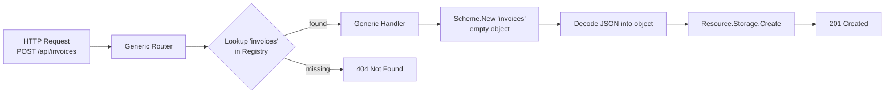

Notice what the handler never says `if resource == "users"`.
It never imports `User` or `Invoice`. It works entirely through three interfaces we
will design in the coming chapters: `Resource`, `Storage`, and `Scheme`.

### The four pillars

The whole framework rests on four small abstractions:

| Pillar | Responsibility |
| --- | --- |
| `Resource` | Ties a name to an object factory and a storage backend |
| `Storage` | Persists objects, hiding *how* and *where* |
| `Registry` | Tracks which resources exist; consulted on every request |
| `Scheme` | Creates empty typed objects by name, so handlers stay generic |

Master these four and everything else — CRDs, plugins, watch, controllers — is a
natural extension. Let us set up the project.

### Checkpoint

You understand the goal: a server whose router never changes while its
capabilities grow at runtime. No code yet — that starts in Chapter 2.

---

## Chapter 2: Project Setup

### Goal

Create the module and directory layout we will fill in throughout the book.

### The layout

We will build this structure. Do not create the files' contents yet; just make
the folders and the module. Each file is filled in by a later chapter.

```text
api-server/
├── go.mod
├── cmd/
│   ├── api-server/
│   │   └── main.go          # server entrypoint (Chapter 7, 12, 15)
│   └── apictl/
│       ├── main.go          # CLI entrypoint (Chapter 8)
│       ├── client.go        # HTTP client library (Chapter 8, 14)
│       └── commands.go      # CLI commands (Chapter 9)
├── pkg/
│   ├── api/
│   │   ├── resource.go      # Resource interface (Chapter 3)
│   │   ├── storage.go       # Storage interface + memory impl (Chapter 3, 13)
│   │   ├── registry.go      # Resource registry (Chapter 4)
│   │   ├── scheme.go        # Type factory (Chapter 4)
│   │   ├── types.go         # response envelopes (Chapter 5)
│   │   ├── router.go        # generic router (Chapter 5, 10, 11, 14)
│   │   ├── middleware.go    # HTTP middleware (Chapter 6)
│   │   ├── server.go        # server lifecycle (Chapter 6)
│   │   ├── crd.go           # CRD registry (Chapter 10)
│   │   ├── dynamic.go       # dynamic objects (Chapter 10)
│   │   ├── event.go         # event model (Chapter 13)
│   │   └── eventbus.go      # pub/sub event bus (Chapter 13)
│   ├── resources/
│   │   ├── users.go         # built-in resource (Chapter 7)
│   │   ├── products.go      # built-in resource (Chapter 7)
│   │   └── orders.go        # built-in resource (Chapter 7)
│   ├── plugins/
│   │   ├── interface.go     # Plugin interface (Chapter 12)
│   │   └── loader.go        # plugin loader (Chapter 12)
│   └── controllers/
│       ├── controller.go    # Controller interface (Chapter 15)
│       ├── manager.go       # controller manager (Chapter 15)
│       └── orders.go        # example controller (Chapter 15)
├── plugins/
│   ├── build.sh             # plugin build script (Chapter 12)
│   └── invoices/
│       └── main.go          # example plugin (Chapter 12)
└── examples/                # sample JSON/YAML payloads
```

### Create the module

Pick any module path you like; this book uses `github.com/pergus/api-server`. If
you choose a different path, substitute it everywhere you see that import
prefix.

```bash
mkdir api-server && cd api-server
go mod init github.com/pergus/api-server
```

We need exactly one third-party dependency — a YAML parser for the CLI's `apply`
command. Add it now:

```bash
go get gopkg.in/yaml.v2@v2.4.0
```

Your `go.mod` should look like this:

**Listing 2.1 — `go.mod`**

```go
module github.com/pergus/api-server

go 1.26.5

require gopkg.in/yaml.v2 v2.4.0
```

> **Platform note:** Chapter 12 uses Go's `plugin` package, which builds shared
> objects (`.so`). That works on Linux and macOS but not Windows. Everything else in
> the book is cross-platform. If you are on Windows, you can skip Chapter 12 and the
> rest still works.

### Create the directories

```bash
mkdir -p cmd/api-server cmd/apictl \
         pkg/api pkg/resources pkg/plugins pkg/controllers \
         plugins/invoices examples
```

### Checkpoint

```bash
go build ./...
go: warning: "./..." matched no packages
```

This succeeds with a warning but confirms your module is set up. You now have a
skeleton ready to fill in.

---

# Part II — The Core Framework

All core framework code lives in package `api` under `pkg/api/`. We build it
bottom up: first the contracts (`Resource`, `Storage`), then the runtime
registries (`Registry`, `Scheme`), then the router and server on top.

**Figure 2.1 — How the core pieces fit together**

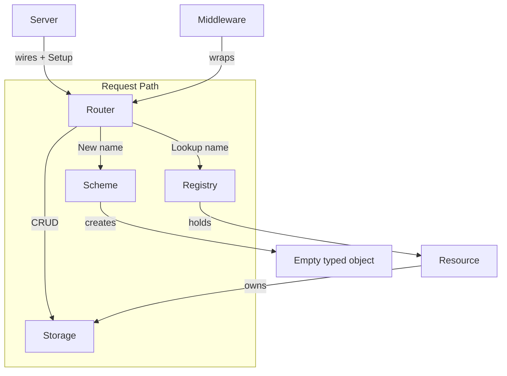

## Chapter 3: Resources and Storage

### Goal

Define the two most fundamental contracts: what a *resource* is, and how it
*persists* its objects. Then provide a thread-safe in-memory storage
implementation.

### The Resource interface

A `Resource` is the framework's abstraction for a type of object. It defines the
resource name (used in the URL), provides a factory for creating empty
instances, and specifies the storage backend. The framework doesn't know about
concrete types such as `User` or `Order`; it only interacts with `Resource`.


**Listing 3.1 — `pkg/api/resource.go`**

```go
// pkg/api/resource.go
package api

// Resource defines the interface that all API resources must implement.
//
// This is the contract between the generic framework and concrete resources.
// The framework never knows about specific types like User or Product—it only
// knows about resources through this interface.
//
// This design is how the API server allows arbitrary resources (Custom Resource Definitions)
// to be added at runtime without changing the core API server code.
type Resource interface {
	// Name returns the singular name of this resource.
	// Used as the path component: /api/{name}
	// Examples: "users", "products", "orders", "invoices"
	Name() string

	// NewObject returns a new, zero-value instance of this resource type.
	// Called by generic handlers to create empty objects for JSON unmarshalling.
	// The handler then decodes incoming JSON into this object.
	//
	// Example: returns &User{} for users, &Product{} for products
	NewObject() any

	// Storage returns the persistence layer for this resource.
	// Each resource has its own storage instance.
	// Implementations might use memory, a database, cloud storage, etc.
	Storage() Storage
}

```

### The Storage interface

Persistence is abstracted behind a `Storage` interface, allowing the framework to 
remain completely independent of where data is stored. Whether objects are kept 
in memory, persisted in Postgres, written to S3, or managed by etcd makes no 
difference to the rest of the framework. As long as the storage backend 
implements the interface, it can be used interchangeably. 
The interface consists of five methods that together cover the complete 
CRUD lifecycle.


**Listing 3.2 — `pkg/api/storage.go` (interface + type)**

```go
// pkg/api/storage.go
package api

import (
	"encoding/json"
	"fmt"
	"sync"
	// "time" (Added in Chapter 13)
)

// Storage defines the persistence interface for all resources.
//
// By depending on this interface rather than a concrete storage backend,
// the framework is agnostic to HOW data is stored. Implementations can be:
// - In-memory (provided here)
// - SQL databases (PostgreSQL, MySQL, etc.)
// - NoSQL databases (MongoDB, DynamoDB, etc.)
// - Cloud storage (S3, Google Cloud Storage, etc.)
// - Distributed systems (etcd, Consul, etc.)
//
// This is identical to how the API server abstracts storage behind StorageInterface.
type Storage interface {
	// List returns all stored objects.
	List() ([]any, error)

	// Get retrieves a single object by its ID.
	Get(id string) (any, error)

	// Create stores a new object.
	// The object should have an "id" field that serves as the unique key.
	Create(obj any) error

	// Update modifies an existing object.
	Update(id string, obj any) error

	// Delete removes an object by ID.
	Delete(id string) error
}

// MemoryStorage is a simple, thread-safe in-memory storage implementation.
//
// All objects are stored in a map protected by a sync.RWMutex.
// This provides basic ACID properties for this example.
//
// For production use, you would replace this with a real database.
//
// Integration with EventBus:
// When an object is created, updated, or deleted, MemoryStorage publishes
// an event to the EventBus. This allows watch clients and controllers
// to react to changes without polling.
type MemoryStorage struct {
	mu       sync.RWMutex
	items    map[string]any
//	eventBus EventBus (Added in Chapter 13)
	resource string
}

// NewMemoryStorage creates a new in-memory storage instance.
func NewMemoryStorage() Storage {
	return &MemoryStorage{
		items:    make(map[string]any),
//		eventBus: nil, (Added in Chapter 13)
		resource: "",
	}
}
```

Now let's look at the five methods that make up the storage interface. Each
method that modifies data—creating, updating, or deleting an object—publishes an
event after the operation has completed successfully. Event publication is
optional, however. If an event bus has been attached to the storage backend, the
corresponding event is emitted; otherwise nothing happens. Early in the book no
event bus has been configured, so these event-publishing blocks are effectively
inactive. They are included from the beginning to show where notifications
naturally belong without complicating the initial implementation. 

**Listing 3.3 — `pkg/api/storage.go` (methods)**

```go
// SetEventBus attaches an event bus to this storage.
// Events will be published when objects are created, updated, or deleted.
// This must be called after NewMemoryStorage and before using the storage.
/* Added in Chapter 13
func (s *MemoryStorage) SetEventBus(bus EventBus, resource string) {
	s.eventBus = bus
	s.resource = resource
}
*/

// List returns a copy of all stored items.
func (s *MemoryStorage) List() ([]any, error) {
	s.mu.RLock()
	defer s.mu.RUnlock()

	items := make([]any, 0, len(s.items))
	for _, item := range s.items {
		items = append(items, item)
	}
	return items, nil
}

// Get retrieves an item by ID.
func (s *MemoryStorage) Get(id string) (any, error) {
	s.mu.RLock()
	defer s.mu.RUnlock()

	item, exists := s.items[id]
	if !exists {
		return nil, fmt.Errorf("not found: %s", id)
	}
	return item, nil
}

// Create stores a new item.
// Expects the item to have an "id" field in its JSON representation.
// After storing, publishes an ADDED event if an event bus is attached.
func (s *MemoryStorage) Create(obj any) error {
	s.mu.Lock()
	defer s.mu.Unlock()

	id, err := extractID(obj)
	if err != nil {
		return err
	}

	if _, exists := s.items[id]; exists {
		return fmt.Errorf("already exists: %s", id)
	}

	s.items[id] = obj

	// Publish ADDED event if event bus is attached
	/*
	if s.eventBus != nil {
		s.eventBus.Publish(Event{
			Type:      Added,
			Resource:  s.resource,
			Object:    obj,
			Timestamp: time.Now(),
		})
	}
	*/
	return nil
}

// Update modifies an existing item.
// After updating, publishes a MODIFIED event if an event bus is attached.
func (s *MemoryStorage) Update(id string, obj any) error {
	s.mu.Lock()
	defer s.mu.Unlock()

	if _, exists := s.items[id]; !exists {
		return fmt.Errorf("not found: %s", id)
	}

	s.items[id] = obj

	// Publish MODIFIED event if event bus is attached
	/*
	if s.eventBus != nil {
		s.eventBus.Publish(Event{
			Type:      Modified,
			Resource:  s.resource,
			Object:    obj,
			Timestamp: time.Now(),
		})
	}
	*/
	return nil
}

// Delete removes an item by ID.
// Before deleting, publishes a DELETED event if an event bus is attached.
// The event contains the last state of the object.
func (s *MemoryStorage) Delete(id string) error {
	s.mu.Lock()
	defer s.mu.Unlock()

	//obj, exists := s.items[id] (Added in Chapter 13)
	_, exists := s.items[id]
	if !exists {
		return fmt.Errorf("not found: %s", id)
	}

	delete(s.items, id)

	// Publish DELETED event if event bus is attached
	/*
	if s.eventBus != nil {
		s.eventBus.Publish(Event{
			Type:      Deleted,
			Resource:  s.resource,
			Object:    obj,
			Timestamp: time.Now(),
		})
	}
	*/
	return nil
}

// extractID pulls the ID from an object by marshalling to JSON.
// This works for any type that has an "id" JSON field.
func extractID(obj any) (string, error) {

	// Marshal the object to its JSON representation.
	data, err := json.Marshal(obj)
	if err != nil {
		return "", fmt.Errorf("marshal error: %w", err)
	}

	// Unmarshal into a generic map for dynamic field lookup.
	var m map[string]interface{}
	if err := json.Unmarshal(data, &m); err != nil {
		return "", fmt.Errorf("unmarshal error: %w", err)
	}

	// Look up the "id" field.
	idVal, exists := m["id"]
	if !exists {
		return "", fmt.Errorf("object missing 'id' field")
	}

	// Convert the ID to its string representation.
	id := fmt.Sprintf("%v", idVal)
	if id == "" || id == "<nil>" {
		return "", fmt.Errorf("id field is empty or nil")
	}

	return id, nil
}
```

The `extractID` helper is worth a closer look. Because the storage layer
operates on values of type `any`, it has no knowledge of the concrete object
type and therefore cannot simply access an `ID` field or method. Instead, it
marshals the object to JSON, unmarshals it into a generic map, and retrieves the
value associated with the `id` key.

Although this approach is not the most efficient, it keeps the storage layer
completely type-agnostic. The same implementation can store `User` objects,
`Order` objects, or entirely new resource types that have not even been defined
when the framework itself is written. This flexibility is one of the key design
goals of the framework: the storage layer works with the serialized
representation of an object rather than its concrete Go type. 

**Figure 3.1 — Type-agnostic ID extraction**

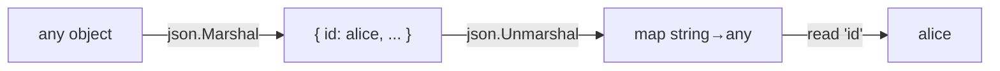

### Checkpoint

You cannot run a server yet, but you can compile the two files and even exercise
storage from a tiny test:

```go
// pkg/api/storage_smoke_test.go
package api

import "testing"

func TestMemorySmoke(t *testing.T) {
	s := NewMemoryStorage()
	if err := s.Create(map[string]any{"id": "a", "v": 1}); err != nil {
		t.Fatal(err)
	}
	got, err := s.Get("a")
	if err != nil {
		t.Fatal(err)
	}
	if got.(map[string]any)["v"] != 1 {
		t.Fatalf("unexpected: %v", got)
	}
}
```

```bash
go test ./pkg/api -run Smoke -v
=== RUN   TestMemorySmoke
--- PASS: TestMemorySmoke (0.00s)
PASS
ok  	github.com/pergus/api-server/pkg/api	0.262s
```

PASS means your storage foundation works.

---

## Chapter 4: The Registry and the Scheme

### Goal

Build the two runtime tables that make the router generic: the `Registry` (the
set of registered resources) and the `Scheme` (how to build an empty object for
a resource by name). Both are consulted on every request, so both use
`sync.RWMutex` for cheap concurrent reads.


### The Registry

The `Registry` is the heart of runtime extensibility. It maps names to
`Resource` values and can be modified while requests are flowing, allowing the
system to adapt dynamically without requiring restarts or disruptive
redeployments. By acting as a central point of discovery and coordination, the
registry enables components to be added, replaced, or reconfigured at runtime
while keeping the rest of the application decoupled from implementation details.

This design provides a flexible foundation for building systems that can evolve
alongside changing requirements. Resources can be registered as they become
available, looked up when needed, and updated as the runtime environment
changes. The registry therefore serves not only as a storage mechanism, but as
the connective tissue that allows independent parts of the system to collaborate
safely and efficiently. 

**Listing 4.1 — `pkg/api/registry.go`**

```go
// pkg/api/registry.go
package api

import (
	"fmt"
	"sort"
	"sync"
)

// Registry manages all known API resources.
//
// This is THE key to extensibility. The registry:
// - Is consulted on every request to determine if a resource exists
// - Supports registration/unregistration at runtime
// - Is thread-safe for concurrent access
// - Never requires HTTP router rebuilding
//
// This is exactly how the API server manages resources dynamically.
// When you define a CRD (Custom Resource Definition), the API server registers it
// in the resource registry. The next request to /api includes it.
type Registry interface {
	// Register adds a resource to the registry.
	// Called by plugins or the main server during initialization.
	// Returns error if a resource with this name already exists.
	Register(resource Resource) error

	// Unregister removes a resource from the registry.
	// Called when plugins are unloaded.
	// Returns error if the resource doesn't exist.
	Unregister(name string) error

	// Lookup retrieves a resource by name.
	// Returns the resource and a boolean indicating if it was found.
	// This is called on every HTTP request to determine which resource to use.
	Lookup(name string) (Resource, bool)

	// List returns all registered resources in sorted order.
	// Used by the discovery endpoint.
	List() []Resource

	// Names returns just the names of all registered resources in sorted order.
	Names() []string

	// Count returns the number of registered resources.
	Count() int
}

// SimpleRegistry implements the Registry interface.
//
// It uses a sync.RWMutex to protect concurrent access.
// This allows:
// - Multiple readers (HTTP requests looking up resources)
// - Single writer (registering/unregistering resources)
// - Safe concurrent access without blocking readers unnecessarily
type SimpleRegistry struct {
	mu        sync.RWMutex
	resources map[string]Resource
}

// NewRegistry creates a new resource registry.
func NewRegistry() Registry {
	return &SimpleRegistry{
		resources: make(map[string]Resource),
	}
}

// Register adds a resource to the registry.
// Thread-safe; blocks write but allows concurrent reads.
func (r *SimpleRegistry) Register(resource Resource) error {
	r.mu.Lock()
	defer r.mu.Unlock()

	name := resource.Name()
	if _, exists := r.resources[name]; exists {
		return fmt.Errorf("resource %q already registered", name)
	}

	r.resources[name] = resource
	return nil
}

// Unregister removes a resource from the registry.
// Thread-safe; blocks write but allows concurrent reads.
func (r *SimpleRegistry) Unregister(name string) error {
	r.mu.Lock()
	defer r.mu.Unlock()

	if _, exists := r.resources[name]; !exists {
		return fmt.Errorf("resource %q not found", name)
	}

	delete(r.resources, name)
	return nil
}

// Lookup retrieves a resource by name.
// Thread-safe; allows concurrent reads.
// This is called on EVERY HTTP request, so read-lock performance matters.
func (r *SimpleRegistry) Lookup(name string) (Resource, bool) {
	r.mu.RLock()
	defer r.mu.RUnlock()

	resource, exists := r.resources[name]
	return resource, exists
}

// List returns all registered resources in sorted order.
// Thread-safe; allows concurrent reads.
// Used by the discovery endpoint.
func (r *SimpleRegistry) List() []Resource {
	r.mu.RLock()
	defer r.mu.RUnlock()

	resources := make([]Resource, 0, len(r.resources))
	for _, resource := range r.resources {
		resources = append(resources, resource)
	}

	// Sort by name for deterministic output
	sort.Slice(resources, func(i, j int) bool {
		return resources[i].Name() < resources[j].Name()
	})

	return resources
}

// Names returns just the resource names in sorted order.
func (r *SimpleRegistry) Names() []string {
	r.mu.RLock()
	defer r.mu.RUnlock()

	names := make([]string, 0, len(r.resources))
	for name := range r.resources {
		names = append(names, name)
	}

	sort.Strings(names)
	return names
}

// Count returns the number of registered resources.
func (r *SimpleRegistry) Count() int {
	r.mu.RLock()
	defer r.mu.RUnlock()
	return len(r.resources)
}

```

### The Scheme

Generic handlers face a problem: to decode incoming JSON they need a concrete
destination object, but they must not import the resource e.g. `User` or
`Order`. The `Scheme` solves this by mapping a name to a factory function that
returns a fresh, empty object. This creates a layer of indirection between the
generic processing logic and the concrete types being handled, allowing the
system to work with new resource types without requiring changes to the handler
itself.

At runtime, the handler can ask the `Scheme` for an object based only on its
registered name, populate it with decoded data, and continue processing without
needing to know anything about the object's internal structure. This keeps
type-specific knowledge isolated at the registration boundary while preserving
the flexibility of a generic execution pipeline. New resources can be introduced
simply by adding new registrations, rather than modifying existing
infrastructure code.

**Listing 4.2 — `pkg/api/scheme.go`**

```go
// pkg/api/scheme.go
package api

import (
	"fmt"
	"sync"
)

// ObjectFactory is a function that creates a new, empty instance of an object type.
//
// The generic HTTP handlers cannot directly reference types like User or Product.
// Instead, they ask the Scheme to create an empty instance by name.
// This is loaded into and marshalled with incoming JSON.
type ObjectFactory func() any

// Scheme is a type registry and factory.
//
// This maps between:
// - Type names (strings) -> Constructor functions
// - This allows the API server to create objects without importing or knowing about types
//
// The Scheme is how the generic handlers avoid importing resource types.
// When a request arrives for /api/users, the handler asks:
//
//	obj, _ := scheme.New("users")
//
// This returns &User{} without the handler knowing anything about User.
//
// The Scheme is thread-safe for registration (which happens at startup or when
// plugins load) and lookups (which happen on every request).
type Scheme interface {
	// Register maps a type name to a factory function.
	// Called during server initialization or plugin loading.
	// Returns error if the type is already registered.
	Register(name string, factory ObjectFactory) error

	// Unregister removes a type factory from the registry.
	// Called when CRDs or plugins are unloaded.
	// Returns error if the type is not registered.
	Unregister(name string) error

	// New creates a new instance of a registered type.
	// Called by generic HTTP handlers to create empty objects for unmarshalling.
	// Returns error if the type is not registered.
	New(name string) (any, error)

	// Has checks if a type is registered.
	Has(name string) bool
}

// SimpleScheme implements the Scheme interface.
type SimpleScheme struct {
	mu        sync.RWMutex
	factories map[string]ObjectFactory
}

// NewScheme creates a new Scheme.
func NewScheme() Scheme {
	return &SimpleScheme{
		factories: make(map[string]ObjectFactory),
	}
}

// Register adds a factory for a type.
// Thread-safe for concurrent registration.
// Called during initialization or when plugins load.
func (s *SimpleScheme) Register(name string, factory ObjectFactory) error {
	s.mu.Lock()
	defer s.mu.Unlock()

	if _, exists := s.factories[name]; exists {
		return fmt.Errorf("type %q already registered", name)
	}

	s.factories[name] = factory
	return nil
}

// Unregister removes a factory for a type.
// Thread-safe for concurrent unregistration.
// Called when CRDs or plugins are unloaded.
func (s *SimpleScheme) Unregister(name string) error {
	s.mu.Lock()
	defer s.mu.Unlock()

	if _, exists := s.factories[name]; !exists {
		return fmt.Errorf("type %q not registered", name)
	}

	delete(s.factories, name)
	return nil
}

// New creates a new instance of a registered type.
// Thread-safe for concurrent lookups.
// Called on every HTTP request, so read-lock performance matters.
func (s *SimpleScheme) New(name string) (any, error) {
	s.mu.RLock()
	defer s.mu.RUnlock()

	factory, exists := s.factories[name]
	if !exists {
		return nil, fmt.Errorf("unknown type: %q", name)
	}

	return factory(), nil
}

// Has checks if a type is registered.
// Thread-safe for concurrent lookups.
func (s *SimpleScheme) Has(name string) bool {
	s.mu.RLock()
	defer s.mu.RUnlock()
	_, exists := s.factories[name]
	return exists
}

```

The registry answers one simple question: "Is this resource available, and where
can I find its data?" The scheme answers another: "How do I create an empty
object of this type so I can fill it with incoming data?" Together, they give a
single handler everything it needs to work with any resource in the system.

**Figure 4.1 — Registry and Scheme, side by side**

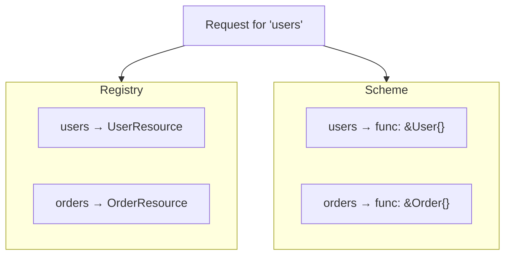

For example, when a request arrives for `users`, the handler does not need to
know what a `User` object looks like or where users are stored. It asks the
registry for the `users` resource, uses the scheme to create a new empty user
object, and then decodes the incoming data into that object. The same process
works for `orders`, `products`, or any other registered resource.

This separation keeps the handler simple and reusable. The handler focuses only
on processing requests, while the registry and scheme provide the
resource-specific details behind the scenes. Adding a new resource does not
require changing the handler; it only requires registering the resource and
teaching the scheme how to create it.


### Checkpoint

```bash
go test ./pkg/api -run 'Registry|Scheme' -v
PASS
ok  	github.com/pergus/api-server/pkg/api	0.244s [no tests to run]
go build ./...
```

Write a quick test if you like: register a resource, look it up, register a
factory, and call `New`. Both tables should behave as expected. This small check
confirms that the registry can store and retrieve resources correctly, while the
scheme can create new objects when requested.

Once these pieces work together, the dynamic core is in place. Resources can be
added, discovered, and created at runtime without changing the main handler
logic. From here, the system has the foundation it needs to support new resource
types through simple registration rather than custom code.

---

## Chapter 5: The Generic Router

### Goal

Write the single most important file in the project: the router that turns every
HTTP request into a registry lookup plus one generic handler. We also define the
JSON response envelopes it returns.

### Response envelopes

The API package defines the standard response shapes used by the router. Instead
of returning different JSON formats from different parts of the system, every
endpoint follows a small set of predictable envelopes. This makes the API easier
to understand and keeps future clients, such as a CLI, from needing special
handling for every request. 

`ListResponse` is used when returning multiple objects. It contains the objects
themselves in `Items` and includes a `Count` field so clients know how many
results were returned. The router can use this same structure for any resource
because the items are stored as `any`, allowing different object types to be
returned through the same generic code path. 

`ErrorResponse` provides a consistent format for failures. Rather than returning
plain text or different error structures, the API always returns an error
message together with the HTTP status code that describes what happened.

The creation, update, and deletion responses are intentionally simple. When an
object is created, `CreatedResponse` returns a confirmation message and the new
object's ID. Updates and deletes only need to confirm that the operation
completed, so their responses contain a message field.

Finally, `DiscoveryResponse` is used when the system needs to describe what
resources are available. It returns the list of registered resources along with
a timestamp, giving clients a way to discover the current capabilities of the
running application.

These response types form the common language between the router and its
clients. With the response format defined up front, the router can focus on its
main job: finding the correct resource, calling the generic handler, and
returning the result in a consistent way.


**Listing 5.1 — `pkg/api/types.go`**

```go
// pkg/api/types.go
//
// Package api provides the core framework for a truly dynamic API server
// that can have resources registered and unregistered at runtime without
// rebuilding the HTTP router or restarting the server.
//
// This package demonstrates how the API server achieves extensibility:
// - The router is completely generic and never changes
// - Resources are looked up dynamically on every request
// - New resources are immediately available once registered
// - The registry is thread-safe for concurrent access
//
// Key difference from static servers:
// - No routes are built during startup
// - Every request determines the target resource at runtime
// - The Scheme creates objects by name, not by type
// - Middleware and handlers never know specific resource types
package api

import "time"

// ListResponse wraps a list of objects.
type ListResponse struct {
	Items []any `json:"items"`
	Count int   `json:"count"`
}

// ErrorResponse represents an API error.
type ErrorResponse struct {
	Error  string `json:"error"`
	Status int    `json:"status"`
}

// CreatedResponse confirms object creation.
type CreatedResponse struct {
	Message string `json:"message"`
	ID      string `json:"id"`
}

// UpdatedResponse confirms object update.
type UpdatedResponse struct {
	Message string `json:"message"`
}

// DeletedResponse confirms object deletion.
type DeletedResponse struct {
	Message string `json:"message"`
}

// DiscoveryResponse lists available resources.
type DiscoveryResponse struct {
	Resources []string `json:"resources"`
	Time      string   `json:"timestamp"`
}

// RequestTiming captures request metrics.
type RequestTiming struct {
	StartTime  time.Time
	Method     string
	Path       string
	StatusCode int
	Duration   time.Duration
}

```

### The router skeleton

The router is the central piece that connects incoming HTTP requests to the
dynamic parts of the system. Instead of creating a separate route for every
resource, it creates a small number of generic routes and decides what to do
only after a request arrives. This is what allows the system to support new
resources without changing the router code. 

The `Router` keeps references to the components it needs to make those
decisions. The `registry` tells the router which resources exist and where they
are stored. The `scheme` helps create new objects of the correct type when data
needs to be decoded. The `crdRegistry` and `eventBus` fields are reserved for
later chapters, where the router will gain additional capabilities such as
custom resources and event notifications. 

The constructor, `NewRouter`, connects these dependencies together and creates
the internal `http.ServeMux`. The router does not know about individual
resources here. It only receives the systems that allow it to discover and work
with resources dynamically. 

The `Setup` method is where the router registers its routes. The important
detail is that these routes are fixed. The router does not add a new route when
a resource is created. Instead, the same generic routes handle every resource
that exists in the registry. For example, adding a new `users` or `orders`
resource does not require a new HTTP path to be registered. 

The `/api` route provides discovery information by listing available resources.
Requests that do not match a more specific route are passed to the generic
routing logic. 

Finally, `ServeHTTP` allows `Router` to behave like any other Go HTTP handler.
It simply forwards the request to the internal `ServeMux`, which selects the
correct handler function. 

The result is a router that remains unchanged as the system grows. The routes
define the API structure, while the registry and scheme determine what resources
the API can serve at runtime. This separation is the foundation of the project's
dynamic design. 

**Listing 5.2 — `pkg/api/router.go` (type, constructor, Setup, ServeHTTP)**

```go
package api

import (
	"encoding/json"
	"fmt"
	"io"
	"log"
	"net/http"
	"strings"
	"time"
)

// Router is the HTTP request dispatcher and the key to dynamic extensibility.
//
// Unlike servers that register per-resource routes at startup, this router
// registers only generic routes and determines the resource at request time.
type Router struct {
	registry    Registry
	scheme      Scheme
	mux         *http.ServeMux
}

// NewRouter creates a new router.
func NewRouter(registry Registry, scheme Scheme ) *Router {
	return &Router{
		registry:    registry,
		scheme:      scheme,
		mux:         http.NewServeMux(),
	}
}

// Setup registers the generic routes ONCE. They never change, even as resources
// are added or removed at runtime.
func (r *Router) Setup() {
	r.mux.HandleFunc("/api", r.discovery)         // list resources
	r.mux.HandleFunc("/", r.route)                // everything else
}

// ServeHTTP makes Router satisfy http.Handler.
func (r *Router) ServeHTTP(w http.ResponseWriter, req *http.Request) {
	r.mux.ServeHTTP(w, req)
}
```


### Discovery and routing

The router has two closely related responsibilities: helping clients discover
what the server can do, and directing every incoming request to the correct
handler. Both tasks rely on the registry, which is consulted at runtime rather
than at application startup.

The `discovery` handler implements the `GET /api` endpoint. When called, it asks
the registry for the names of all currently registered resources and returns
them in a `DiscoveryResponse` together with the current timestamp. Because the
information comes directly from the live registry, the response always reflects
the current state of the system. If a resource is added or removed while the
server is running, the next discovery request immediately shows the change.

The `route` function is the heart of the router. Every resource request
eventually passes through this single function. Instead of relying on hundreds
of predefined routes, it examines the request path, identifies the requested
resource, and decides what action to perform.

The first step is to check for special paths. All resource requests are expected
to begin with `/api/`. Requests that do not follow this format are rejected with
a `404 Not Found` response. 

Once the path has been validated, the router extracts the resource name. For
example, `/api/users/alice` is split into the resource name `users` and the
object identifier `alice`. The router then performs the most important operation
in the entire request flow: it asks the registry whether the requested resource
exists.

If the registry cannot find the resource, the request ends with a `404 Not
Found`. If the resource does exist, the router never needs to know whether it
represents users, orders, products, or any other type. It simply receives a
`Resource` value that contains everything needed to continue processing.

The remaining logic is based on the structure of the URL. Requests of the form
`/api/{resource}` operate on the collection as a whole, while requests of the
form `/api/{resource}/{id}` operate on a single object. Rather than handling
every HTTP method directly inside `route`, the router delegates to two small
helper functions.

`routeListOrCreate` handles collection-level operations. A `GET` request lists
all objects in the resource, while a `POST` request creates a new one.
Similarly, `routeItemOp` handles operations on an individual object. Depending
on the HTTP method, it retrieves, updates, or deletes the specified object.

This layered design keeps the routing logic easy to follow. The `route` function
is responsible only for understanding the URL and locating the requested
resource. Once those decisions have been made, the appropriate helper function
performs the requested operation. The result is a single routing pipeline that
works for every resource registered with the system, without requiring
resource-specific routes or handlers.


**Listing 5.3 — `pkg/api/router.go` (discovery + route)**

```go
// discovery handles GET /api and lists all registered resources.
func (r *Router) discovery(w http.ResponseWriter, req *http.Request) {
	if req.Method != http.MethodGet {
		http.Error(w, "method not allowed", http.StatusMethodNotAllowed)
		return
	}
	response := DiscoveryResponse{
		Resources: r.registry.Names(),
		Time:      time.Now().UTC().Format(time.RFC3339),
	}
	w.Header().Set("Content-Type", "application/json")
	json.NewEncoder(w).Encode(response)
}

// route is the single dispatcher for all resource (and CRD) requests.
func (r *Router) route(w http.ResponseWriter, req *http.Request) {
	path := req.URL.Path

	if !strings.HasPrefix(path, "/api/") {
		http.Error(w, "not found", http.StatusNotFound)
		return
	}

	// Split the path after /api/ : "users/alice" -> ["users", "alice"].
	parts := strings.Split(strings.TrimPrefix(path, "/api/"), "/")
	if len(parts) < 1 || parts[0] == "" {
		http.Error(w, "not found", http.StatusNotFound)
		return
	}
	resourceName := parts[0]

	// The heart of the design: a live registry lookup on every request.
	resource, ok := r.registry.Lookup(resourceName)
	if !ok {
		http.Error(w, fmt.Sprintf("resource %q not found", resourceName), http.StatusNotFound)
		return
	}

	if len(parts) == 1 {
		r.routeListOrCreate(w, req, resource) // /api/{resource}
	} else if len(parts) == 2 && parts[1] != "" {
		r.routeItemOp(w, req, resource, parts[1]) // /api/{resource}/{id}
	} else {
		http.Error(w, "not found", http.StatusNotFound)
	}
}

func (r *Router) routeListOrCreate(w http.ResponseWriter, req *http.Request, resource Resource) {
	switch req.Method {
	case http.MethodGet:
		r.list(w, req, resource)
	case http.MethodPost:
		r.create(w, req, resource)
	default:
		http.Error(w, "method not allowed", http.StatusMethodNotAllowed)
	}
}

func (r *Router) routeItemOp(w http.ResponseWriter, req *http.Request, resource Resource, id string) {
	switch req.Method {
	case http.MethodGet:
		r.get(w, req, resource, id)
	case http.MethodPut:
		r.update(w, req, resource, id)
	case http.MethodDelete:
		r.delete(w, req, resource, id)
	default:
		http.Error(w, "method not allowed", http.StatusMethodNotAllowed)
	}
}
```

### The five generic handlers

This is where the design comes together. Instead of writing separate CRUD
handlers for `users`, `orders`, `products`, and every future resource, the
router implements just five generic handlers. Each one works with any registered
resource by relying on the registry, the scheme, and the resource's storage
implementation.

The `list` handler serves `GET /api/{resource}` requests. It asks the resource's
storage to return every stored object and wraps the result in a `ListResponse`.
The handler does not know or care what type of objects it is returning. As long
as the resource provides a storage implementation, the same code can list users,
orders, or any other resource.

The `get` handler is even simpler. It receives the resource and an object ID,
asks the storage for the matching object, and returns it as JSON. If no object
exists with the given ID, the handler responds with a `404 Not Found`.

The `create` handler demonstrates why the scheme exists. Before JSON can be
decoded, Go needs an empty destination object of the correct type. Rather than
importing concrete types such as `User` or `Order`, the handler asks the scheme
to create a new object based on the resource's name. The request body is then
decoded into that object and passed to the resource's storage for creation. If
everything succeeds, the handler returns a `201 Created` response along with the
ID of the newly created object.

The `update` handler follows almost the same process. It creates a new empty
object through the scheme, decodes the incoming JSON into it, and asks the
storage to replace the existing object identified by the URL. Because object
creation is delegated to the scheme, the update logic remains completely
independent of any concrete type.

The `delete` handler is the simplest of the five. It tells the storage to remove
the object with the specified ID and returns a confirmation message if the
operation succeeds.

Finally, the helper function `extractIDFromObject` retrieves the object's `id`
field without knowing its concrete type. It does this by temporarily converting
the object to JSON and then reading the resulting data as a generic map.
Although this approach is less efficient than accessing a struct field directly,
it keeps the generic handlers completely decoupled from resource-specific types.

Taken together, these five handlers demonstrate the benefit of the architecture
built in the previous chapters. Every request follows the same path: the router
identifies the resource, the scheme creates an empty object when necessary, and
the storage performs the requested operation. The handlers never import or
reference concrete application types, yet they can perform full CRUD operations
on any resource registered with the system. Adding a new resource therefore
requires no changes to the router—only a new registration in the registry and a
factory function in the scheme.


**Listing 5.4 — `pkg/api/router.go` (CRUD handlers)**

```go
// list handles GET /api/{resource}. The ?watch=true branch is added in Chapter 14.
func (r *Router) list(w http.ResponseWriter, req *http.Request, resource Resource) {
	objects, err := resource.Storage().List()
	if err != nil {
		http.Error(w, err.Error(), http.StatusInternalServerError)
		return
	}
	w.Header().Set("Content-Type", "application/json")
	json.NewEncoder(w).Encode(ListResponse{Items: objects, Count: len(objects)})
}

// get handles GET /api/{resource}/{id}.
func (r *Router) get(w http.ResponseWriter, _ *http.Request, resource Resource, id string) {
	object, err := resource.Storage().Get(id)
	if err != nil {
		http.Error(w, err.Error(), http.StatusNotFound)
		return
	}
	w.Header().Set("Content-Type", "application/json")
	json.NewEncoder(w).Encode(object)
}

// create handles POST /api/{resource}. The scheme creates an empty object so this
// handler never needs to know the concrete type.
func (r *Router) create(w http.ResponseWriter, req *http.Request, resource Resource) {
	body := io.LimitReader(req.Body, 1024*1024)
	defer req.Body.Close()

	obj, err := r.scheme.New(resource.Name())
	if err != nil {
		http.Error(w, err.Error(), http.StatusInternalServerError)
		return
	}
	if err := json.NewDecoder(body).Decode(obj); err != nil {
		http.Error(w, fmt.Sprintf("invalid JSON: %v", err), http.StatusBadRequest)
		return
	}
	if err := resource.Storage().Create(obj); err != nil {
		http.Error(w, err.Error(), http.StatusBadRequest)
		return
	}
	w.Header().Set("Content-Type", "application/json")
	w.WriteHeader(http.StatusCreated)
	json.NewEncoder(w).Encode(CreatedResponse{
		Message: fmt.Sprintf("%s created", resource.Name()),
		ID:      extractIDFromObject(obj),
	})
}

// update handles PUT /api/{resource}/{id}.
func (r *Router) update(w http.ResponseWriter, req *http.Request, resource Resource, id string) {
	body := io.LimitReader(req.Body, 1024*1024)
	defer req.Body.Close()

	obj, err := r.scheme.New(resource.Name())
	if err != nil {
		http.Error(w, err.Error(), http.StatusInternalServerError)
		return
	}
	if err := json.NewDecoder(body).Decode(obj); err != nil {
		http.Error(w, fmt.Sprintf("invalid JSON: %v", err), http.StatusBadRequest)
		return
	}
	if err := resource.Storage().Update(id, obj); err != nil {
		http.Error(w, err.Error(), http.StatusNotFound)
		return
	}
	w.Header().Set("Content-Type", "application/json")
	json.NewEncoder(w).Encode(UpdatedResponse{Message: fmt.Sprintf("%s updated", resource.Name())})
}

// delete handles DELETE /api/{resource}/{id}.
func (r *Router) delete(w http.ResponseWriter, _ *http.Request, resource Resource, id string) {
	if err := resource.Storage().Delete(id); err != nil {
		http.Error(w, err.Error(), http.StatusNotFound)
		return
	}
	w.Header().Set("Content-Type", "application/json")
	json.NewEncoder(w).Encode(DeletedResponse{Message: fmt.Sprintf("%s deleted", resource.Name())})
}

// extractIDFromObject reads the "id" field from any object via JSON.
func extractIDFromObject(obj any) string {
	data, err := json.Marshal(obj)
	if err != nil {
		log.Printf("error marshalling object: %v", err)
		return ""
	}
	var m map[string]interface{}
	if err := json.Unmarshal(data, &m); err != nil {
		log.Printf("error unmarshalling object: %v", err)
		return ""
	}
	if id, ok := m["id"]; ok {
		return fmt.Sprintf("%v", id)
	}
	return ""
}
```

### Checkpoint

The following test proves the important architectural claim from Chapter 5:

- /api dynamically discovers registered resources.
- /api/users is handled without a users-specific route.
- JSON is decoded through the scheme factory.
- Storage receives the created object.
- /api/users/alice retrieves it through the generic get handler.

**Listing 5.5 — `pkg/api/router_test.go` (Router API test)**
```go
package api

import (
	"encoding/json"
	"net/http"
	"net/http/httptest"
	"strings"
	"testing"
)

// TestUser is a minimal object type used only by the routing tests.
// The router does not know about this type; it only interacts with it
// through the Resource and Scheme interfaces.
type TestUser struct {
	ID   string `json:"id"`
	Name string `json:"name"`
}

// TestResource is a small Resource implementation used to connect the
// generic router to the in-memory storage during tests.
type TestResource struct {
	name    string
	storage Storage
}

// Name returns the URL name of this resource.
// The router uses this value when matching paths such as /api/users.
func (r *TestResource) Name() string {
	return r.name
}

// NewObject returns an empty object instance.
// The scheme uses this factory when decoding incoming JSON requests.
func (r *TestResource) NewObject() any {
	return &TestUser{}
}

// Storage returns the persistence backend associated with this resource.
func (r *TestResource) Storage() Storage {
	return r.storage
}

// newTestRouter creates a complete in-memory API stack for testing.
//
// It wires together the same components used by the real application:
//
//	Registry  -> knows which resources exist
//	Scheme    -> knows how to create empty objects
//	Storage   -> stores objects
//	Router    -> handles HTTP requests
//
// No HTTP server is started. The router is tested directly through ServeHTTP.
func newTestRouter() *Router {
	// Create an isolated in-memory storage backend.
	storage := NewMemoryStorage()

	// Create a resource that exposes the users collection.
	resource := &TestResource{
		name:    "users",
		storage: storage,
	}

	// Register the resource so the router can discover it dynamically.
	registry := NewRegistry()

	if err := registry.Register(resource); err != nil {
		panic(err)
	}

	// Register a factory that allows generic handlers to create
	// empty TestUser objects without knowing the concrete type.
	scheme := NewScheme()

	if err := scheme.Register("users", func() any {
		return &TestUser{}
	}); err != nil {
		panic(err)
	}

	// Build the router and install its generic routes.
	router := NewRouter(registry, scheme)
	router.Setup()

	return router
}

// TestRoutingDiscovery verifies that GET /api returns the list of
// resources currently registered in the registry.
//
// This proves that the router is using dynamic resource discovery
// rather than hard-coded routes.
func TestRoutingDiscovery(t *testing.T) {
	router := newTestRouter()

	// Create a fake HTTP GET request.
	req := httptest.NewRequest(
		http.MethodGet,
		"/api",
		nil,
	)

	// Recorder captures the HTTP response generated by the router.
	rec := httptest.NewRecorder()

	// Send the request through the router.
	router.ServeHTTP(rec, req)

	// Verify the discovery endpoint succeeded.
	if rec.Code != http.StatusOK {
		t.Fatalf(
			"expected status %d, got %d",
			http.StatusOK,
			rec.Code,
		)
	}

	// Decode the JSON discovery response.
	var response DiscoveryResponse

	if err := json.NewDecoder(rec.Body).Decode(&response); err != nil {
		t.Fatal(err)
	}

	// Verify that the registered resource appears in discovery.
	if len(response.Resources) != 1 {
		t.Fatalf(
			"expected one resource, got %v",
			response.Resources,
		)
	}

	if response.Resources[0] != "users" {
		t.Fatalf(
			"expected users resource, got %s",
			response.Resources[0],
		)
	}
}

// TestRoutingCreateAndGet verifies the complete generic CRUD path:
//
//	POST /api/users
//	    |
//	    v
//	Generic create handler
//	    |
//	    v
//	MemoryStorage.Create()
//
// followed by:
//
//	GET /api/users/{id}
//	    |
//	    v
//	Generic get handler
//	    |
//	    v
//	MemoryStorage.Get()
//
// The important part is that the router never directly references TestUser.
func TestRoutingCreateAndGet(t *testing.T) {
	router := newTestRouter()

	// Create a fake POST request containing a JSON user object.
	createRequest := httptest.NewRequest(
		http.MethodPost,
		"/api/users",
		strings.NewReader(
			`{"id":"alice","name":"Alice"}`,
		),
	)

	// Tell the handler that the request body contains JSON.
	createRequest.Header.Set(
		"Content-Type",
		"application/json",
	)

	// Capture the response.
	createRecorder := httptest.NewRecorder()

	// Send the create request through the generic router.
	router.ServeHTTP(
		createRecorder,
		createRequest,
	)

	// A successful create should return HTTP 201 Created.
	if createRecorder.Code != http.StatusCreated {
		t.Fatalf(
			"expected status %d, got %d: %s",
			http.StatusCreated,
			createRecorder.Code,
			createRecorder.Body.String(),
		)
	}

	// Now retrieve the object using its ID.
	getRequest := httptest.NewRequest(
		http.MethodGet,
		"/api/users/alice",
		nil,
	)

	// Capture the GET response.
	getRecorder := httptest.NewRecorder()

	// Send the request through the router.
	router.ServeHTTP(
		getRecorder,
		getRequest,
	)

	// The object should now exist in storage.
	if getRecorder.Code != http.StatusOK {
		t.Fatalf(
			"expected status %d, got %d",
			http.StatusOK,
			getRecorder.Code,
		)
	}

	// Decode the returned object.
	var user TestUser

	if err := json.NewDecoder(getRecorder.Body).Decode(&user); err != nil {
		t.Fatal(err)
	}

	// Verify the stored object survived the create/get round trip.
	if user.Name != "Alice" {
		t.Fatalf(
			"expected Alice, got %s",
			user.Name,
		)
	}
}
```


```
go test ./pkg/api -run Routing -v
=== RUN   TestRoutingDiscovery
--- PASS: TestRoutingDiscovery (0.00s)
=== RUN   TestRoutingCreateAndGet
--- PASS: TestRoutingCreateAndGet (0.00s)
PASS
ok  	github.com/pergus/api-server/pkg/api	(cached)
```

---

## Chapter 6: Middleware and the Server

### Goal

Wrap the router in cross-cutting middleware and give it a real lifecycle: start,
serve with timeouts, and shut down gracefully.

### Middleware

Middleware provides a clean way to add behavior around every HTTP request
without placing that logic inside the router or individual handlers. The
router's job is to understand paths and execute resource operations. Middleware
handles concerns that apply to the entire server, such as logging, security
headers, measuring performance, and protecting the application from unexpected
failures.

In Go, middleware works by wrapping an existing `http.Handler` with another
handler. The wrapper receives the request first, performs some action before or
after calling the next handler, and then passes control forward. Because every
request passes through the middleware chain before reaching the router, these
features are automatically applied to every endpoint.

The `Middleware` type defines this pattern. It is simply a function that accepts
one handler and returns another handler. This small abstraction makes it
possible to build reusable request-processing layers that can be combined in
different ways.

The `LoggingMiddleware` records basic information about each request and its
result. Before the router runs, it records the HTTP method, path, and client
address. After the request finishes, it logs the response status code and how
long the request took. To capture the status code, it wraps the original
`ResponseWriter` with a custom `responseWriter`.

The `RecoveryMiddleware` protects the server from crashes caused by unexpected
panics. Normally, a panic inside a handler could terminate the request abruptly
and potentially bring down parts of the application. This middleware catches the
panic, logs the problem, and converts it into a normal HTTP `500 Internal Server
Error` response. This keeps the server running while still making failures
visible.

The `TimingMiddleware` focuses only on measuring performance. It records the
start time before the request is processed and logs the total duration
afterward. While the logging middleware also measures time, keeping timing as a
separate middleware allows the behavior to be enabled, disabled, or extended
independently.

The `CORSMiddleware` adds the headers required for browser-based clients running
on different origins. These headers tell browsers which methods and headers are
allowed when communicating with the API. It also handles `OPTIONS` requests,
which browsers send as a preflight check before certain cross-origin requests.

The `Chain` function combines multiple middleware functions into a single
handler. Middleware is applied from right to left internally so that the final
execution order matches the order in which the middleware are listed. This makes
it easy to define the request flow in one place and reason about which layers
run before and after the router.

The custom `responseWriter` exists because the standard `http.ResponseWriter`
does not expose the response status after it has been written. By wrapping it,
the server can record the status code for logging purposes. The wrapper also
forwards the `Flush` method from `http.Flusher`.

Forwarding `Flush` is important for future Server-Sent Events (SSE) support. SSE
keeps an HTTP connection open and sends data to the client as events occur. It
relies on flushing buffered data immediately, so middleware must preserve this
capability instead of hiding it behind a wrapper that only supports normal
responses.

Together, these middleware components create a more reliable HTTP layer around
the dynamic router. The router remains focused on routing and resources, while
middleware provides the operational features needed to run the server in a
production environment.


**Listing 6.1 — `pkg/api/middleware.go`**

```go
package api

import (
	"log"
	"net/http"
	"time"
)

// Middleware wraps an HTTP handler.
type Middleware func(http.Handler) http.Handler

// LoggingMiddleware logs each request and its outcome.
func LoggingMiddleware(next http.Handler) http.Handler {
	return http.HandlerFunc(func(w http.ResponseWriter, r *http.Request) {
		start := time.Now()
		wrapped := &responseWriter{ResponseWriter: w, statusCode: http.StatusOK}
		log.Printf("[%s] %s %s", r.Method, r.URL.Path, r.RemoteAddr)
		next.ServeHTTP(wrapped, r)
		log.Printf("[%s] %s completed: %d in %v", r.Method, r.URL.Path, wrapped.statusCode, time.Since(start))
	})
}

// RecoveryMiddleware converts panics into 500 responses.
func RecoveryMiddleware(next http.Handler) http.Handler {
	return http.HandlerFunc(func(w http.ResponseWriter, r *http.Request) {
		defer func() {
			if err := recover(); err != nil {
				log.Printf("PANIC: %v", err)
				http.Error(w, "Internal server error", http.StatusInternalServerError)
			}
		}()
		next.ServeHTTP(w, r)
	})
}

// TimingMiddleware logs request duration.
func TimingMiddleware(next http.Handler) http.Handler {
	return http.HandlerFunc(func(w http.ResponseWriter, r *http.Request) {
		start := time.Now()
		next.ServeHTTP(w, r)
		log.Printf("Timing: %v for %s %s", time.Since(start), r.Method, r.URL.Path)
	})
}

// CORSMiddleware adds permissive CORS headers.
func CORSMiddleware(next http.Handler) http.Handler {
	return http.HandlerFunc(func(w http.ResponseWriter, r *http.Request) {
		w.Header().Set("Access-Control-Allow-Origin", "*")
		w.Header().Set("Access-Control-Allow-Methods", "GET, POST, PUT, DELETE, OPTIONS")
		w.Header().Set("Access-Control-Allow-Headers", "Content-Type, Authorization")
		if r.Method == http.MethodOptions {
			w.WriteHeader(http.StatusOK)
			return
		}
		next.ServeHTTP(w, r)
	})
}

// Chain applies middleware right-to-left so they execute in listed order.
func Chain(h http.Handler, middleware ...Middleware) http.Handler {
	for i := len(middleware) - 1; i >= 0; i-- {
		h = middleware[i](h)
	}
	return h
}

// responseWriter captures the status code and forwards Flush for SSE.
type responseWriter struct {
	http.ResponseWriter
	statusCode int
}

// WriteHeader captures the status code.
func (rw *responseWriter) WriteHeader(code int) {
	rw.statusCode = code
	rw.ResponseWriter.WriteHeader(code)
}

// Write delegates to the wrapped writer.
func (rw *responseWriter) Write(b []byte) (int, error) { 
	return rw.ResponseWriter.Write(b) 
}

// Flush flushes if supported.
func (rw *responseWriter) Flush() {
	if flusher, ok := rw.ResponseWriter.(http.Flusher); ok {
		flusher.Flush()
	}
}
```

### The Server

The `Server` type is the component that connects the main pieces of the
application together. The router handles HTTP requests, middleware handles
behavior that applies to every request, and the server manages the lifecycle of
the entire API. It creates the shared components, exposes them to the rest of
the system, starts the HTTP listener, and shuts everything down cleanly.

At this stage of the project, the server owns three important components: the
registry, the scheme, and the router. The registry stores the resources that are
available through the API. The scheme stores the factories needed to create
empty objects for those resources. The router uses both of them to process
generic requests. Future chapters will add more collaborators, but the core
relationship between server, registry, scheme, and router is established here.

The `Config` structure contains the settings needed to start the server. For
now, the only setting is the HTTP port. Keeping configuration separate from the
server implementation makes it easier to add more options later without changing
how the server is created.

The `NewServer` function creates the initial runtime environment. It starts with
an empty registry and scheme, then creates a router that uses those shared
objects. The important part is that the same registry and scheme are used
everywhere. When a plugin or the main application registers a new resource, the
router immediately sees that change because it references the same live
registry.

The `Registry()` and `Scheme()` methods provide controlled access to these
systems. Code outside the server, such as `main()` or plugins, can use them to
register resources and object factories without needing to know how the server
stores or manages them internally. This keeps the server as the owner of the
application lifecycle while still allowing the system to be extended.

The `Start` method begins the server lifecycle. The first step is setting up the
router. The router registers the generic routes that handle all resources, and
these routes do not need to change when new resources are added later. After
setup, the server logs the resources currently available, which is useful for
confirming that registration happened correctly.

Next, the server wraps the router with middleware. From this point on, every
request passes through the same processing pipeline before reaching the router.
Recovery protects the server from unexpected panics, CORS enables browser
clients to communicate with the API, logging records request activity, and
timing measures request duration.

The underlying `http.Server` is then configured with connection limits and
timeouts. These settings help the API behave reliably under real usage by
preventing slow or abandoned connections from consuming resources forever. The
server is then ready to accept requests.

The `Stop` method provides a graceful shutdown path. Instead of immediately
terminating the process, it asks the HTTP server to stop accepting new requests
and finish handling existing ones within the provided context. This allows the
application to shut down cleanly.

The `RegisterResource` method is the main mechanism for adding new API resources
while the server is running. Once a resource is registered, it becomes visible
through discovery and available through the generic router. No new route needs
to be added because the router already knows how to handle any resource stored
in the registry.

The `RegisterType` method extends the scheme with a new object factory. This
allows the generic create and update handlers to construct the correct object
type without importing or knowing about that type directly.

Finally, `UnregisterResource` removes a resource from the running system. This
supports dynamic environments where resources may be added or removed during the
lifetime of the server.

At this point, the server provides the foundation for the rest of the project.
It creates the runtime environment, exposes the extension points, and manages
the HTTP lifecycle. The design keeps the server generic: it does not know what
resources exist, only how to provide the systems that allow those resources to
be registered and served.


**Listing 6.2 — `pkg/api/server.go`**

```go
package api

import (
	"context"
	"fmt"
	"log"
	"net/http"
	"time"
)

// Server is the HTTP API server.
type Server struct {
	registry    Registry
	scheme      Scheme
	router      *Router
	httpServer  *http.Server
	port        int
}

// Config holds server configuration.
type Config struct {
	Port int
}

// NewServer creates a new server.
func NewServer(cfg Config) *Server {
	registry := NewRegistry()
	scheme := NewScheme()
	router := NewRouter(registry, scheme)

	return &Server{
		registry:    registry,
		scheme:      scheme,
		router:      router,
		port:        cfg.Port,
	}
}

// Registry returns the resource registry.
// Called by plugins and main to register resources.
func (s *Server) Registry() Registry {
	return s.registry
}

// Scheme returns the type scheme.
// Called by plugins and main to register types.
func (s *Server) Scheme() Scheme {
	return s.scheme
}

// Start begins listening.
// The router is set up here.
func (s *Server) Start() error {
	log.Printf("Setting up routes (generic, never change)")
	s.router.Setup()

	log.Printf("Registered resources: %d", s.registry.Count())
	for _, name := range s.registry.Names() {
		log.Printf("  - %s", name)
	}

	// Wrap router with middleware
	handler := Chain(
		s.router,
		RecoveryMiddleware,
		CORSMiddleware,
		LoggingMiddleware,
		TimingMiddleware,
	)

	s.httpServer = &http.Server{
		Addr:           fmt.Sprintf(":%d", s.port),
		Handler:        handler,
		ReadTimeout:    5 * time.Minute,
		WriteTimeout:   5 * time.Minute,
		IdleTimeout:    1 * time.Minute,
		MaxHeaderBytes: 1 << 20,
	}

	log.Printf("Starting server on http://localhost:%d", s.port)
	log.Printf("Discovery: GET http://localhost:%d/api", s.port)

	if err := s.httpServer.ListenAndServe(); err != nil && err != http.ErrServerClosed {
		return err
	}

	return nil
}

// Stop gracefully shuts down the server.
func (s *Server) Stop(ctx context.Context) error {
	if s.httpServer == nil {
		return nil
	}

	log.Println("Shutting down server...")
	return s.httpServer.Shutdown(ctx)
}

// RegisterResource registers a resource at runtime.
// This makes the resource immediately available without restarting the server.
func (s *Server) RegisterResource(resource Resource) error {
	err := s.registry.Register(resource)
	if err == nil {
		log.Printf("Registered resource: %s", resource.Name())
	}
	return err
}

// RegisterType registers a type factory at runtime.
func (s *Server) RegisterType(name string, factory ObjectFactory) error {
	return s.scheme.Register(name, factory)
}

// UnregisterResource unregisters a resource at runtime.
// This is called when plugins are unloaded.
func (s *Server) UnregisterResource(name string) error {
	err := s.registry.Unregister(name)
	if err == nil {
		log.Printf("Unregistered resource: %s", name)
	}
	return err
}

```

### Checkpoint

At this point in the project, the server should compile without requiring
temporary code or placeholder implementations. The current version only depends
on the registry, scheme, and router, so no CRD registry or event bus types are
needed yet.

If you are building chapter by chapter, run a build check now:

```bash
go build ./...
```

A successful build confirms that the server lifecycle, middleware chain, and
dynamic registration pieces are connected correctly.

The later chapters will extend the server with additional collaborators,
including custom resource definitions and event handling. Those features will be
introduced when they are needed rather than added as empty placeholders here.

Next, we will give the server real resources to manage and add the application
entrypoint that starts the runtime. 

---

## Chapter 7: Built-In Resources and main()

### Goal

Ship three concrete resources — users, products, orders — and write the server
entrypoint that registers them and starts listening.

### Three resource types

This chapter introduces the first real resources managed by the server. Until
now, the framework has only provided the mechanisms needed to register,
discover, and operate on resources. Now we add actual application data by
creating three built-in resources: users, products, and orders.

Each resource follows the same simple pattern. There is a normal Go struct that
represents the data stored by the API, and a small wrapper type that implements
the `Resource` interface required by the framework. This repetition is
intentional. The resource-specific code only describes what the data looks like
and how it is named. The generic router, storage layer, and handlers continue to
provide the common behavior.

The `User`, `Product`, and `Order` structs contain only fields relevant to their
own domain. They do not contain HTTP logic, routing code, or storage behavior.
This keeps the data model separate from the API framework and allows the same
resource types to be used by the generic system.

The wrapper types, such as `UserResource`, connect the data model to the
framework. They provide three important pieces of information:

* The resource name used by the registry and HTTP API.
* A way to create an empty object of the correct type.
* The storage implementation used to save and retrieve objects.

The `Name()` method defines the public resource name. For example,
`UserResource` returns `"users"`, which means the resource becomes available
through endpoints such as `/api/users`. This name is also used by the scheme
when creating new objects during generic create and update operations.

The `NewObject()` method returns an empty instance of the resource type. The
router uses this method indirectly through the scheme when it needs a
destination object for decoding JSON. Because each resource provides its own
factory behavior, the generic handlers never need to import or reference `User`,
`Product`, or `Order` directly.

The `Storage()` method connects the resource to its persistence layer. In this
chapter, each resource uses an in-memory storage implementation. This keeps the
example simple while still exercising the full API flow. Later, the same
interface can support other storage backends without changing the router or
resource definitions.

The similarity between the three resources is the main lesson. Creating a new
resource requires only a small amount of setup: define the data structure,
implement the resource wrapper, provide object creation, and attach storage.
Everything else — routing, CRUD operations, discovery, and JSON handling — is
already handled by the framework.


**Listing 7.1 — `pkg/resources/users.go`**

```go
package resources

import (
	"github.com/pergus/api-server/pkg/api"
)

// User is a sample resource type.
type User struct {
	ID       string `json:"id"`
	Name     string `json:"name"`	
	Email    string `json:"email"`
	IsActive bool   `json:"is_active"`
}

// UserResource implements the Resource interface.
type UserResource struct {
	storage api.Storage
}

// NewUserResource creates a new user resource.
func NewUserResource() *UserResource {
	return &UserResource{
		storage: api.NewMemoryStorage(),
	}
}

// Name returns "users".
func (r *UserResource) Name() string {
	return "users"
}

// NewObject returns an empty User.
func (r *UserResource) NewObject() any {
	return &User{}
}

// Storage returns the storage implementation.
func (r *UserResource) Storage() api.Storage {
	return r.storage
}

```

**Listing 7.2 — `pkg/resources/products.go`**

```go
package resources

import (
	"github.com/pergus/api-server/pkg/api"
)

// Product is a sample resource type.
type Product struct {
	ID          string  `json:"id"`
	Name        string  `json:"name"`
	Description string  `json:"description"`
	Price       float64 `json:"price"`
	StockCount  int     `json:"stock_count"`
}

// ProductResource implements the Resource interface.
type ProductResource struct {
	storage api.Storage
}

// NewProductResource creates a new product resource.
func NewProductResource() *ProductResource {
	return &ProductResource{
		storage: api.NewMemoryStorage(),
	}
}

// Name returns "products".
func (r *ProductResource) Name() string {
	return "products"
}

// NewObject returns an empty Product.
func (r *ProductResource) NewObject() any {
	return &Product{}
}

// Storage returns the storage implementation.
func (r *ProductResource) Storage() api.Storage {
	return r.storage
}

```

**Listing 7.3 — `pkg/resources/orders.go`**

```go
package resources

import (
	"github.com/pergus/api-server/pkg/api"
)

// Order is a sample resource type.
type Order struct {
	ID         string   `json:"id"`
	UserID     string   `json:"user_id"`
	ProductIDs []string `json:"product_ids"`
	Status     string   `json:"status"`
	Total      float64  `json:"total"`
}

// OrderResource implements the Resource interface.
type OrderResource struct {
	storage api.Storage
}

// NewOrderResource creates a new order resource.
func NewOrderResource() *OrderResource {
	return &OrderResource{
		storage: api.NewMemoryStorage(),
	}
}

// Name returns "orders".
func (r *OrderResource) Name() string {
	return "orders"
}

// NewObject returns an empty Order.
func (r *OrderResource) NewObject() any {
	return &Order{}
}

// Storage returns the storage implementation.
func (r *OrderResource) Storage() api.Storage {
	return r.storage
}

```

### The server entrypoint

The `main()` function is where the application runtime is assembled. It creates
the server, registers the built-in resources, connects their type factories to
the scheme, and starts accepting HTTP requests.

The first step is creating the server with its configuration. At this point the
server contains an empty registry and scheme. Nothing is available through the
API until resources are registered.

Each resource registration has two parts. `RegisterResource` adds the resource
to the live registry, making it discoverable and accessible through the generic
router. `RegisterType` adds a factory function to the scheme, allowing the
generic create and update handlers to construct the correct object type when
JSON data arrives.

For example, registering users does not add a `/api/users` route manually. The
generic router already handles that path pattern. Instead, registration simply
tells the runtime that a resource named `users` exists and explains how to
create a new `User` object when needed.

After all three resources are registered, the server is ready to start. The call
to `Start()` is placed inside a goroutine so the main function can continue
running and wait for operating system shutdown signals. This is a common pattern
for long-running services: one goroutine runs the server while the main
goroutine manages application lifetime.

The signal handling code listens for `SIGINT` and `SIGTERM`, which are commonly
sent when a user presses Ctrl+C or when a process manager asks the application
to stop. When a shutdown signal arrives, the program creates a context with a
timeout and passes it to `server.Stop()`.

The graceful shutdown process allows existing requests to finish before the
application exits. This is important for production services because an
immediate shutdown could interrupt active clients or leave incomplete operations
behind.

By the end of this chapter, the project has moved from a framework into a
running application. The server can start, discover resources, and handle
generic CRUD operations for multiple resource types. Most importantly, the
addition of new resources still requires no changes to the router or HTTP layer
— the dynamic architecture is working as designed.


**Listing 7.4 — `cmd/api-server/main.go` (Chapter-7 version)**

```go
package main

import (
	"context"
	"log"
	"os"
	"os/signal"
	"syscall"
	"time"

	"github.com/pergus/api-server/pkg/api"
	"github.com/pergus/api-server/pkg/resources"
)

func main() {
	server := api.NewServer(api.Config{Port: 8080})

	log.Println("Registering built-in resources...")

	// Users
	if err := server.RegisterResource(resources.NewUserResource()); err != nil {
		log.Fatalf("Failed to register users: %v", err)
	}
	if err := server.RegisterType("users", func() any { return &resources.User{} }); err != nil {
		log.Fatalf("Failed to register users type: %v", err)
	}

	// Products
	if err := server.RegisterResource(resources.NewProductResource()); err != nil {
		log.Fatalf("Failed to register products: %v", err)
	}
	if err := server.RegisterType("products", func() any { return &resources.Product{} }); err != nil {
		log.Fatalf("Failed to register products type: %v", err)
	}

	// Orders
	if err := server.RegisterResource(resources.NewOrderResource()); err != nil {
		log.Fatalf("Failed to register orders: %v", err)
	}
	if err := server.RegisterType("orders", func() any { return &resources.Order{} }); err != nil {
		log.Fatalf("Failed to register orders type: %v", err)
	}

	// Start the server in a goroutine so we can wait for a shutdown signal.
	go func() {
		if err := server.Start(); err != nil {
			log.Printf("Server error: %v", err)
		}
	}()

	sigChan := make(chan os.Signal, 1)
	signal.Notify(sigChan, syscall.SIGINT, syscall.SIGTERM)
	<-sigChan

	log.Println("Shutdown signal received")
	ctx, cancel := context.WithTimeout(context.Background(), 5*time.Second)
	defer cancel()
	if err := server.Stop(ctx); err != nil {
		log.Printf("Shutdown error: %v", err)
	}
	log.Println("Server stopped")
}
```

We will add plugin loading (Chapter 12) and controller startup (Chapter 15) to this
same file later.

### Checkpoint

Your first fully working server.

```bash
go build -o api-server ./cmd/api-server
./api-server
```

In another terminal:

```bash
curl -s http://localhost:8080/api
# {"resources":["orders","products","users"],"timestamp":"..."}

curl -s -X POST http://localhost:8080/api/users \
  -H 'Content-Type: application/json' \
  -d '{"id":"alice","name":"Alice Johnson","email":"alice@example.com","is_active":true}'
# {"message":"users created","id":"alice"}

curl -s http://localhost:8080/api/users/alice
# {"id":"alice","name":"Alice Johnson","email":"alice@example.com","is_active":true}
```

Three resources, full CRUD, all through generic handlers. The core is done.

---

# Part III — The Client

A server is only half the story. Kubernetes' `kubectl` never hardcodes the list
of resource types — it asks the API server what exists. We build `apictl` the
same way. 

## Chapter 8: The apictl Client Library

### Goal

Create a reusable `Client` type that talks to the server over HTTP, including
discovery and CRUD, with clean error handling. Then write the CLI entrypoint
that dispatches subcommands.

### The client

So far, all of the work has focused on the server. This chapter introduces the
other half of the system: a reusable client library that knows how to
communicate with the API over HTTP. Rather than scattering HTTP requests
throughout the command-line tool, all communication is collected into a single
`Client` type with a simple, consistent interface.

The `Client` wraps Go's standard `http.Client` together with the base URL of the
server. This gives the rest of the application a higher-level API. Instead of
constructing HTTP requests manually, callers can simply invoke methods such as
`ListResources`, `GetResource`, or `CreateResource`.

The `NewClient` function creates a client configured to communicate with a
particular server. From that point on, every request automatically uses the same
base URL and HTTP client, making the rest of the code simpler and more
consistent.

The discovery methods mirror the discovery endpoints provided by the server.
`GetAPIResources` calls `GET /api` to retrieve the names of all registered
resources. Because the server generates this list from the live registry, the
client automatically discovers resources that are added at runtime without
needing any prior knowledge of them.

Similarly, `GetAPIs` retrieves the list of API groups. Although these endpoints
will not become fully useful until later chapters, adding the client methods now
establishes a consistent interface that will grow alongside the server.

The CRUD methods provide a higher-level interface for working with resources.
`ListResources` retrieves every object belonging to a resource type, while
`GetResource` retrieves a single object by its identifier. `CreateResource`,
`UpdateResource`, and `DeleteResource` correspond directly to the server's
generic handlers, hiding the details of HTTP methods and JSON serialization from
the rest of the application.

Notice that none of these methods know anything about users, products, or
orders. They all work with generic maps and resource names. This mirrors the
server's design: just as the router is independent of concrete resource types,
the client is also independent of them. As long as a resource follows the API
conventions, the same client methods can communicate with it.

**Listing 8.1 — `cmd/apictl/client.go` (core)**

```go
package main

import (
	"bytes"
	"encoding/json"
	"fmt"
	"io"
	"net/http"
)

// Client communicates with the dynamic API server.
type Client struct {
	baseURL string
	http    *http.Client
}

// NewClient creates a new client.
func NewClient(baseURL string) *Client {
	return &Client{baseURL: baseURL, http: &http.Client{}}
}

// GetAPIResources retrieves all available resource names via GET /api.
func (c *Client) GetAPIResources() ([]string, error) {
	resp, err := c.get("/api")
	if err != nil {
		return nil, err
	}
	var result map[string]interface{}
	if err := json.Unmarshal(resp, &result); err != nil {
		return nil, err
	}
	resources, ok := result["resources"].([]interface{})
	if !ok {
		return []string{}, nil
	}
	res := make([]string, 0, len(resources))
	for _, r := range resources {
		if s, ok := r.(string); ok {
			res = append(res, s)
		}
	}
	return res, nil
}

// GetAPIs retrieves all API groups via GET /apis (Chapter 11).
func (c *Client) GetAPIs() ([]string, error) {
	resp, err := c.get("/apis")
	if err != nil {
		return nil, err
	}
	var result map[string]interface{}
	if err := json.Unmarshal(resp, &result); err != nil {
		return nil, err
	}
	groups, ok := result["groups"].([]interface{})
	if !ok {
		return []string{}, nil
	}
	res := make([]string, 0, len(groups))
	for _, g := range groups {
		if s, ok := g.(string); ok {
			res = append(res, s)
		}
	}
	return res, nil
}

// ListResources lists all objects of a resource type.
func (c *Client) ListResources(resource string) ([]map[string]interface{}, error) {
	resp, err := c.get(fmt.Sprintf("/api/%s", resource))
	if err != nil {
		return nil, err
	}
	var result map[string]interface{}
	if err := json.Unmarshal(resp, &result); err != nil {
		return nil, err
	}
	items, ok := result["items"].([]interface{})
	if !ok {
		return []map[string]interface{}{}, nil
	}
	res := make([]map[string]interface{}, 0, len(items))
	for _, item := range items {
		if m, ok := item.(map[string]interface{}); ok {
			res = append(res, m)
		}
	}
	return res, nil
}

// GetResource retrieves a specific object.
func (c *Client) GetResource(resource, id string) (map[string]interface{}, error) {
	resp, err := c.get(fmt.Sprintf("/api/%s/%s", resource, id))
	if err != nil {
		return nil, err
	}
	var result map[string]interface{}
	if err := json.Unmarshal(resp, &result); err != nil {
		return nil, err
	}
	return result, nil
}

// CreateResource POSTs a new object and returns its ID.
func (c *Client) CreateResource(resource string, obj map[string]interface{}) (string, error) {
	data, err := json.Marshal(obj)
	if err != nil {
		return "", err
	}
	resp, err := c.post(fmt.Sprintf("/api/%s", resource), data)
	if err != nil {
		return "", err
	}
	var result map[string]interface{}
	if err := json.Unmarshal(resp, &result); err != nil {
		return "", err
	}
	if id, ok := result["id"].(string); ok {
		return id, nil
	}
	return "", fmt.Errorf("no id in response")
}

// UpdateResource PUTs an object.
func (c *Client) UpdateResource(resource, id string, obj map[string]interface{}) error {
	data, err := json.Marshal(obj)
	if err != nil {
		return err
	}
	_, err = c.put(fmt.Sprintf("/api/%s/%s", resource, id), data)
	return err
}

// DeleteResource deletes an object.
func (c *Client) DeleteResource(resource, id string) error {
	_, err := c.delete(fmt.Sprintf("/api/%s/%s", resource, id))
	return err
}
```

The second part of the file extends the client with operations that will become
important later in the project. Methods such as `CreateCRD`, `ListCRDs`,
`DeleteCRD`, and `ListPlugins` correspond to features that will be introduced in
future chapters. Including them here establishes the overall shape of the client
while allowing new capabilities to be added without changing its overall design.

The small helper methods, `get`, `post`, `put`, and `delete`, exist purely for
convenience. They remove repeated code by forwarding every request to a single
implementation. Instead of every client method creating its own HTTP request,
they all delegate to the common `request` function.

The `request` method is the heart of the client. It constructs the HTTP request,
sends it to the server, reads the response body, and performs consistent error
handling. Every operation in the client eventually passes through this function,
making it the single place where HTTP communication is implemented.

Centralizing request handling has several advantages. Common headers only need
to be set once, response bodies are always read the same way, and error handling
remains consistent across every API call. If the server returns an error status,
the client attempts to decode the structured error response before returning a
normal Go `error`. As a result, callers never need to inspect HTTP status codes
directly—they simply receive an error describing what went wrong.

This separation of responsibilities keeps the rest of the client focused on API
operations rather than networking details. Each public method describes *what*
it wants to do, while the `request` method handles *how* the HTTP communication
takes place.


**Listing 8.2 — `cmd/apictl/client.go` (CRD, plugins, HTTP plumbing)**

```go
// CreateCRD POSTs a CRD definition (Chapter 10).
func (c *Client) CreateCRD(crd map[string]interface{}) error {
	data, err := json.Marshal(crd)
	if err != nil {
		return err
	}
	_, err = c.post("/crds", data)
	return err
}

// ListCRDs lists all CRDs.
func (c *Client) ListCRDs() ([]map[string]interface{}, error) {
	resp, err := c.get("/crds")
	if err != nil {
		return nil, err
	}
	var result map[string]interface{}
	if err := json.Unmarshal(resp, &result); err != nil {
		return nil, err
	}
	items, ok := result["items"].([]interface{})
	if !ok {
		return []map[string]interface{}{}, nil
	}
	res := make([]map[string]interface{}, 0, len(items))
	for _, item := range items {
		if m, ok := item.(map[string]interface{}); ok {
			res = append(res, m)
		}
	}
	return res, nil
}

// DeleteCRD deletes a CRD by full name.
func (c *Client) DeleteCRD(crdName string) error {
	_, err := c.delete(fmt.Sprintf("/crds/%s", crdName))
	return err
}

// ListPlugins lists loaded plugins (Chapter 12).
func (c *Client) ListPlugins() ([]map[string]interface{}, int, error) {
	resp, err := c.get("/plugins")
	if err != nil {
		return nil, 0, err
	}
	var result map[string]interface{}
	if err := json.Unmarshal(resp, &result); err != nil {
		return nil, 0, err
	}
	plugins, ok := result["plugins"].([]interface{})
	if !ok {
		return []map[string]interface{}{}, 0, nil
	}
	count := 0
	if v, ok := result["count"].(float64); ok {
		count = int(v)
	}
	res := make([]map[string]interface{}, 0, len(plugins))
	for _, p := range plugins {
		if m, ok := p.(map[string]interface{}); ok {
			res = append(res, m)
		}
	}
	return res, count, nil
}

// Helper methods

func (c *Client) get(path string) ([]byte, error) {
	return c.request("GET", path, nil)
}

func (c *Client) post(path string, body []byte) ([]byte, error) {
	return c.request("POST", path, body)
}

func (c *Client) put(path string, body []byte) ([]byte, error) {
	return c.request("PUT", path, body)
}

func (c *Client) delete(path string) ([]byte, error) {
	return c.request("DELETE", path, nil)
}

// request performs an HTTP request with the given method, path, and body.
func (c *Client) request(method, path string, body []byte) ([]byte, error) {
	url := c.baseURL + path
	var req *http.Request
	var err error
	if body != nil {
		req, err = http.NewRequest(method, url, bytes.NewReader(body))
	} else {
		req, err = http.NewRequest(method, url, nil)
	}
	if err != nil {
		return nil, err
	}
	req.Header.Set("Content-Type", "application/json")

	resp, err := c.http.Do(req)
	if err != nil {
		return nil, err
	}
	defer resp.Body.Close()

	respBody, err := io.ReadAll(resp.Body)
	if err != nil {
		return nil, err
	}
	if resp.StatusCode >= 400 {
		var errResp map[string]interface{}
		if err := json.Unmarshal(respBody, &errResp); err == nil {
			if msg, ok := errResp["error"].(string); ok {
				return nil, fmt.Errorf("HTTP %d: %s", resp.StatusCode, msg)
			}
		}
		return nil, fmt.Errorf("HTTP %d: %s", resp.StatusCode, string(respBody))
	}
	return respBody, nil
}
```

In Chapter 14, this client will gain one more capability: the ability to watch
resources as they change. Rather than issuing a single request and waiting for a
complete response, the client will maintain a streaming connection to the server
and process events as they arrive. That functionality will build on the same
HTTP infrastructure established in this chapter.


### The CLI entrypoint

The `main` function is intentionally small. Its responsibility is not to
implement the behavior of every command, but simply to determine what the user
wants to do and hand control to the appropriate function. Keeping the entrypoint
lightweight makes it easier to add new commands without turning `main()` into a
large collection of application logic.

The program begins by checking that a command was supplied on the command line.
If the user starts `apictl` without any arguments, the program displays a usage
message and exits. This provides immediate guidance on the available commands
and their expected syntax.

Once the arguments have been validated, the first command-line argument is
treated as the subcommand, while the remaining arguments are collected into a
slice that is passed unchanged to the command implementation. This keeps
argument parsing simple and allows each command to interpret its own options
independently.

Next, the program creates a `Client` connected to the API server. Every command
uses this same client instance to communicate with the server, ensuring that all
HTTP requests share the same implementation and error handling introduced
earlier in the chapter.

The `switch` statement acts as a dispatcher. Each supported command is mapped to
a dedicated function responsible for carrying out the requested operation. For
example, the `get` command retrieves resources, `create` sends new objects to
the server, and `delete` removes existing objects. Commands such as
`api-resources` and `api-versions` provide discovery features, while `watch`
will become a streaming command in a later chapter.

This design keeps each command isolated from the others. Adding a new command
requires only two small changes: implement a new command function and add
another case to the dispatcher. The entrypoint itself remains straightforward
regardless of how many commands the CLI eventually supports.

If the user enters an unknown command, the dispatcher reports the error and
displays the usage information. This provides immediate feedback while also
showing the correct command names and expected syntax.

The `printUsage` function defines the built-in help text for the CLI. It
summarizes the available commands, their arguments, and several example
invocations. Having this information available directly in the executable makes
it easy for users to discover the interface without consulting external
documentation.

**Listing 8.3 — `cmd/apictl/main.go`**

```go
package main

import (
	"fmt"
	"os"
)

func main() {
	if len(os.Args) < 2 {
		printUsage()
		os.Exit(1)
	}
	cmd := os.Args[1]
	args := os.Args[2:]

	client := NewClient("http://localhost:8080")

	switch cmd {
	case "api-resources":
		cmdAPIResources(client)
	case "api-versions":
		cmdAPIVersions(client)
	case "plugins":
		cmdPlugins(client)
	case "get":
		cmdGet(client, args)
	case "create":
		cmdCreate(client, args)
	case "delete":
		cmdDelete(client, args)
	case "apply":
		cmdApply(client, args)
	case "explain":
		cmdExplain(client, args)
	case "watch":
		cmdWatch(client, args)
	default:
		fmt.Printf("Unknown command: %s\n", cmd)
		printUsage()
		os.Exit(1)
	}
}

func printUsage() {
	fmt.Print(`apictl - CLI for the dynamic API server

USAGE:
  apictl <command> [options]

COMMANDS:
  api-resources          List all available resources
  api-versions           List all API versions
  plugins                List loaded plugins and count
  get <resource>         List all objects of a resource type
  get <resource> <id>    Get a specific object
  create -f <file>       Create a resource from a file
  delete <resource> <id> Delete a resource
  apply -f <file>        Apply a CRD or create/update a resource
  explain <resource>     Show resource schema
  watch <resource>       Stream events for a resource

EXAMPLES:
  apictl api-resources
  apictl get users
  apictl create -f invoice.json
  apictl apply -f invoice-crd.yaml
  apictl watch orders
`)
}
```


### Checkpoint

At this point, both halves of the project are in place. The server exposes a
dynamic HTTP API, and the client library together with the CLI entrypoint
provides a convenient way to interact with it from the command line.

If the server is already running, you can build the CLI and verify that it can
communicate with the API:

```bash
go build -o apictl ./cmd/apictl
./apictl api-resources
```

The `api-resources` command should contact the server's discovery endpoint and
retrieve the names of the registered resources. At this stage, the command
functions are still minimal, so the output formatting shown in later chapters
has not yet been implemented. The important thing is that the request reaches
the server, the client successfully processes the response, and the dispatcher
invokes the correct command handler.

The next chapter focuses on those command functions. They will build on the
client library introduced here, transforming the raw API responses into the
user-friendly output expected from a command-line tool. By keeping networking,
command dispatch, and presentation separate, each part of the CLI remains small,
focused, and easy to extend.

---

## Chapter 9: apictl Commands

### Goal

Implement the command functions and the presentation helpers: tables, JSON
pretty printing, file loading, and kind-to-plural inference.

### Discovery and listing commands

The first CLI commands focus on reading information from the server. They do not
modify resources or send data to the API. Instead, they retrieve information and
present it in a format that is easy for a user to read at the terminal.

Each command follows the same overall pattern. It calls a method on the
`Client`, checks for errors, and then formats the returned data for display.
Because all HTTP communication is already handled by the client library, the
command functions can concentrate entirely on user interaction and presentation.

The `cmdAPIResources` command implements the `api-resources` subcommand. It asks
the server for the list of currently registered resources and displays them as a
simple table. Since the server generates this list from the live registry, the
command always reflects the current state of the running application. Resources
added or removed at runtime appear automatically without requiring any changes
to the CLI.

The `cmdAPIVersions` command follows exactly the same pattern. Instead of
listing resources, it retrieves the available API groups and displays them in a
table. Although API groups will become more important in later chapters, the
command already demonstrates how discovery endpoints can be exposed through a
consistent command-line interface.

The `cmdPlugins` command retrieves information about the plugins currently
loaded by the server. In addition to displaying the total number of plugins, it
prints a table containing details about each one. Like the API group
functionality, plugins are introduced later in the project, but the command
structure already fits naturally into the rest of the CLI.

The `cmdGet` command is slightly more flexible because it supports two related
operations. If only a resource name is provided, such as `apictl get users`, the
command lists every object belonging to that resource. If both a resource name
and an identifier are supplied, such as `apictl get users alice`, the command
retrieves just that single object.

When listing multiple objects, the command asks the client for every item
belonging to the specified resource. If no objects exist, it prints a simple
message informing the user. Otherwise, it passes the collection to the
`printTable` helper, which is responsible for formatting the data into neatly
aligned columns.

When retrieving a single object, the command instead formats the response as
indented JSON. This makes it easy to inspect every field of the object without
having to define a separate display format for each resource type. Because the
objects are represented as generic maps, the same code works for users,
products, orders, and any future resource.

Throughout these commands, error handling follows a consistent pattern. If a
client operation returns an error, the command prints a clear message to
standard error and exits with a non-zero status code. This behavior makes the
CLI predictable for both interactive users and shell scripts.

A small but important detail is the use of Go's `tabwriter`. Rather than
manually calculating column widths, the commands write tab-separated output and
allow the writer to align each column automatically. This produces clean,
readable tables regardless of the length of the resource names or values being
displayed.

Together, these commands demonstrate the separation of responsibilities
established in the previous chapter. The client handles HTTP communication, the
command functions interpret user intent, and helper functions format the
results. Each layer has a single responsibility, making the CLI straightforward
to extend as new server capabilities are added.


**Listing 9.1 — `cmd/apictl/commands.go` (discovery, get, plugins)**

```go
package main

import (
	"encoding/json"
	"fmt"
	"os"
	"sort"
	"strings"
	"text/tabwriter"

	"gopkg.in/yaml.v2"
)

// cmdAPIResources lists all available resources.
func cmdAPIResources(c *Client) {
	resources, err := c.GetAPIResources()
	if err != nil {
		fmt.Fprintf(os.Stderr, "Error: %v\n", err)
		os.Exit(1)
	}
	if len(resources) == 0 {
		fmt.Println("No resources found")
		return
	}
	w := tabwriter.NewWriter(os.Stdout, 0, 0, 2, ' ', 0)
	fmt.Fprintln(w, "NAME")
	for _, r := range resources {
		fmt.Fprintf(w, "%s\n", r)
	}
	w.Flush()
}

// cmdAPIVersions lists all API groups.
func cmdAPIVersions(c *Client) {
	groups, err := c.GetAPIs()
	if err != nil {
		fmt.Fprintf(os.Stderr, "Error: %v\n", err)
		os.Exit(1)
	}
	if len(groups) == 0 {
		fmt.Println("No API groups found")
		return
	}
	w := tabwriter.NewWriter(os.Stdout, 0, 0, 2, ' ', 0)
	fmt.Fprintln(w, "GROUP")
	for _, g := range groups {
		fmt.Fprintf(w, "%s\n", g)
	}
	w.Flush()
}

// cmdPlugins lists loaded plugins.
func cmdPlugins(c *Client) {
	plugins, count, err := c.ListPlugins()
	if err != nil {
		fmt.Fprintf(os.Stderr, "Error: %v\n", err)
		os.Exit(1)
	}
	fmt.Printf("Loaded Plugins: %d\n", count)
	if len(plugins) == 0 {
		fmt.Println("No plugins loaded")
		return
	}
	w := tabwriter.NewWriter(os.Stdout, 0, 0, 2, ' ', 0)
	fmt.Fprintln(w, "NAME\tPATH\tLOADED")
	for _, p := range plugins {
		name, _ := p["name"].(string)
		path, _ := p["path"].(string)
		loaded, _ := p["loaded"].(string)
		fmt.Fprintf(w, "%s\t%s\t%s\n", name, path, loaded)
	}
	w.Flush()
}

// cmdGet lists a resource type or fetches one object.
func cmdGet(c *Client, args []string) {
	if len(args) == 0 {
		fmt.Fprintf(os.Stderr, "Error: resource name required\n")
		os.Exit(1)
	}
	resource := args[0]
	var id string
	if len(args) > 1 {
		id = args[1]
	}

	if id == "" {
		// List all resources of this type
		items, err := c.ListResources(resource)
		if err != nil {
			fmt.Fprintf(os.Stderr, "Error: %v\n", err)
			os.Exit(1)
		}
		if len(items) == 0 {
			fmt.Printf("No %s found\n", resource)
			return
		}
		w := tabwriter.NewWriter(os.Stdout, 0, 0, 2, ' ', 0)
		printTable(w, items)
		w.Flush()

	} else {
		// Get specific resource
		item, err := c.GetResource(resource, id)
		if err != nil {
			fmt.Fprintf(os.Stderr, "Error: %v\n", err)
			os.Exit(1)
		}
		data, err := json.MarshalIndent(item, "", "  ")
		if err != nil {
			fmt.Fprintf(os.Stderr, "Error: %v\n", err)
			os.Exit(1)
		}
		
		fmt.Println(string(data))		
	}
}
```

### Mutating commands

Unlike the discovery commands, the commands in this section change the state of
the server. They create new resources, delete existing ones, and apply resource
definitions from files. Although their behavior is different, they all follow
the same overall structure: read input, validate it, determine the correct API
operation, and delegate the actual HTTP communication to the client library.

The `cmdCreate` command creates a new resource from a JSON document stored in a
file. Rather than asking the user to specify both the resource type and the
file, the command reads the object's `kind` field and derives the resource name
automatically. For example, an object with `"kind": "User"` is mapped to the
`users` resource. This makes the command easier to use and keeps the resource
type embedded in the object itself.

After loading and decoding the file, the command performs a small amount of
validation by ensuring that a `kind` field exists. Once the resource name has
been determined, the object is passed to the client, which sends it to the
server using the generic create endpoint. If the operation succeeds, the server
returns the identifier of the newly created object, which is displayed to the
user.

The `cmdDelete` command performs the opposite operation. It accepts a resource
name and an object identifier, then asks the client to remove that object from
the server. Most resources follow exactly the same deletion path, demonstrating
once again how the generic API allows a single command to work with every
registered resource.

There is one special case: Custom Resource Definitions (CRDs). Because CRDs are
managed through their own API endpoints, the command checks whether the
requested resource is `crd` or `crds` before deciding which client method to
call. This allows the command-line interface to present a consistent experience
while still accommodating the server's specialized endpoints.

The `cmdApply` command combines multiple operations into a single workflow.
Inspired by tools such as `kubectl`, it examines the contents of a file and
decides what action to perform instead of requiring the user to choose between
separate commands.

The command begins by reading the supplied file and attempting to parse it as
YAML. If that fails, it falls back to JSON. Supporting both formats makes the
tool more flexible and allows users to work with whichever representation is
most convenient.

Once the object has been parsed, the command again inspects the `kind` field. If
the object represents a custom resource definition, it extracts the CRD
specification and sends it to the server using the dedicated CRD API. Otherwise,
it treats the object as a normal resource, determines its resource name from the
`kind`, and creates it through the generic API.

Although `cmdApply` contains more decision-making than the other commands, the
underlying pattern remains the same. The command interprets the input file,
chooses the correct client operation, and leaves the details of HTTP
communication to the client library.

These mutating commands illustrate one of the benefits of the generic server
architecture. The CLI does not need separate implementations for users,
products, orders, or future resource types. As long as an object identifies its
kind, the command can determine the correct resource automatically and send it
through the same generic API. New resource types therefore become available to
the CLI without requiring new command implementations.

By separating file parsing, resource discovery, and HTTP communication into
distinct layers, the code remains easy to follow. The commands focus on
interpreting user input, the client focuses on communicating with the server,
and the server performs the actual resource operations.


**Listing 9.2 — `cmd/apictl/commands.go` (create, delete, apply)**

```go
// cmdCreate creates a resource from a JSON file.
func cmdCreate(c *Client, args []string) {
	if len(args) < 2 || args[0] != "-f" {
		fmt.Fprintf(os.Stderr, "Usage: apictl create -f <file>\n")
		os.Exit(1)
	}
	data, err := os.ReadFile(args[1])
	if err != nil {
		fmt.Fprintf(os.Stderr, "Error reading file: %v\n", err)
		os.Exit(1)
	}
	var obj map[string]interface{}
	if err := json.Unmarshal(data, &obj); err != nil {
		fmt.Fprintf(os.Stderr, "Error parsing JSON: %v\n", err)
		os.Exit(1)
	}
	kind, ok := obj["kind"].(string)
	if !ok {
		fmt.Fprintf(os.Stderr, "Error: object must have 'kind' field\n")
		os.Exit(1)
	}
	resource := pluralize(kind)
	id, err := c.CreateResource(resource, obj)
	if err != nil {
		fmt.Fprintf(os.Stderr, "Error: %v\n", err)
		os.Exit(1)
	}
	fmt.Printf("%s created: %s\n", resource, id)
}

// cmdDelete deletes a resource or a CRD.
func cmdDelete(c *Client, args []string) {
	if len(args) < 2 {
		fmt.Fprintf(os.Stderr, "Usage: apictl delete <resource> <id>\n")
		os.Exit(1)
	}
	resource, id := args[0], args[1]

	if resource == "crd" || resource == "crds" {
		if err := c.DeleteCRD(id); err != nil {
			fmt.Fprintf(os.Stderr, "Error: %v\n", err)
			os.Exit(1)
		}
		fmt.Printf("CRD deleted: %s\n", id)
		return
	}
	if err := c.DeleteResource(resource, id); err != nil {
		fmt.Fprintf(os.Stderr, "Error: %v\n", err)
		os.Exit(1)
	}
	fmt.Printf("%s deleted: %s\n", resource, id)
}

// cmdApply applies a CRD (YAML) or creates a resource.
func cmdApply(c *Client, args []string) {
	if len(args) < 2 || args[0] != "-f" {
		fmt.Fprintf(os.Stderr, "Usage: apictl apply -f <file>\n")
		os.Exit(1)
	}
	data, err := os.ReadFile(args[1])
	if err != nil {
		fmt.Fprintf(os.Stderr, "Error reading file: %v\n", err)
		os.Exit(1)
	}
	var obj map[string]interface{}
	if err := yaml.Unmarshal(data, &obj); err != nil {
		if err := json.Unmarshal(data, &obj); err != nil {
			fmt.Fprintf(os.Stderr, "Error parsing file: %v\n", err)
			os.Exit(1)
		}
	}
	kind, ok := obj["kind"].(string)
	if !ok {
		fmt.Fprintf(os.Stderr, "Error: object must have 'kind' field\n")
		os.Exit(1)
	}

	if kind == "CustomResourceDefinition" || kind == "CRD" {
		spec, ok := obj["spec"].(map[interface{}]interface{})
		if !ok {
			fmt.Fprintf(os.Stderr, "Error: CRD must have 'spec' field\n")
			os.Exit(1)
		}
		crd := convertMap(spec)
		if err := c.CreateCRD(crd); err != nil {
			fmt.Fprintf(os.Stderr, "Error: %v\n", err)
			os.Exit(1)
		}
		fmt.Printf("CRD applied: %v.%v\n", crd["plural"], crd["group"])
	} else {
		resource := pluralize(kind)
		if _, err := c.CreateResource(resource, obj); err != nil {
			fmt.Fprintf(os.Stderr, "Error: %v\n", err)
			os.Exit(1)
		}
		fmt.Printf("%s applied\n", resource)
	}
}
```

### explain and helpers

The final command in this chapter provides a way to inspect a resource rather
than simply list or modify it. While the previous commands work with resource
instances, the `explain` command focuses on the resource definition itself by
displaying information about its kind, API group, version, and available schema.

The `cmdExplain` function begins by validating that a resource name was
supplied. Before requesting schema information, it asks the server for the list
of available resources. This check ensures that the command can provide a clear
error message when the requested resource does not exist.

After confirming that the resource is registered, the command looks through the
available Custom Resource Definitions. If a matching CRD is found, it displays
the resource's kind, API group, and version. If the CRD contains a schema, that
schema is formatted as indented JSON so it can be inspected directly from the
terminal.

Not every resource has a CRD schema. Built-in resources such as users, products,
and orders are implemented as Go types inside the server rather than being
created dynamically through CRDs. For these resources, the command reports that
no schema is available. The same command can therefore work for both built-in
resources and dynamically created resources introduced later in the project.

The rest of the file contains helper functions used throughout the CLI. These
helpers keep common operations in one place so command functions can focus on
their main purpose instead of repeating formatting, conversion, and lookup
logic.

The `extractID` helper retrieves an object's identifier in a flexible way. It
first checks for a top-level `id` field, which is how the built-in resources
represent their identifiers. If that field is not present, it checks for a
Kubernetes-style `metadata.name` field, allowing the CLI to work with
dynamically created resources that follow that convention. If neither location
contains an identifier, it returns `"unknown"`.

The `getFieldNames` helper collects the field names from a resource object and
returns them as a slice of strings. This provides a small utility for code that
needs to inspect or display the structure of generic objects without knowing
their concrete type.

The `pluralize` function converts an object's `Kind` into the plural resource
name used by the API. For example, `User` becomes `users`, `Product` becomes
`products`, and `Order` becomes `orders`. The implementation uses a small lookup
table for known resources and falls back to appending `"s"` for unknown kinds.
This simplified approach is enough for the resources used in this project while
keeping the example easy to understand.

The `convertMap` helper handles a common issue when working with YAML. YAML
parsers often represent objects using `map[interface{}]interface{}`, while JSON
and the rest of the application typically use `map[string]interface{}`. This
helper converts YAML-style maps into JSON-compatible maps by converting keys to
strings and recursively processing nested maps.

The `printTable` helper generates the tabular output used by commands such as
`get`. Because the CLI works with generic objects, it cannot know the fields of
a resource ahead of time. Instead, the helper examines the returned objects,
collects all available fields, places the `id` column first, sorts the remaining
columns alphabetically, and prints the results using the provided `tabwriter`.

This dynamic approach means the same table renderer can display users, products,
orders, and future resource types without requiring custom formatting code for
each one. If a field is missing from an individual object, the table simply
leaves that cell empty.

The `formatValue` helper converts individual values into display-friendly
strings. Simple values such as strings, numbers, and booleans are printed
directly. More complex values, such as maps and slices, are converted into JSON
so nested data remains readable in the terminal. Nil values are displayed as
empty cells.

Together, these helpers support the generic design of the CLI. The commands do
not need to know the concrete structure of every resource type. Instead, they
operate on generic objects and rely on reusable helper functions for tasks such
as identifier extraction, pluralization, YAML conversion, and table rendering.
This allows new resource types to become available without requiring changes
throughout the command implementation.

```go
// cmdExplain shows resource schema
func cmdExplain(c *Client, args []string) {
	if len(args) == 0 {
		fmt.Fprintf(os.Stderr, "Usage: apitcl explain <resource>\n")
		os.Exit(1)
	}

	resource := args[0]

	// Check if it's a registered resource (built-in or CRD)
	allResources, err := c.GetAPIResources()
	if err != nil {
		fmt.Fprintf(os.Stderr, "Error getting resources: %v\n", err)
		os.Exit(1)
	}

	// Check if resource exists
	found := false
	for _, r := range allResources {
		if r == resource {
			found = true
			break
		}
	}

	if !found {
		fmt.Fprintf(os.Stderr, "Resource not found: %s\n", resource)
		os.Exit(1)
	}

	// Try to find CRD/schema information
	crds, err := c.ListCRDs()
	if err == nil {
		for _, crd := range crds {
			if crdPlural, ok := crd["plural"].(string); ok && crdPlural == resource {
				// Get CRD metadata
				kind, _ := crd["kind"].(string)
				group, _ := crd["group"].(string)
				version, _ := crd["version"].(string)

				fmt.Printf("Kind: %s\n", kind)
				fmt.Printf("API: %s/%s\n", group, version)
				fmt.Println()

				// Show schema
				schema, hasSchema := crd["schema"]
				if hasSchema && schema != nil {
					if schemaMap, ok := schema.(map[string]interface{}); ok && len(schemaMap) > 0 {
						fmt.Println("Schema:")
						data, _ := json.MarshalIndent(schemaMap, "", "  ")
						fmt.Printf("%s\n", string(data))
					}
				}

				// Show sample object if available
				items, err := c.ListResources(resource)
				if err == nil && len(items) > 0 {
					fmt.Println()
					fmt.Println("Sample object:")
					data, _ := json.MarshalIndent(items[0], "", "  ")
					fmt.Printf("%s\n", string(data))
				}
				return
			}
		}
	}

	// Fallback: show fields from sample objects
	items, err := c.ListResources(resource)
	if err == nil && len(items) > 0 {
		fmt.Printf("Resource: %s\n", resource)
		fmt.Printf("Available fields:\n")
		for _, field := range getFieldNames(items[0]) {
			fmt.Printf("  - %s\n", field)
		}
		fmt.Printf("\nSample object:\n")
		data, _ := json.MarshalIndent(items[0], "", "  ")
		fmt.Printf("%s\n", string(data))
	} else {
		fmt.Printf("Resource: %s\n", resource)
		fmt.Printf("(No schema or sample objects available)\n")
	}
}

// cmdWatch streams events for a resource
func cmdWatch(c *Client, args []string) {
	fmt.Fprintln(os.Stderr, "watch not implemented yet")
	os.Exit(1)
}


// Helper functions

// extractID extracts the ID from a resource object.
// It first looks for the "id" field, then "metadata.name", and returns
// "unknown" if neither is found.
func extractID(obj map[string]interface{}) string {
	if id, ok := obj["id"]; ok {
		return fmt.Sprintf("%v", id)
	}
	if meta, ok := obj["metadata"].(map[string]interface{}); ok {
		if name, ok := meta["name"]; ok {
			return fmt.Sprintf("%v", name)
		}
	}
	return "unknown"
}

// getFieldNames returns the field names of a resource object as a slice of
// strings.
func getFieldNames(obj map[string]interface{}) []string {
	fields := make([]string, 0, len(obj))
	for k := range obj {
		fields = append(fields, k)
	}
	return fields
}

// pluralize returns the plural form of a resource kind.
// This is a simplified version and may not cover all cases.
func pluralize(kind string) string {
	// Simplified pluralization
	switch kind {
	case "User":
		return "users"
	case "Product":
		return "products"
	case "Order":
		return "orders"
	case "Invoice":
		return "invoices"
	default:
		return kind + "s"
	}
}

// convertMap converts a map with interface{} keys to a map with string keys.
// This is useful for converting YAML parsed maps to JSON-compatible maps.
func convertMap(m map[interface{}]interface{}) map[string]interface{} {
	result := make(map[string]interface{})
	for k, v := range m {
		key := fmt.Sprintf("%v", k)
		if mv, ok := v.(map[interface{}]interface{}); ok {
			result[key] = convertMap(mv)
		} else if av, ok := v.([]interface{}); ok {
			result[key] = av
		} else {
			result[key] = v
		}
	}
	return result
}

// printTable prints a slice of maps as a table.
func printTable(w *tabwriter.Writer, items []map[string]interface{}) {
	// The "id" field is always printed as the first column.
	// Other fields are printed in alphabetical order.
	// If a field is missing in an item, it will be printed as empty.
	// The table is printed to the provided tabwriter.Writer.

	if len(items) == 0 {
		return
	}

	// Collect all keys except "id".
	keySet := make(map[string]struct{})

	for _, item := range items {
		for key := range item {
			if key != "id" {
				keySet[key] = struct{}{}
			}
		}
	}

	columns := make([]string, 0, len(keySet)+1)
	columns = append(columns, "id")

	keys := make([]string, 0, len(keySet))
	for key := range keySet {
		keys = append(keys, key)
	}
	sort.Strings(keys)

	columns = append(columns, keys...)

	// Header.
	for i, col := range columns {
		if i > 0 {
			fmt.Fprint(w, "\t")
		}
		fmt.Fprint(w, strings.ToUpper(col))
	}
	fmt.Fprintln(w)

	// Rows.
	for _, item := range items {
		for i, col := range columns {
			if i > 0 {
				fmt.Fprint(w, "\t")
			}

			fmt.Fprint(w, formatValue(item[col]))
		}
		fmt.Fprintln(w)
	}

	w.Flush()
}

// formatValue formats a value for display in the table.
func formatValue(value interface{}) string {
	// If the value is a map or slice, it is marshaled to JSON.
	// If the value is nil, it returns an empty string.
	// Otherwise, it returns the string representation of the value.

	if value == nil {
		return ""
	}

	switch value.(type) {
	case map[string]interface{}, []interface{}:
		if data, err := json.Marshal(value); err == nil {
			return string(data)
		}
	}

	return fmt.Sprint(value)
}
```

The implementation in the repository now includes a real `cmdWatch` command
that calls the client-side watch stream and prints incoming SSE events. The
book's later chapter on watch streaming shows the full behavior, so this
chapter can simply present it as part of the completed CLI surface.

### Checkpoint

A complete, useful CLI:

```bash
go build -o apictl ./cmd/apictl

./apictl create -f - <<'EOF'
{"kind":"User","id":"bob","name":"Bob","email":"bob@x.io","is_active":true}
EOF
# (or save to a file and pass its path)

./apictl get users
# ID    EMAIL       IS_ACTIVE  NAME
# alice alice@...   true       Alice Johnson
# bob   bob@x.io    true       Bob
```

You now have a discovery-driven client that already works with everything the
server can do — including resource types we have not even invented yet.

This is an important milestone because the CLI is no longer tied to a fixed set
of resources. It does not contain special knowledge about users, products,
orders, or any other built-in type. Instead, it discovers what the server
currently provides and interacts with resources through the same generic API
operations.

When a new resource is registered at runtime, the client can immediately
discover it through the API discovery endpoint, list its objects, retrieve
individual instances, create new objects, update existing ones, and delete them.
No new CLI command, client method, or resource-specific code is required.

This works because the client and server share the same contract: resources are
identified by names, objects are represented using generic JSON data, and
operations are performed through consistent endpoints. The client does not need
to understand the internal implementation of a resource; it only needs to know
how to communicate with the API.

This design is what makes the system extensible. Future chapters will add
capabilities such as custom resource definitions, plugins, schemas, and event
streaming, but the foundation is already complete. The client has been built
around discovery rather than assumptions, allowing it to continue working as the
server grows and new resource types appear.

---

# Part IV — Runtime Extensibility

So far, resources are compiled in. Now we make the server *truly* dynamic: users
can define new types at runtime (CRDs) or drop in compiled plugins.

Up to this point, the server has demonstrated dynamic behavior through the
registry and generic handlers, but the available resources have still been
decided ahead of time by the application developer. Users, products, and orders
exist because their Go types and resource implementations were included when the
server was built.

The next step removes that limitation. Instead of requiring every resource to be
known at compile time, the server will gain the ability to extend itself while
it is running. New resource types can be introduced without modifying the core
server, rebuilding the application, or changing the existing API routes.

Custom Resource Definitions (CRDs) provide one way to achieve this. A CRaD
describes a new resource using data: its name, group, version, schema, and other
metadata. The server reads this definition at runtime, creates the necessary
registration entries, and immediately exposes the new resource through the same
generic API used by built-in resources.

Plugins provide a second extension mechanism. Instead of describing a resource
with data, a plugin can contain compiled Go code that adds new behavior to the
running server. Plugins can register resources, types, commands, or other
capabilities while keeping the main server application unchanged.

These two approaches serve different purposes. CRDs are ideal when a resource
can be described through configuration and data. Plugins are useful when a
resource requires custom logic, integrations, or behavior that cannot be
expressed through a schema alone.

Together, they transform the server from a fixed application into an extensible
platform. The core server provides the routing, storage, discovery, and
lifecycle management, while extensions provide the resources and capabilities
that run on top of it.


## Chapter 10: Custom Resource Definitions

### Goal

Let a client `POST /crds` a definition and immediately get a fully working
`/api/{plural}` endpoint — no restart, no new Go code. We need a CRD registry, a
generic "dynamic object," and CRD routes in the router.

**Figure 10.1 — CRD registration wires three tables at once**

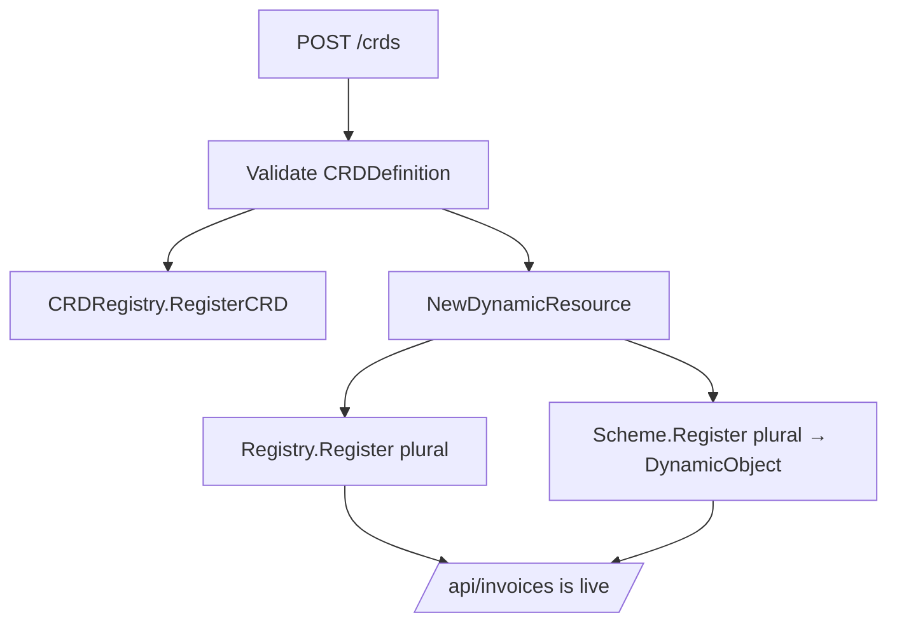

### The CRD registry

### The CRD registry

A `CRDDefinition` describes a new resource type that can be introduced while the
server is running. Instead of defining a Go struct and recompiling the
application, users can provide a resource description containing the information
the server needs to expose the new API.

The CRD registry is responsible for storing these definitions and making them
available to the rest of the system. It acts as the source of truth for
dynamically created resources, allowing the API server to discover what custom
resources exist, route requests correctly, and provide metadata about those
resources.

A `CRDDefinition` contains the core pieces of information required to identify a
resource. The `Group` and `Version` fields determine where the resource exists
in the API hierarchy, while `Kind` describes the object type from the user's
perspective. The `Plural` field is the name used in API paths and commands, such
as `invoices` or `reports`. The optional `Schema` field stores the structure of
the resource, allowing clients and tools to understand which fields are
available.

Before a CRD can be registered, it must pass validation. The `Validate` method
checks that all required identity fields are present. Without a group, version,
kind, or plural name, the server would not know how to expose the resource or
how to route requests to it. Keeping this validation close to the definition
ensures that invalid resource descriptions are rejected before they enter the
registry.

The `FullName` method creates a unique identifier for a CRD by combining its
plural name and group. For example, an `invoices` resource in the `example.io`
group becomes `invoices.example.io`. This format provides a stable name that can
be used when retrieving or removing a CRD.

The `APIPath` method generates the URL path where the resource will be exposed.
For example, a resource with group `example.io`, version `v1`, and plural
`invoices` maps to:

```
/apis/example.io/v1/invoices
```

This follows the same pattern used by many extensible API systems: groups
separate different families of resources, versions allow schemas to evolve over
time, and plural names identify the collection being accessed.

The `CRDRegistry` interface defines the operations required to manage these
definitions. The rest of the server depends only on this interface rather than a
specific implementation. This keeps the design flexible and allows the storage
mechanism to change later without affecting the router or other components.

The registry supports five main operations:

* `RegisterCRD` adds a new resource definition.
* `UnregisterCRD` removes an existing definition.
* `GetCRD` retrieves a CRD using its full name.
* `ListCRDs` returns all registered custom resources.
* `FindByPlural` performs a fast lookup using the resource name used in API paths.

The `SimpleCRDRegistry` implementation uses two maps internally. The first map
stores CRDs by their full name, which provides direct access when a complete
identifier is available. The second map indexes CRDs by plural name, allowing
the router to quickly determine whether a request refers to a custom resource.
In the current implementation, the list operation simply returns the registered
entries that are currently present in the registry; it does not guarantee a
particular ordering.

Because CRDs can be added and removed while requests are being processed, the
registry must be safe for concurrent access. The implementation uses a
`sync.RWMutex` to protect the maps. Read operations such as lookup and listing
use a read lock, allowing multiple requests to inspect the registry at the same
time. Write operations such as registration and removal use an exclusive lock to
prevent inconsistent state.

When a CRD is registered, the registry first validates the definition and then
checks whether a resource with the same full name already exists. Duplicate
registrations are rejected to prevent accidental replacement of an existing
resource definition.

Removing a CRD updates both indexes. The full-name entry is deleted from the
main map, and the plural lookup entry is removed from the secondary index.
Maintaining both maps together ensures that future lookups cannot return stale
resource definitions.

The registry is the foundation for runtime resource creation. Later components
will use it to expose new API endpoints, generate discovery information, and
connect dynamically defined resources to storage. By keeping CRD management
separate from the core router and handlers, the server gains the ability to grow
at runtime without changing the code that handles requests.


**Listing 10.1 — `pkg/api/crd.go`**

```go
package api

import (
	"fmt"
	"sync"
)

// CRDDefinition represents a Custom Resource Definition.
// This is how the API server allows arbitrary new resources to be registered at
// runtime.
type CRDDefinition struct {
	Group   string                 `json:"group"`
	Version string                 `json:"version"`
	Kind    string                 `json:"kind"`
	Plural  string                 `json:"plural"`
	Schema  map[string]interface{} `json:"schema"`
}

// Validate checks if the CRD definition is valid.
func (c *CRDDefinition) Validate() error {
	if c.Group == "" {
		return fmt.Errorf("group is required")
	}
	if c.Version == "" {
		return fmt.Errorf("version is required")
	}
	if c.Kind == "" {
		return fmt.Errorf("kind is required")
	}
	if c.Plural == "" {
		return fmt.Errorf("plural is required")
	}
	return nil
}

// FullName returns "plural.group", e.g. "invoices.example.io".
func (c *CRDDefinition) FullName() string { return fmt.Sprintf("%s.%s", c.Plural, c.Group) }

// APIPath returns "/apis/{group}/{version}/{plural}" for this CRD.
// e.g., /apis/example.io/v1/invoices
func (c *CRDDefinition) APIPath() string {
	return fmt.Sprintf("/apis/%s/%s/%s", c.Group, c.Version, c.Plural)
}

// CRDRegistry manages Custom Resource Definitions.
type CRDRegistry interface {
	// RegisterCRD registers a new CRD.
	RegisterCRD(crd *CRDDefinition) error

	// UnregisterCRD removes a CRD.
	UnregisterCRD(fullName string) error

	// GetCRD retrieves a CRD by its full name.
	GetCRD(fullName string) (*CRDDefinition, bool)

	// ListCRDs returns all registered CRDs.
	ListCRDs() []*CRDDefinition

	// FindByPlural finds a CRD by its plural name.
	FindByPlural(plural string) (*CRDDefinition, bool)
}

// SimpleCRDRegistry implements CRDRegistry.
type SimpleCRDRegistry struct {
	mu    sync.RWMutex
	crds  map[string]*CRDDefinition // fullName -> CRD
	byKey map[string]string         // plural   -> fullName
}

// NewCRDRegistry creates a new CRD registry.
func NewCRDRegistry() CRDRegistry {
	return &SimpleCRDRegistry{
		crds:  make(map[string]*CRDDefinition),
		byKey: make(map[string]string),
	}
}

// RegisterCRD registers a new CRD.
func (r *SimpleCRDRegistry) RegisterCRD(crd *CRDDefinition) error {
	if err := crd.Validate(); err != nil {
		return err
	}
	r.mu.Lock()
	defer r.mu.Unlock()

	fullName := crd.FullName()
	if _, exists := r.crds[fullName]; exists {
		return fmt.Errorf("CRD %q already registered", fullName)
	}
	r.crds[fullName] = crd
	r.byKey[crd.Plural] = fullName
	return nil
}

// UnregisterCRD removes a CRD.
func (r *SimpleCRDRegistry) UnregisterCRD(fullName string) error {
	r.mu.Lock()
	defer r.mu.Unlock()

	crd, exists := r.crds[fullName]
	if !exists {
		return fmt.Errorf("CRD %q not found", fullName)
	}
	delete(r.crds, fullName)
	delete(r.byKey, crd.Plural)
	return nil
}

// GetCRD retrieves a CRD by its full name.
func (r *SimpleCRDRegistry) GetCRD(fullName string) (*CRDDefinition, bool) {
	r.mu.RLock()
	defer r.mu.RUnlock()

	crd, exists := r.crds[fullName]
	return crd, exists
}

// ListCRDs returns all registered CRDs.
func (r *SimpleCRDRegistry) ListCRDs() []*CRDDefinition {
	r.mu.RLock()
	defer r.mu.RUnlock()
	crds := make([]*CRDDefinition, 0, len(r.crds))
	for _, crd := range r.crds {
		crds = append(crds, crd)
	}
	return crds
}

// FindByPlural finds a CRD by its plural name.
func (r *SimpleCRDRegistry) FindByPlural(plural string) (*CRDDefinition, bool) {
	r.mu.RLock()
	defer r.mu.RUnlock()
	fullName, exists := r.byKey[plural]
	if !exists {
		return nil, false
	}
	return r.crds[fullName], true
}
```

### Dynamic objects

A CRD introduces a new resource type without introducing a new Go type. This
creates an important difference from the built-in resources used earlier in the
project. A `User` or `Product` has a concrete struct defined in source code, so
the compiler knows every field that exists. A custom resource does not have that
luxury: its structure is only known after the server reads the CRD definition at
runtime.

To support these resources, the server needs a generic object representation
that can hold arbitrary JSON fields while still behaving like every other API
object. `DynamicObject` provides this bridge. It stores the standard API fields
such as `apiVersion`, `kind`, and `metadata`, while allowing resource-specific
fields to be stored without requiring a predefined struct.

The most important compatibility requirement is the object identifier. The
storage layer and generic handlers expect resources to have an `id` value, but
many API-style resources use the Kubernetes-inspired `metadata.name` convention
instead. `DynamicObject` handles this difference by translating between the two
formats.

When JSON enters the server, the custom `UnmarshalJSON` method checks whether
the object contains a top-level `id` field. If it does, that value is moved into
`metadata.name`. Internally, the object then follows the standard metadata-based
representation. This allows existing clients that send simple objects with an
`id` field to work with dynamically created resources without requiring any
changes.

The reverse happens when the object is returned to a client. The custom
`MarshalJSON` method takes the internal representation and converts it back into
a flat JSON structure. The value stored in `metadata.name` is exposed as the
top-level `id` field, and fields stored inside `spec` and `data` are moved back
into the top-level object. This keeps the external API format consistent with
the built-in resources already supported by the server.

The `GetID` method provides the storage layer with a standard way to retrieve
the object's identifier. Instead of knowing anything about the structure of a
custom resource, storage simply asks the object for its ID. The method validates
that metadata exists, that `metadata.name` is present, and that the value is a
valid non-empty string.

The custom JSON methods are what allow dynamic resources to participate in the
same generic CRUD pipeline as compiled resources. The router does not need
separate logic for CRDs. The storage layer does not need to understand arbitrary
schemas. The generic handlers can continue working because the dynamic object
adapts runtime-defined resources to the interfaces already used by the
framework.

The `DynamicResource` type connects a CRD definition to the existing resource
system. It implements the same `Resource` interface used by built-in resources,
which means the generic router can treat it exactly like users, products, and
orders.

A dynamic resource contains two important pieces of information: the CRD
definition that describes the resource and the storage backend that holds its
objects. The CRD provides metadata such as the resource name, group, version,
and kind. The storage provides the runtime data operations needed by the generic
handlers.

`NewDynamicResource` creates a resource from a CRD definition and assigns it a
memory storage backend. Later chapters can replace or extend this storage
behavior, but the important idea is that the resource lifecycle is identical
whether the type was compiled into the server or created dynamically.

The `Name` method returns the plural resource name from the CRD. This is the
name used by API paths and discovery. For example, a CRD defining an `Invoice`
type with a plural name of `invoices` becomes available through the same generic
endpoints used by built-in resources.

The `NewObject` method creates an empty instance of the dynamic object. It
initializes the API version and kind from the CRD definition and prepares empty
metadata and specification maps. When a client sends a create request, the
generic handler asks the resource for a new object, decodes JSON into it, and
stores it without needing to know anything about the fields inside the resource.

The `CRD` method exposes the original definition so other parts of the system
can inspect the schema and metadata associated with the resource. This will be
used later by discovery endpoints, schema inspection commands, and other runtime
features.

Dynamic objects are the key piece that completes the transition from a server
with configurable resources to a server with runtime-defined resources. The same
routing, storage, discovery, and client code now works for both compiled-in
types and resources that did not exist when the application was built.


**Listing 10.2 — `pkg/api/dynamic.go`**

```go
package api

import (
	"encoding/json"
	"fmt"
)

// DynamicObject represents a generic API-like object.
// It can hold any JSON data without requiring a compiled Go struct.
// This is how the API server stores Custom Resources.
type DynamicObject struct {
	APIVersion string                 `json:"apiVersion"`
	Kind       string                 `json:"kind"`
	Metadata   map[string]interface{} `json:"metadata"`
	Spec       map[string]interface{} `json:"spec"`
	Data       map[string]interface{} `json:"data,omitempty"`
}

// GetID extracts the ID from metadata.name.
func (d *DynamicObject) GetID() (string, error) {
	if d.Metadata == nil {
		return "", fmt.Errorf("metadata is nil")
	}

	name, exists := d.Metadata["name"]
	if !exists {
		return "", fmt.Errorf("metadata.name not found")
	}

	id, ok := name.(string)
	if !ok {
		return "", fmt.Errorf("metadata.name is not a string")
	}

	if id == "" {
		return "", fmt.Errorf("metadata.name is empty")
	}

	return id, nil
}

// UnmarshalJSON implements custom JSON unmarshalling.
// This allows the object to accept flat JSON structures and normalize them.
func (d *DynamicObject) UnmarshalJSON(data []byte) error {
	var raw map[string]interface{}
	if err := json.Unmarshal(data, &raw); err != nil {
		return err
	}

	// If the incoming JSON has an "id" field, move it to metadata.name
	if id, exists := raw["id"]; exists {
		if d.Metadata == nil {
			d.Metadata = make(map[string]interface{})
		}
		d.Metadata["name"] = id
		delete(raw, "id")
	}

	// Preserve apiVersion and kind if present
	if apiVersion, exists := raw["apiVersion"]; exists {
		d.APIVersion = apiVersion.(string)
		delete(raw, "apiVersion")
	}

	if kind, exists := raw["kind"]; exists {
		d.Kind = kind.(string)
		delete(raw, "kind")
	}

	// Everything else goes into spec (or data for backwards compatibility)
	if d.Spec == nil {
		d.Spec = make(map[string]interface{})
	}
	for k, v := range raw {
		if k != "metadata" {
			d.Spec[k] = v
		}
	}

	// Ensure metadata exists
	if d.Metadata == nil {
		d.Metadata = make(map[string]interface{})
	}

	return nil
}


// MarshalJSON implements custom JSON marshalling.
// Returns a flat structure for backwards compatibility.
func (d *DynamicObject) MarshalJSON() ([]byte, error) {
	result := make(map[string]interface{})

	// Add apiVersion and kind if present
	if d.APIVersion != "" {
		result["apiVersion"] = d.APIVersion
	}
	if d.Kind != "" {
		result["kind"] = d.Kind
	}

	// Add id from metadata.name for backwards compatibility
	if d.Metadata != nil {
		if name, exists := d.Metadata["name"]; exists {
			result["id"] = name
		}
	}

	// Add all spec fields at the top level
	if d.Spec != nil {
		for k, v := range d.Spec {
			result[k] = v
		}
	}

	// Add data fields if present
	if d.Data != nil {
		for k, v := range d.Data {
			result[k] = v
		}
	}

	return json.Marshal(result)
}

// DynamicResource is a Resource implementation for CRD-based resources.
// It wraps a CRD definition with in-memory storage and generic object handling.
type DynamicResource struct {
	crd     *CRDDefinition
	storage Storage
}

// NewDynamicResource creates a new dynamic resource for a CRD.
func NewDynamicResource(crd *CRDDefinition) *DynamicResource {
	return &DynamicResource{crd: crd, storage: NewMemoryStorage()}
}

// Name returns the plural name of the resource.
func (r *DynamicResource) Name() string { 
	return r.crd.Plural 
}

// NewObject returns a new DynamicObject.
func (r *DynamicResource) NewObject() any {
	return &DynamicObject{
		APIVersion: fmt.Sprintf("%s/%s", r.crd.Group, r.crd.Version),
		Kind:       r.crd.Kind,
		Metadata:   make(map[string]interface{}),
		Spec:       make(map[string]interface{}),
	}
}

// Storage returns the storage backend.
func (r *DynamicResource) Storage() Storage {
	return r.storage
}

// CRD returns the CRD definition.
func (r *DynamicResource) CRD() *CRDDefinition {
	return r.crd
}
```

Because `DynamicObject` marshals to `{"id": ..., ...spec}`, the storage layer's
`extractID` still finds the `id`, and the CLI table still shows an `ID` column.
The dynamic type slots seamlessly into all the generic machinery.

### CRD routes

Now the router methods that Chapter 5 deferred. `routeCRD` dispatches `/crds`
endpoints; `createCRD` performs the three-way registration.

**Listing 10.3 — `pkg/api/router.go` (CRD handlers)**

```go
// routeCRD dispatches all /crds endpoints.
func (r *Router) routeCRD(w http.ResponseWriter, req *http.Request) {
	path := req.URL.Path
	if path == "/crds" || path == "/crds/" {
		// /crds - list or create		
		switch req.Method {
		case http.MethodGet:
			r.listCRDs(w, req)
		case http.MethodPost:
			r.createCRD(w, req)
		default:
			http.Error(w, "method not allowed", http.StatusMethodNotAllowed)
		}
	} else if strings.HasPrefix(path, "/crds/") {
		// /crds/{name} - delete
		switch req.Method {
		case http.MethodDelete:
			r.deleteCRD(w, req)
		default:
			http.Error(w, "method not allowed", http.StatusMethodNotAllowed)
		}
	} else {
		http.Error(w, "not found", http.StatusNotFound)
	}
}

// createCRD handles POST /crds
func (r *Router) createCRD(w http.ResponseWriter, req *http.Request) {
	body := io.LimitReader(req.Body, 1024*1024)
	defer req.Body.Close()

	var crd CRDDefinition
	if err := json.NewDecoder(body).Decode(&crd); err != nil {
		http.Error(w, fmt.Sprintf("invalid JSON: %v", err), http.StatusBadRequest)
		return
	}

	// Register the CRD
	if err := r.crdRegistry.RegisterCRD(&crd); err != nil {
		http.Error(w, err.Error(), http.StatusBadRequest)
		return
	}

	// Create a dynamic resource for this CRD
	resource := NewDynamicResource(&crd)

	// Register the resource in the main registry
	if err := r.registry.Register(resource); err != nil {
		// Unregister the CRD if resource registration fails
		r.crdRegistry.UnregisterCRD(crd.FullName())
		http.Error(w, err.Error(), http.StatusBadRequest)
		return
	}

	// Register the object factory in the scheme
	plural := crd.Plural
	if err := r.scheme.Register(plural, func() any {
		return &DynamicObject{
			APIVersion: fmt.Sprintf("%s/%s", crd.Group, crd.Version),
			Kind:       crd.Kind,
			Metadata:   make(map[string]interface{}),
			Spec:       make(map[string]interface{}),
		}
	}); err != nil {
		// Unregister on failure
		r.registry.Unregister(plural)
		r.crdRegistry.UnregisterCRD(crd.FullName())
		http.Error(w, err.Error(), http.StatusBadRequest)
		return
	}

	log.Printf("CRD registered: %s", crd.FullName())

	response := map[string]interface{}{
		"message": fmt.Sprintf("CRD %s registered", crd.FullName()),
		"name":    crd.FullName(),
		"path":    crd.APIPath(),
	}

	w.Header().Set("Content-Type", "application/json")
	w.WriteHeader(http.StatusCreated)
	json.NewEncoder(w).Encode(response)
}

// listCRDs handles GET /crds
func (r *Router) listCRDs(w http.ResponseWriter, req *http.Request) {
	if req.Method != http.MethodGet {
		http.Error(w, "method not allowed", http.StatusMethodNotAllowed)
		return
	}

	crds := r.crdRegistry.ListCRDs()
	crdList := make([]map[string]interface{}, 0, len(crds))

	for _, crd := range crds {
		crdList = append(crdList, map[string]interface{}{
			"name":    crd.FullName(),
			"group":   crd.Group,
			"version": crd.Version,
			"kind":    crd.Kind,
			"plural":  crd.Plural,
			"schema":  crd.Schema,
		})
	}

	w.Header().Set("Content-Type", "application/json")
	json.NewEncoder(w).Encode(map[string]interface{}{
		"items": crdList,
		"count": len(crdList),
	})
}

// deleteCRD handles DELETE /crds/{name}
func (r *Router) deleteCRD(w http.ResponseWriter, req *http.Request) {
	if req.Method != http.MethodDelete {
		http.Error(w, "method not allowed", http.StatusMethodNotAllowed)
		return
	}

	path := strings.TrimPrefix(req.URL.Path, "/crds/")
	if path == "" {
		http.Error(w, "not found", http.StatusNotFound)
		return
	}

	crdName := path

	// Get the CRD to find the plural name
	crd, exists := r.crdRegistry.GetCRD(crdName)
	if !exists {
		http.Error(w, fmt.Sprintf("CRD %q not found", crdName), http.StatusNotFound)
		return
	}

	plural := crd.Plural

	// Unregister from all three places to ensure complete cleanup

	// 1. Unregister the resource from Resource Registry
	if err := r.registry.Unregister(plural); err != nil {
		// Log but don't fail - resource might not exist in registry
		log.Printf("Warning: could not unregister resource %q: %v", plural, err)
	}

	// 2. Unregister the type factory from Scheme
	if err := r.scheme.Unregister(plural); err != nil {
		// Log but don't fail - type might not exist in scheme
		log.Printf("Warning: could not unregister type %q: %v", plural, err)
	}

	// 3. Unregister the CRD from CRD Registry
	if err := r.crdRegistry.UnregisterCRD(crdName); err != nil {
		http.Error(w, err.Error(), http.StatusInternalServerError)
		return
	}

	log.Printf("CRD unregistered: %s", crdName)

	response := map[string]interface{}{
		"message": fmt.Sprintf("CRD %s deleted", crdName),
	}

	w.Header().Set("Content-Type", "application/json")
	json.NewEncoder(w).Encode(response)
}
```

### A CRD definition file

A CRD definition is the description of a new resource type. Instead of creating
a Go struct and adding a new resource implementation to the server, users
provide a document that tells the API server what the resource is called, where
it belongs in the API hierarchy, and what fields it supports.

The example below defines an `Invoice` resource. Once this CRD is registered,
the server can create a new API endpoint for invoices and handle invoice objects
through the same generic CRUD handlers used by built-in resources.

The top-level `apiVersion` and `kind` fields describe the document itself. In
this example, the document is a `CustomResourceDefinition` understood by the API
server. The `apiVersion` value identifies the CRD API format being used.

The `metadata.name` field gives the CRD a unique name. By convention, this
combines the resource plural name with the API group. In this case,
`invoices.example.io` identifies the invoice resource within the `example.io`
API group.

The fields inside `spec` describe the resource being created. The `group` field
places the resource into an API group, allowing related resources to be
organized together. The `version` field allows the resource definition to evolve
over time without breaking existing clients. The `kind` field defines the
singular object type, while `plural` defines the collection name used in API
paths.

For this example, the resulting resource identity is:

```
Group:   example.io
Version: v1
Kind:    Invoice
Plural:  invoices
```

This information allows the server to expose the resource through an endpoint
such as:

```
/apis/example.io/v1/invoices
```

The `schema` section describes the fields that can appear on invoice objects.
The schema is intentionally simple in this example, but it demonstrates the core
idea: the server can understand the shape of a resource without having a
compiled Go type.

The repository example in `examples/invoice-crd.yaml` also includes a `date`
field and a small enum for `status`, which matches the checked-in sample data
and makes the example closer to the implementation used in the project.
The `customer`, `amount`, `date`, and `status` fields describe the business data
stored inside the invoice. The schema can provide additional metadata such as
field descriptions, which can later be used by tools such as the CLI `explain`
command to help users understand available fields.

After the CRD has been registered, clients can create objects of this new type.
The sample invoice object demonstrates how a dynamically created resource looks
when sent to the API server.

Unlike the CRD itself, the object represents an actual instance of the resource.
The `kind` field identifies the object type, while the `id` field provides the
unique identifier used by the generic storage layer. The remaining fields
contain the invoice data.

The important detail is that this object does not require a Go struct named
`Invoice`. The server receives the JSON, creates a `DynamicObject`, and stores
the fields generically. The same create, list, get, update, and delete
operations already used by built-in resources can now operate on invoices.

This example shows the complete lifecycle of a runtime-defined resource:

1. A user creates a CRD describing the new resource type.
2. The server registers the definition in the CRD registry.
3. A dynamic resource is created from that definition.
4. The resource becomes visible through discovery.
5. Clients can create and manage objects using the normal API endpoints.

The result is a server that can grow beyond the resources included in its
original source code. New concepts can be introduced through data alone, while
the existing API infrastructure continues to handle them automatically.

**Listing 10.4 — `examples/invoice-crd.yaml`**

```yaml
apiVersion: api.example.io/v1
kind: CustomResourceDefinition
metadata:
  name: invoices.example.io
spec:
  group: example.io
  version: v1
  kind: Invoice
  plural: invoices
  schema:
    properties:
      id:
        type: string
        description: Unique invoice identifier
      customer:
        type: string
        description: Customer name
      amount:
        type: number
        description: Invoice amount in USD
      date:
        type: string
        description: Invoice date (ISO 8601 format)
      status:
        type: string
        enum:
          - draft
          - sent
          - paid
          - overdue
        description: Current invoice status
```

And a sample object:

**Listing 10.5 — `examples/invoice-1.json`**

```json
{
  "kind": "Invoice",
  "id": "inv-001",
  "customer": "Acme Corp",
  "amount": 5000.00,
  "date": "2025-07-15",
  "status": "sent"
}
```

### Checkpoint

With the server running:

```bash
./apictl api-resources           # orders, products, users
./apictl apply -f examples/invoice-crd.yaml

# CRD applied: invoices.example.io
./apictl api-resources           # invoices now appears!
./apictl create -f examples/invoice-1.json
./apictl get invoices
# ID       AMOUNT  CUSTOMER    DATE        STATUS
# inv-001  5000    Acme Corp   2025-07-15  sent

./apictl delete crd invoices.example.io
./apictl api-resources           # invoices is gone again
```

A brand-new resource appeared and disappeared without touching a line of server
code. 

---

## Chapter 11: API Discovery

### Goal

Add Kubernetes-style discovery beyond `/api`: list API *groups* and the
resources within a group and version. This is what lets clients understand the
whole surface, including CRDs.

The original `/api` endpoint introduced earlier provides a simple view of the
server by returning the names of available resources. This is enough for basic
clients, but it does not describe where those resources belong or how they are
versioned.

As the server becomes more extensible, a flat resource list is no longer
sufficient. Built-in resources, custom resources, and future extensions may come
from different API groups and versions. Clients need a way to discover the
complete API structure before they attempt to interact with resources.

This chapter adds a second level of discovery through the `/apis` hierarchy.
Instead of only asking "what resources exist?", clients can now ask "what API
groups exist?" and "what resources belong to a particular group and version?"

This discovery model follows the same idea used by Kubernetes-style APIs: the
API surface is organized into groups, versions, and resources. A client can
begin with no knowledge of the server, walk the discovery endpoints, and learn
exactly what operations and resource types are available.

The discovery system is especially important for CRDs. Since custom resources
are created dynamically, the server cannot know their names when it is compiled.
Discovery provides the bridge between runtime extensibility and client
usability. Once a user registers a new CRD, clients can discover it through the
same endpoints used for built-in resources.

### Discovery handlers

These handlers complete the discovery routes registered earlier in the router
setup. The router itself remains unchanged as resources are added or removed;
instead, these methods inspect the live registries whenever a discovery request
arrives.

The `discoverAPIs` method handles `GET /apis`. Its purpose is to return the list
of API groups currently available on the server.

The method first validates that the request uses the GET method. Discovery
endpoints are read-only, so other HTTP methods are rejected.

It then collects group names from two sources. Built-in resources are placed
into the default `api.example.io` group, while dynamically created resources
contribute their own groups from their CRD definitions. A map is used while
collecting groups so duplicate entries are automatically removed. In the current
implementation, the built-in resources are represented by the default group and
CRDs add any additional groups from the registry.

For example, a server containing the built-in users resource and an invoice CRD
might return groups such as:

```text
api.example.io
example.io
```

The important detail is that the result is generated dynamically. If a new CRD
is registered while the server is running, the next discovery request
automatically includes its API group.

The `discoverAPIPath` method handles more detailed discovery requests under
`/apis`. It supports paths representing either an API group or a specific group
and version.

For example:

```text
GET /apis/example.io
```

asks for information about the `example.io` group.

A more specific request:

```text
GET /apis/example.io/v1
```

asks for resources available in version `v1` of that group.

The method parses the request path, extracts the group and optional version, and
then searches the CRD registry for matching resources. Each matching CRD
contributes a resource description containing its plural name, kind, and
version.

The response gives clients enough information to understand what resources exist
inside that part of the API hierarchy. A client does not need to know that
invoices, reports, or any other custom resources were created after the server
started. It can discover them by querying the API.

The `listPlugins` method is included as a placeholder for future extension.
Plugins will be introduced later, but the route is registered now so the API
structure is ready for that feature.

At this stage, the endpoint returns an empty plugin list with a consistent
response shape. Future chapters will connect this endpoint to the plugin loader
so clients can discover installed extensions in the same way they discover
resources.

Together, these discovery handlers complete the transition from a server with
known resources to a server that can describe itself. Clients no longer need
hard-coded knowledge about available APIs. They can query discovery endpoints,
learn the current API surface, and interact with resources that may not have
existed when the client was written.


**Listing 11.1 — `pkg/api/router.go` (discovery + plugins stub)**

```go
// discoverAPIs handles GET /apis
// Returns all API groups
func (r *Router) discoverAPIs(w http.ResponseWriter, req *http.Request) {
	if req.Method != http.MethodGet {
		http.Error(w, "method not allowed", http.StatusMethodNotAllowed)
		return
	}

	// Collect unique groups from built-in and CRD resources
	groups := make(map[string]bool)

	// Add built-in resources to a default group
	if len(r.registry.List()) > 0 {
		groups["api.example.io"] = true
	}

	// Add CRD groups
	for _, crd := range r.crdRegistry.ListCRDs() {
		groups[crd.Group] = true
	}

	groupList := make([]string, 0, len(groups))
	for g := range groups {
		groupList = append(groupList, g)
	}

	w.Header().Set("Content-Type", "application/json")
	json.NewEncoder(w).Encode(map[string]interface{}{
		"groups":    groupList,
		"timestamp": time.Now().UTC().Format(time.RFC3339),
	})
}

// discoverAPIPath handles GET /apis/{group} and /apis/{group}/{version}
func (r *Router) discoverAPIPath(w http.ResponseWriter, req *http.Request) {
	if req.Method != http.MethodGet {
		http.Error(w, "method not allowed", http.StatusMethodNotAllowed)
		return
	}

	path := strings.TrimPrefix(req.URL.Path, "/apis/")
	parts := strings.Split(strings.Trim(path, "/"), "/")

	if len(parts) == 0 || parts[0] == "" {
		http.Error(w, "not found", http.StatusNotFound)
		return
	}

	group := parts[0]
	version := ""
	if len(parts) > 1 {
		version = parts[1]
	}

	// Filter CRDs by group and version
	resources := make([]map[string]interface{}, 0)
	for _, crd := range r.crdRegistry.ListCRDs() {
		if crd.Group == group && (version == "" || crd.Version == version) {
			resources = append(resources, map[string]interface{}{
				"name":    crd.Plural,
				"kind":    crd.Kind,
				"version": crd.Version,
			})
		}
	}

	w.Header().Set("Content-Type", "application/json")
	json.NewEncoder(w).Encode(map[string]interface{}{
		"group":     group,
		"version":   version,
		"resources": resources,
	})
}

// listPlugins handles GET /plugins
// Returns information about loaded plugins (framework endpoint for future enhancement)
func (r *Router) listPlugins(w http.ResponseWriter, req *http.Request) {
	if req.Method != http.MethodGet {
		http.Error(w, "method not allowed", http.StatusMethodNotAllowed)
		return
	}

	// For now, return a simple response structure
	// In the future, this will be connected to the plugin loader
	w.Header().Set("Content-Type", "application/json")
	json.NewEncoder(w).Encode(map[string]interface{}{
		"plugins": []interface{}{},
		"count":   0,
	})
}
```

To make the discovery API present a complete picture of the server, the built-in
resources can also be described through the same CRD metadata system used for
dynamically created resources. This does not make the built-in resources dynamic
— they are still compiled Go types registered through `RegisterResource` — but
it gives clients a consistent way to discover their shape.

Without these definitions, `/api` will still list the built-in resources because
they exist in the normal resource registry. However, the richer discovery
endpoints introduced in this chapter need additional metadata to describe things
such as the API group, version, kind, and schema. Registering CRD-style
descriptions for built-ins bridges that gap and allows tools such as `apictl
explain` to display useful information for both built-in and runtime-created
resources.

The registration is intentionally lightweight. The schema is only descriptive
metadata; it is not replacing Go structs, changing storage behavior, or altering
how requests are handled. The existing `User`, `Product`, and `Order` resources
continue to use their normal typed implementations. The CRD registry simply
provides a discovery document that says, "this resource exists, this is its
kind, and these are the fields clients can expect."

For example, after registering the users resource, `main()` can add a discovery
definition like this:

```go
userCRD := &api.CRDDefinition{
	Group:   "api.example.io",
	Version: "v1",
	Kind:    "User",
	Plural:  "users",
	Schema: map[string]interface{}{
		"properties": map[string]interface{}{
			"id": map[string]interface{}{
				"type": "string",
			},
			"name": map[string]interface{}{
				"type": "string",
			},
			"email": map[string]interface{}{
				"type": "string",
			},
			"is_active": map[string]interface{}{
				"type": "boolean",
			},
		},
	},
}

_ = server.CRDRegistry().RegisterCRD(userCRD)
```

The same pattern can be repeated for `Product` and `Order`. Once registered,
discovery clients can treat these resources exactly like CRD-created resources:
they can identify the API group, determine the available versions, inspect the
schema, and present useful help information without needing special knowledge of
the server's built-in types.

This is an important architectural step. The server now has two complementary
registration paths: compiled resources provide behavior, storage, and request
handling, while discovery definitions provide a common description layer.
Keeping these responsibilities separate is what allows the API surface to grow
dynamically while preserving the simplicity of the original framework.


### Checkpoint

```bash
curl -s http://localhost:8080/apis
# {"groups":["api.example.io"],"timestamp":"..."}

./apictl apply -f examples/invoice-crd.yaml
curl -s http://localhost:8080/apis
# {"groups":["api.example.io","example.io"],...}

curl -s http://localhost:8080/apis/example.io
# {"group":"example.io","version":"","resources":[{"name":"invoices",...}]}
```

Clients can now discover groups and versions, not just flat names.

---

## Chapter 12: Go Plugins

### Goal

Add a second extension path: compiled Go plugins (`.so`) that register resources
when dropped into a watched directory — no restart. This uses Go's `plugin`
package (Linux / macOS only).

**Figure 12.1 — Plugin loading**

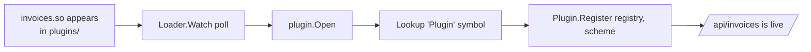

### The Plugin interface

The plugin system needs a stable contract between the core API server and any
external extensions that are loaded at runtime. The server should not need to
know what a plugin provides, which resources it creates, or which types it
introduces. Instead, it only needs to know that the plugin follows a common
interface.

The `Plugin` interface defines this contract. A plugin is responsible for
describing itself, registering the resources and types it contributes, and
cleaning up those registrations when it is removed. This keeps the plugin
mechanism independent from the rest of the server architecture: the core
framework manages loading and lifecycle, while the plugin owns the details of
the functionality it adds.

The most important method is `Register`. When a plugin is loaded, the plugin
manager provides access to the server's existing `Registry` and `Scheme`. The
plugin uses these objects in exactly the same way that built-in resources are
registered during startup. It can add new resources, associate resource names
with concrete Go types, and extend the API without requiring any changes to the
main server code.

This follows the same design principle used throughout the project: the API
server should depend on abstractions rather than concrete implementations. A
plugin does not modify routing logic, create custom handlers, or patch the
server. It simply contributes new resources to the registries that the generic
API layer already understands.

The `Unregister` method provides the reverse operation. When a plugin is
unloaded, it removes the resources it previously added. This is important
because plugins are not permanent additions to the binary; they represent
optional capabilities that can appear and disappear during the server's
lifetime. Removing a plugin should leave the server in a clean state, with no
stale resource registrations pointing to code that is no longer available.

A typical plugin therefore follows a simple lifecycle:

1. The server starts and initializes its registries.
2. The plugin manager loads a plugin package.
3. The plugin manager discovers the exported `Plugin` implementation.
4. The server calls `Register(...)`.
5. The plugin adds resources and types.
6. The generic router immediately begins serving the new resources.
7. If the plugin is removed later, `Unregister(...)` removes its contributions.

The interface intentionally does not expose the `Router`. Plugins do not add
routes directly because doing so would break the dynamic design. Every resource
should flow through the same discovery, CRUD, middleware, and authorization
paths provided by the framework. By limiting plugins to registry and scheme
operations, newly added capabilities automatically inherit the behavior of the
existing API server.

**Listing 12.1 — `pkg/plugins/interface.go`**

```go
// Package plugins provides a plugin loading system for dynamic API extensibility.
package plugins

import (
	"github.com/pergus/api-server/pkg/api"
)

// Plugin defines the interface that all plugins must implement.
//
// Each plugin is a separate Go package that exports a Plugin symbol.
// When the plugin loads, the plugin manager calls Register() to add the plugin's
// resources and types to the API server.
type Plugin interface {
	// Name returns the plugin name.
	Name() string

	// Register adds the plugin's resources to the server.
	// Called when the plugin is loaded.
	// The plugin receives the registry and scheme so it can register itself.
	Register(registry api.Registry, scheme api.Scheme) error

	// Unregister removes the plugin's resources from the server.
	// Called when the plugin is unloaded.
	Unregister(registry api.Registry) error
}
```

This interface is deliberately small. A plugin only needs three pieces of
information: its identity, how to install its functionality, and how to remove
it. Everything else — HTTP routing, serialization, discovery, storage access,
and client compatibility — is provided automatically by the framework.

As a result, adding a plugin is equivalent to adding another set of resources to
the server's existing dynamic ecosystem. The same generic machinery that powers
built-in resources and CRDs can now also power independently developed
extensions.


### The loader

The plugin interface defines what a plugin must provide, but the loader is the
component that turns that contract into a running system. Its responsibility is
to discover plugin files, open them, verify that they implement the expected
interface, activate them, and keep track of their lifecycle.

Go plugins are compiled separately as shared object files (`.so`). Unlike
statically linked resources, these extensions do not need to be known when the
API server binary is built. The loader can discover new plugin files after
startup and integrate them into the running server. This is the mechanism that
allows the API surface to grow without requiring a restart or a rebuild.

The loader is intentionally separate from the server itself. The server owns the
registries and the HTTP lifecycle, while the loader only manages extensions that
contribute to those registries. This separation keeps the core API server
independent from the plugin implementation details.

The loading process follows a small number of steps:

1. The loader receives the path to a plugin shared object.
2. It opens the file using Go's `plugin` package.
3. It looks for an exported symbol named `Plugin`.
4. It verifies that the symbol implements the `Plugin` interface.
5. It calls `Register(...)` so the plugin can add its resources and types.
6. It stores metadata about the loaded plugin for later inspection or removal.

The exported `Plugin` symbol is the bridge between the compiled plugin and the
server. A plugin package typically exposes a variable containing its
implementation:

```go
var Plugin plugins.Plugin = &MyPlugin{}
```

When the loader calls `Lookup("Plugin")`, it retrieves that value without
knowing anything about the plugin's internal code. This is the same pattern used
throughout the framework: behavior is discovered through interfaces rather than
hard-coded dependencies.

The loader also maintains a record of loaded plugins. The `LoadedPlugin`
structure stores the plugin instance, its file path, load timestamp, and the
underlying Go plugin handle. Keeping this information makes it possible to
expose plugin status through future API endpoints, provide operational
visibility, and support administrative tooling such as `apictl plugins`.
The repository implementation currently exposes this state through the loader's
`ListLoaded()` and `LoadedCount()` helpers.

The registry map is protected by a mutex because plugin operations can occur
concurrently with normal API activity. For example, a plugin may be loaded while
requests are being served, so access to the loaded plugin collection must be
synchronized.

The directory watcher provides a simple runtime discovery mechanism. Instead of
requiring an administrator to manually call a load operation, the loader
periodically scans a configured directory for new `.so` files. When it finds a
file that has not been seen before, it attempts to load it automatically.

The watcher uses polling rather than filesystem notifications because it keeps
the implementation portable and easy to understand. A production system could
replace this with platform-specific file watching, but the lifecycle remains the
same: detect a new extension, validate it, register it, and make it available.

Unloading is intentionally more limited than loading. Go's native plugin system
does not support unloading shared objects from memory after they have been
opened. The framework therefore treats unloading as a logical operation: it
removes the plugin's registered resources from the API registry by calling
`Unregister(...)`. The code remains loaded inside the process, but the API
server no longer exposes the plugin's functionality.

This distinction is important when designing plugin systems in Go. Loading a
plugin is a true runtime extension; unloading is a cleanup operation that
removes its effects. For many server-side extensions this behavior is
sufficient, because plugins are usually added for the lifetime of the process.

The resulting lifecycle looks like this:

1. The server starts and creates its registries.
2. The loader begins watching the plugin directory.
3. A new `.so` file appears.
4. The loader opens the plugin and finds the exported symbol.
5. The plugin registers resources and types.
6. Discovery immediately exposes the new API surface.
7. Clients can use the new resources through the existing generic endpoints.
8. Removing the plugin unregisters those resources.

The important architectural result is that plugins do not create a second API
mechanism. They participate in the same dynamic resource system used by built-in
resources and CRDs. A plugin-added resource automatically receives the existing
routing, CRUD handling, discovery support, and client compatibility because it
enters the system through the same registries as everything else.

**Listing 12.2 — `pkg/plugins/loader.go`**

```go
package plugins

import (
	"fmt"
	"log"
	"os"
	"path/filepath"
	"plugin"
	"sync"
	"time"

	"github.com/pergus/api-server/pkg/api"
)

// Loader manages plugin loading and lifecycle.
//
// The Loader:
// - Watches a directory for new .so files
// - Loads plugins dynamically
// - Tracks loaded plugins
// - Handles plugin unloading
//
// This demonstrates runtime extensibility without server restart.
type Loader struct {
	pluginDir string
	registry  api.Registry
	scheme    api.Scheme
	mu        sync.RWMutex
	loaded    map[string]*LoadedPlugin
	stopChan  chan struct{}
}

// LoadedPlugin tracks a loaded plugin.
type LoadedPlugin struct {
	Plugin  Plugin
	Path    string
	Loaded  time.Time
	Handle  *plugin.Plugin
}

// NewLoader creates a plugin loader.
func NewLoader(pluginDir string, registry api.Registry, scheme api.Scheme) *Loader {
	return &Loader{
		pluginDir: pluginDir,
		registry:  registry,
		scheme:    scheme,
		loaded:    make(map[string]*LoadedPlugin),
		stopChan:  make(chan struct{}),
	}
}

// LoadPlugin loads a single plugin from a file.
// Returns error if the plugin is invalid.
func (l *Loader) LoadPlugin(path string) error {
	log.Printf("Loading plugin from %s", path)

	// Open the plugin
	handle, err := plugin.Open(path)
	if err != nil {
		return fmt.Errorf("failed to open plugin: %w", err)
	}

	// Look for a Plugin symbol
	pluginSym, err := handle.Lookup("Plugin")
	if err != nil {
		return fmt.Errorf("plugin missing Plugin symbol: %w", err)
	}

	// Assert it's a Plugin
	p, ok := pluginSym.(Plugin)
	if !ok {
		return fmt.Errorf("Plugin symbol is not of type Plugin")
	}

	// Register the plugin
	if err := p.Register(l.registry, l.scheme); err != nil {
		return fmt.Errorf("plugin registration failed: %w", err)
	}

	// Track the loaded plugin
	l.mu.Lock()
	l.loaded[p.Name()] = &LoadedPlugin{
		Plugin: p,
		Path:   path,
		Loaded: time.Now(),
		Handle: handle,
	}
	l.mu.Unlock()

	log.Printf("Successfully loaded plugin: %s", p.Name())
	return nil
}

// UnloadPlugin unloads a plugin by name.
// This removes its resources from the registry.
func (l *Loader) UnloadPlugin(name string) error {
	l.mu.Lock()
	loaded, exists := l.loaded[name]
	if !exists {
		l.mu.Unlock()
		return fmt.Errorf("plugin %q not loaded", name)
	}
	delete(l.loaded, name)
	l.mu.Unlock()

	// Call the plugin's Unregister
	return loaded.Plugin.Unregister(l.registry)
}

// Watch polls the plugin directory for new plugins.
// Runs in a goroutine and watches for changes.
// Call Stop() to stop watching.
func (l *Loader) Watch(interval time.Duration) {
	go func() {
		ticker := time.NewTicker(interval)
		defer ticker.Stop()

		lastSeen := make(map[string]bool)

		for {
			select {
			case <-l.stopChan:
				log.Println("Stopping plugin watcher")
				return
			case <-ticker.C:
				l.scanPlugins(lastSeen)
			}
		}
	}()
}

// scanPlugins looks for new .so files in the plugin directory.
func (l *Loader) scanPlugins(lastSeen map[string]bool) {
	// Check if directory exists
	_, err := os.Stat(l.pluginDir)
	if os.IsNotExist(err) {
		return
	}
	if err != nil {
		log.Printf("Error checking plugin directory: %v", err)
		return
	}

	// List files in the directory
	entries, err := os.ReadDir(l.pluginDir)
	if err != nil {
		log.Printf("Error reading plugin directory: %v", err)
		return
	}

	currentSeen := make(map[string]bool)

	for _, entry := range entries {
		if entry.IsDir() {
			continue
		}

		if filepath.Ext(entry.Name()) != ".so" {
			continue
		}

		path := filepath.Join(l.pluginDir, entry.Name())
		currentSeen[path] = true

		// If we haven't seen this file before, load it
		if !lastSeen[path] {
			if err := l.LoadPlugin(path); err != nil {
				log.Printf("Failed to load plugin %s: %v", path, err)
			}
		}
	}

	// Update lastSeen
	for path := range currentSeen {
		lastSeen[path] = true
	}
}

// Stop stops the plugin watcher.
func (l *Loader) Stop() {
	close(l.stopChan)
}

// ListLoaded returns all loaded plugins.
func (l *Loader) ListLoaded() []LoadedPlugin {
	l.mu.RLock()
	defer l.mu.RUnlock()

	plugins := make([]LoadedPlugin, 0, len(l.loaded))
	for _, p := range l.loaded {
		plugins = append(plugins, *p)
	}
	return plugins
}

// LoadedCount returns the number of loaded plugins.
func (l *Loader) LoadedCount() int {
	l.mu.RLock()
	defer l.mu.RUnlock()
	return len(l.loaded)
}


```

The loader completes the extension model introduced in previous chapters.
Resources can now enter the server through three different paths: built-in
registrations compiled into the application, CRDs created dynamically through
the API, and external plugins loaded at runtime. All three paths converge on the
same registry-driven architecture, which is what allows the server to remain
generic while its capabilities continue to expand.


### An example plugin

The plugin system becomes much clearer when looking at a complete example. A
plugin is not a special type of application and does not need to know about HTTP
routing, request handling, or discovery internals. It is simply another provider
of resources and types.

The only requirement is that the plugin is compiled as a Go `package main` and
exports a variable named `Plugin`. This exported symbol is the entry point
discovered by the loader. When the loader opens the compiled `.so` file, it
searches for this exact symbol, verifies that it implements the `plugins.Plugin`
interface, and then calls its lifecycle methods.

In this example, the plugin adds a new `Invoice` resource. From the server's
perspective, this resource is indistinguishable from one compiled directly into
the application. It has a resource name, creates objects, provides storage, and
registers a type factory. The difference is only where the code came from:
instead of being imported by `main.go`, it arrived through a dynamically loaded
extension.

The plugin defines its own resource type:

```go
type Invoice struct {
	ID         string  `json:"id"`
	CustomerID string  `json:"customer_id"`
	Amount     float64 `json:"amount"`
	Status     string  `json:"status"`
}
```

This type belongs entirely to the plugin. The core API server does not need to
import it or understand its fields. The generic API layer only interacts with it
through the `Resource` interface and the registered factory function. This is
the same abstraction that allows CRDs and built-in resources to share the same
CRUD handlers.

The `InvoiceResource` wrapper connects the concrete Go type to the framework. It
provides the resource name (`invoices`), creates empty objects when requests
need a new instance, and supplies the storage backend. In this example, the
plugin uses the same in-memory storage implementation used by the built-in
resources.

The plugin's `Register` method performs the integration step. When the loader
activates the plugin, it gives the plugin access to the server's `Registry` and
`Scheme`. The plugin then performs the same registration operations that
normally happen during server startup:

1. Register the resource so `/api/invoices` becomes available.
2. Register the type factory so the generic handlers can create `Invoice` objects.
3. Return success so the loader can record that the plugin is active.

After registration completes, no router changes are required. The existing
generic routes automatically discover the new resource through the registry. A
client can immediately run commands such as:

```bash
apictl api-resources
apictl get invoices
apictl create -f invoice.json
```

The plugin does not add endpoints manually. Instead, it contributes data and
behavior to the dynamic resource system that already exists.

The `Unregister` method provides the cleanup path. When the plugin is removed,
it removes the invoice resource from the registry. Because routing and discovery
are registry-driven, the API surface updates automatically and clients will no
longer see `invoices` as an available resource.

The final variable is the most important part of the plugin:

```go
var Plugin plugins.Plugin = &InvoicePlugin{
	resource: NewInvoiceResource(),
}
```

The name `Plugin` is not arbitrary. It is the well-known symbol that the loader
searches for with `Lookup("Plugin")`. Without this exported variable, the loader
can open the shared object but has no way to discover the plugin implementation.

This design keeps plugins small and predictable. A plugin author does not need
to understand the internals of the API server. They only need to implement the
resource abstraction and the plugin lifecycle. Once loaded, their resource
automatically receives the same discovery, CRUD handling, middleware, and client
support as every other resource in the system.

**Listing 12.3 — `plugins/invoices/main.go`**

```go
package main

import (
	"log"

	"github.com/pergus/api-server/pkg/api"
	"github.com/pergus/api-server/pkg/plugins"
)

// Invoice is the resource type defined by this plugin.
type Invoice struct {
	ID         string  `json:"id"`
	CustomerID string  `json:"customer_id"`
	Amount     float64 `json:"amount"`
	Status     string  `json:"status"`
}

// InvoiceResource implements api.Resource.
type InvoiceResource struct {
	storage api.Storage
}

// NewInvoiceResource creates a new invoice resource.
func NewInvoiceResource() *InvoiceResource {
	return &InvoiceResource{
		storage: api.NewMemoryStorage(),
	}
}

// Name returns "invoices".
func (r *InvoiceResource) Name() string {
	return "invoices"
}

// NewObject returns an empty Invoice.
func (r *InvoiceResource) NewObject() any {
	return &Invoice{}
}

// Storage returns the storage implementation.
func (r *InvoiceResource) Storage() api.Storage {
	return r.storage
}

// InvoicePlugin implements the plugins.Plugin interface.
type InvoicePlugin struct {
	resource *InvoiceResource
}

// Name returns the plugin name.
func (p *InvoicePlugin) Name() string {
	return "invoices"
}

// Register adds the invoice resource to the server.
func (p *InvoicePlugin) Register(registry api.Registry, scheme api.Scheme) error {
	log.Println("[InvoicePlugin] Registering invoice resource and type")

	// Register the resource
	if err := registry.Register(p.resource); err != nil {
		return err
	}

	// Register the type factory
	if err := scheme.Register("invoices", func() any { return &Invoice{} }); err != nil {
		return err
	}

	log.Println("[InvoicePlugin] Successfully registered invoices")
	return nil
}

// Unregister removes the invoice resource from the server.
func (p *InvoicePlugin) Unregister(registry api.Registry) error {
	log.Println("[InvoicePlugin] Unregistering invoice resource")
	return registry.Unregister("invoices")
}

// Plugin is the symbol that the plugin loader looks for.
// It must be exported and of type plugins.Plugin.
var Plugin plugins.Plugin = &InvoicePlugin{
	resource: NewInvoiceResource(),
}

```

This example demonstrates the final goal of the architecture: the API server no
longer has a fixed list of resources. Resources can come from the application
itself, from user-defined CRDs, or from separately compiled plugins. The
framework provides the common machinery, while extensions provide only the
pieces that are unique to them. 

**Listing 12.4 — `plugins/build.sh`**

```bash
#!/bin/bash

# Build script for plugins
# This builds all plugins in the plugins/ directory as .so files

set -e

echo "Building plugins..."

# Build invoices plugin
echo "Building invoices plugin..."
go build -buildmode=plugin -o invoices/invoices.so ./invoices/main.go

echo "All plugins built successfully!"
echo ""
echo "To use plugins:"
echo "1. Copy .so files to the plugins/ directory while the server is running"
echo "2. The server will automatically load them"
echo ""
echo "Example:"
echo "  cp invoices/invoices.so ../plugins/"
```


### Wiring the loader into `main()`

The plugin loader is a separate subsystem, so the server entrypoint is
responsible for creating it and connecting it to the existing API registries.
This is the point where the dynamic extension system becomes part of the running
application.

The loader needs two things from the server:

* The `Registry`, where plugins register their resources.
* The `Scheme`, where plugins register their object factories.

By passing these dependencies into the loader, plugins do not need direct access
to the `Server` object itself. They receive only the interfaces required to
extend the API. This keeps the plugin boundary clean and prevents extensions
from depending on server internals.

The loader should be initialized after the built-in resources have been
registered. This ordering is important because it gives the application a
predictable startup sequence:

1. Create the server.
2. Register built-in resources and types.
3. Create the plugin loader.
4. Load any plugins that already exist on disk.
5. Begin watching for newly added plugins.
6. Start serving HTTP requests.

Existing plugins are loaded immediately during startup so that the API is fully
populated before clients begin discovering resources. For example, if an invoice
plugin already exists in the plugins directory, the first `/api` discovery
request should include `invoices` rather than requiring an administrator to wait
for the polling interval.

The loader then begins watching the directory for changes. The watcher
periodically scans for new `.so` files and loads them automatically. This means
an administrator can add a new extension while the server is running, and the
new resources will become available without restarting the process.

The startup code is added after built-in registration and before
`server.Start()`:


**Listing 12.5 — `cmd/api-server/main.go` (plugin additions)**
```go
	// Create the plugin loader watching ./plugins for .so files.
	log.Println("Starting plugin system...")
	loader := plugins.NewLoader("./plugins", server.Registry(), server.Scheme())

	// Load any plugins already present.
	if entries, err := os.ReadDir("./plugins"); err == nil {
		for _, entry := range entries {
			if !entry.IsDir() && len(entry.Name()) > 3 && entry.Name()[len(entry.Name())-3:] == ".so" {
				if err := loader.LoadPlugin("./plugins/" + entry.Name()); err != nil {
					log.Printf("Warning: failed to load %s: %v", entry.Name(), err)
				}
			}
		}
	}

	// Poll for new plugins every 2 seconds.
	loader.Watch(2 * time.Second)
```

The initial directory scan and the background watcher serve different purposes.
The scan handles plugins that were already installed before the server started.
The watcher handles plugins added later while the server is running. Together
they provide both startup discovery and runtime extensibility. 

The loader also has a lifecycle of its own, so it should be stopped when the
server shuts down. During graceful shutdown, call:

```go
loader.Stop()
```

before the process exits. This closes the watcher's stop channel and allows the
background goroutine to terminate cleanly.

The final `main()` lifecycle now looks like this:

1. Initialize the server.
2. Register built-in resources.
3. Initialize the plugin system.
4. Load installed plugins.
5. Watch for new plugins.
6. Start the HTTP server.
7. Wait for a shutdown signal.
8. Stop the plugin watcher.
9. Gracefully shut down the HTTP server.

This keeps the plugin system aligned with the rest of the application lifecycle.
Plugins are not a separate service or a special execution path; they are another
source of resources that participate in the same registry-driven API model.

Remember to add the plugin package import:

```go
import (
	"github.com/pergus/api-server/pkg/plugins"
)
```

After this change, dropping a compiled plugin into `./plugins` is enough to
extend the running API server. No route changes, client updates, or server
rebuilds are required. The discovery system introduced in earlier chapters will
automatically expose the new resource once the plugin registers it.


### Checkpoint

```bash
cd plugins && chmod +x build.sh && ./build.sh && cd ..
# start the server, then in another terminal:
cp plugins/invoices/invoices.so plugins/
# within ~2 seconds the server logs: Successfully loaded plugin: invoices
./apictl api-resources    # invoices appears
./apictl create -f examples/invoice-1.json
./apictl get invoices
```

Two independent runtime-extension mechanisms now coexist: declarative CRDs and
compiled plugins.

---

# Part V — Event-Driven Architecture

The final major capability turns the server from a passive store into a reactive
platform. Every change becomes an event; clients can stream events, and
controllers can act on them.

## Chapter 13: Events and the Event Bus

### Goal

The API server has now reached the point where resources can be created
dynamically, discovered at runtime, and extended through plugins. The next
capability needed is a way for the rest of the system to react when something
changes.


Until this chapter, requests have been handled as isolated operations. A client
sends a request, the router calls storage, and the response is returned. That
model works well for basic CRUD, but it limits what the platform can do. A watch
client cannot know when an object changes unless it repeatedly polls the API. A
controller cannot react immediately when it needs to reconcile state. Plugins
cannot observe resource activity without tightly coupling themselves to request
handlers.

An event system solves this by introducing a notification layer between storage
operations and consumers.

The design goal is a simple publish/subscribe model:

* Storage publishes an event when an object changes.
* Subscribers receive events for the resources they care about.
* HTTP watch clients consume events as streams.
* Controllers use events to trigger reconciliation.
* Plugins can observe changes without modifying core server code.

The important architectural choice is that storage does not know who is
listening. It only announces that something happened. The event bus becomes the
intermediary that distributes those notifications to any interested consumers.

The flow looks like this:

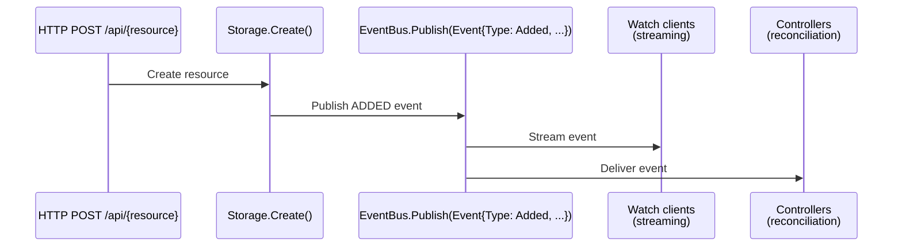

This keeps the API layer loosely coupled. A create request does not need to know
whether there are ten watch clients, zero clients, or several background
controllers. It simply performs the write operation, and the event system
handles distribution.

The event model introduced here is intentionally small. It captures the three
fundamental lifecycle changes that occur in a resource-oriented API: 

* `ADDED`: a new object was created.
* `MODIFIED`: an existing object changed.
* `DELETED`: an object was removed.

These events are sufficient to build higher-level functionality later. A watch
API can stream them directly to clients, while controllers can use them as
signals that reconciliation work may be required.

### The event model

The event model defines the data that travels through the event bus. An event
contains four important pieces of information:

1. **Type** — describes what happened.
2. **Resource** — identifies which resource changed.
3. **Object** — contains the object affected by the change.
4. **Timestamp** — records when the event was generated.

The model deliberately uses `any` for the object field. This is consistent with
the rest of the framework: the event system should not need to know whether it
is carrying a `User`, `Product`, `Order`, or a dynamically created CRD object.
Any resource type can flow through the same event pipeline.

**Figure 13.1 — The event pipeline**

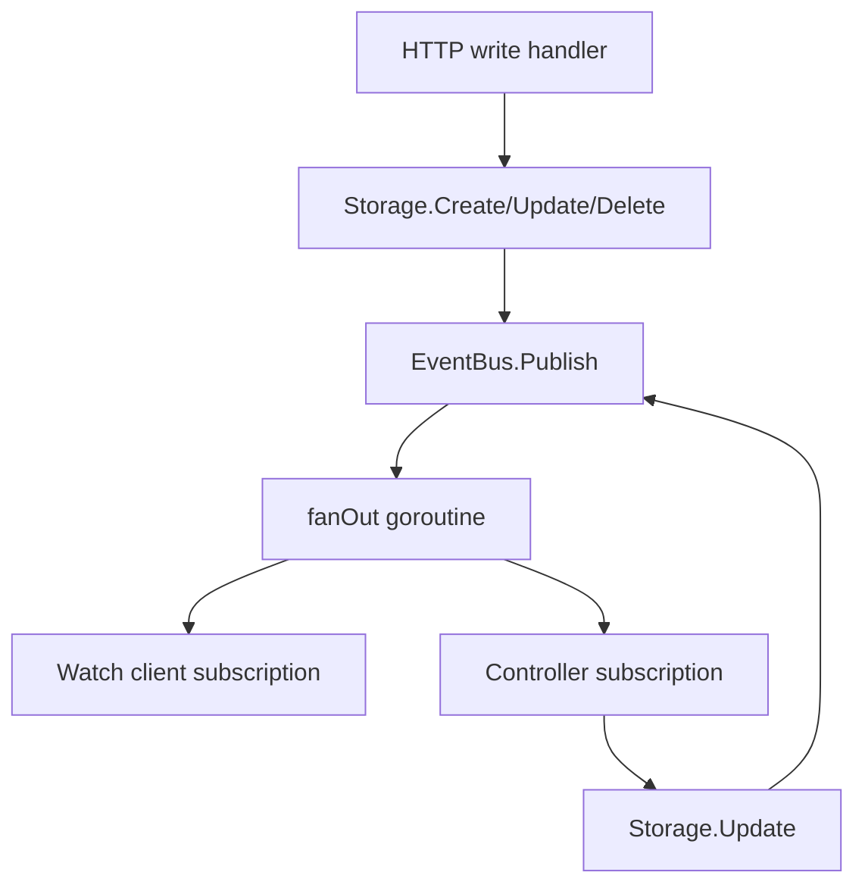


For example, creating a user might generate:

```json
{
  "type": "ADDED",
  "resource": "users",
  "object": {
    "id": "user-001",
    "name": "Alice"
  },
  "timestamp": "2026-01-01T12:00:00Z"
}
```

A client watching `users` does not need to understand the storage
implementation. It only receives the notification that a user object was added.

The `Subscription` type represents an individual consumer's connection to the
event stream. A subscription is created when something wants to receive events
for a particular resource. The consumer receives a read-only channel containing
matching events.

Using channels is a natural fit for Go because they provide safe communication
between goroutines. The event bus can publish from storage operations while
independent consumers process events asynchronously.

However, the subscription design also introduces an important rule: consumers
must keep draining their channels. A slow consumer should not prevent other
consumers from receiving events. The event bus therefore uses buffered channels
and non-blocking delivery so one subscriber cannot stall the entire system.

This is especially important for watch functionality. A browser, CLI client, or
controller may disconnect, pause, or process events slowly. The server must
continue operating normally even if one subscriber is unavailable.

The `Close()` method allows subscribers to terminate their connection cleanly.
When a subscription is closed, the event bus can stop delivering events and
release the associated resources. This lifecycle is important for long-running
systems because subscriptions may exist for minutes, hours, or even the lifetime
of a controller.

**Listing 13.1 — `pkg/api/event.go`**

```go
package api

import "time"

// EventType represents the type of event that occurred.
type EventType string

const (
	// Added indicates a new resource was created.
	Added EventType = "ADDED"
	// Modified indicates an existing resource was updated.
	Modified EventType = "MODIFIED"
	// Deleted indicates a resource was removed.
	Deleted EventType = "DELETED"
)

// Event represents a change to a resource.
//
// Events flow through the system as:
//
//	HTTP POST /api/{resource}
//	      ↓
//	Storage.Create()
//	      ↓
//	EventBus.Publish(Event{Type: Added, ...})
//	      ↓
//	Watch clients (streaming)
//	Concurrent Controllers (reconciliation)
//
// This decouples API handlers from watchers and controllers.
type Event struct {
	// Type indicates what happened: Added, Modified, or Deleted.
	Type EventType `json:"type"`

	// Resource is the name of the resource that changed (e.g., "users", "orders").
	Resource string `json:"resource"`

	// Object is the resource object (after the change).
	// For Deleted events, this is the last state before deletion.
	Object any `json:"object"`

	// Timestamp is when the event was generated.
	Timestamp time.Time `json:"timestamp"`
}

// Subscription represents a client's subscription to events for a specific resource.
//
// Subscribers receive events through a channel and must actively drain the channel
// to avoid blocking other subscribers. The EventBus implementation ensures that
// no subscriber can block others.
type Subscription struct {
	// Resource is the resource name this subscription is for.
	Resource string

	// Events is the channel through which events are delivered.
	// The channel is buffered to handle brief processing delays.
	Events <-chan Event

	// done signals that the subscription should be closed.
	done chan struct{}

	// internal send channel (write-only) - closed by EventBus when unsubscribing.
	sendCh chan Event
}

// Close closes this subscription and stops receiving events.
// After closing, no more events will be sent.
func (s *Subscription) Close() error {
	select {
	case <-s.done:
		return nil
	default:
		close(s.done)
	}
	return nil
}
```


This event model provides the foundation for the next pieces of the system. The
storage layer can now announce changes without knowing who consumes them, and
future features can build on top of the same mechanism.

The next step is implementing the `EventBus` itself: the component responsible
for maintaining subscriptions, publishing events, and ensuring that notification
delivery remains safe and non-blocking.


### The event bus

The event bus is the component that turns the API server from a request/response
system into an event-driven system. Without an event bus, every feature that
needs to react to changes would need to be tightly connected to the storage
layer. A watch endpoint, for example, would need to know exactly when a resource
was created, updated, or deleted. Controllers would need their own hooks into
every write path. Plugins would need special integration points. That approach
quickly becomes difficult to maintain. 

The event bus provides a single communication channel between the parts of the
framework. Storage only needs to announce that something changed. It does not
need to know whether the consumer is an HTTP client watching a stream, a
controller reconciling state, or a plugin reacting to changes. Producers and
consumers remain independent.

The design requirement for the bus is that event delivery must never interfere
with normal API operations. A client connected through a watch endpoint may be
slow because of network latency, a controller may temporarily process events
slowly, or a plugin may stop consuming events altogether. None of those cases
should prevent another API request from creating or updating a resource.

To achieve this, the implementation separates publishing from delivery. Calls to
`Publish()` only place events into an internal buffered queue and return
immediately. A dedicated publishing loop consumes that queue and distributes
events to interested subscribers. The publisher never waits for a subscriber to
read an event.

Each subscriber receives its own buffered channel. This creates isolation
between consumers: one slow subscriber cannot fill a shared queue and delay
everyone else. When an event is distributed, the bus attempts to deliver it to
each subscriber independently. If a subscriber's buffer is temporarily full, the
event is skipped for that subscriber rather than blocking the entire system.

The trade-off is intentional. This event bus prioritizes availability and
responsiveness over guaranteed delivery. It behaves like a notification system:
subscribers learn that something changed and can then retrieve the current state
if needed. This is a common pattern in distributed systems because it prevents a
single unhealthy consumer from affecting the rest of the platform.

The `EventBus` interface defines the contract used by the rest of the server.
Storage implementations only depend on `Publish()`, while future components such
as controllers and watch handlers use `Subscribe()`. Because the interface is
small, the underlying implementation can later be replaced with a distributed
message broker, persistent queue, or external event system without changing the
resource framework.

`SimpleEventBus` provides the in-memory implementation used by the server. It
maintains a list of subscriptions grouped by resource name. When an event is
published, only subscribers interested in that resource receive it. A watcher
for `orders`, for example, will not receive events generated by `users` or
`products`.

The constructor creates the internal subscriber map, the buffered publishing
queue, and the shutdown channel. It also starts the background publishing loop.
From this point onward, event handling happens independently from HTTP request
processing.

`Subscribe()` creates a new subscription and assigns it a private buffered
channel. The returned `Subscription` exposes a read-only event channel to the
consumer while keeping internal control channels private. This prevents
subscribers from accidentally interfering with the event bus lifecycle.

`Unsubscribe()` removes a subscriber from the registry and closes its event
channel. Closing the channel is important because it allows consumers such as
watch handlers and controllers to detect that no more events will arrive and
cleanly terminate.

The publishing loop is responsible for consuming events from the queue. Instead
of performing fan-out directly inside the loop, it starts a separate goroutine
for each event. This extra layer ensures that event distribution itself cannot
slow down future publishing. The loop can continue accepting new events while
previous events are still being delivered.

The `fanOut()` method copies the current subscriber list before sending events.
The copy is important because subscribers can be added or removed concurrently.
The bus does not hold its lock while writing to subscriber channels, since doing
so could turn a slow consumer into a global bottleneck.

Finally, `Close()` provides controlled shutdown behavior. It marks the bus as
closed, stops accepting new events, signals the publishing loop to terminate,
and closes all remaining subscriptions. This allows the server to shut down
without leaving background goroutines running or leaving consumers waiting
forever.

Together, the event model and event bus establish the foundation for the next
features in the framework. Storage operations now have a standard way to
announce changes, and higher-level components can react asynchronously without
creating direct dependencies throughout the codebase. The server has moved from
simply serving data to becoming a platform capable of supporting controllers,
streaming clients, and automated reconciliation.


**Listing 13.2 — `pkg/api/eventbus.go`**

```go
package api

import (
	"log"
	"sync"
)

// EventBus is the publish/subscribe interface for resource events.
//
// The EventBus is the nervous system of the framework:
// - Storage publishes events when resources change
// - Watch endpoints subscribe and stream to clients
// - Controllers subscribe and process events asynchronously
//
// It enables decoupled, event-driven architecture.
type EventBus interface {
	// Publish sends an event to all subscribers of that resource.
	// Non-blocking - publishers never wait for subscribers.
	Publish(event Event)

	// Subscribe registers a client for events on a specific resource.
	// Returns a Subscription that delivers events through a channel.
	// Multiple subscribers can listen to the same resource simultaneously.
	Subscribe(resource string) *Subscription

	// Unsubscribe removes a subscription.
	// Safe to call multiple times.
	Unsubscribe(subscription *Subscription)

	// Close shuts down the event bus and closes all subscriptions.
	Close() error
}

// SimpleEventBus implements EventBus with goroutines and channels.
//
// Architecture:
// - One goroutine per subscription (drains events from its channel)
// - One publish goroutine per event (fans out to all subscribers)
// - Thread-safe using sync.RWMutex for subscriber management
//
// This design ensures:
// - Slow subscribers don't block publishers or other subscribers
// - Publishers never block
// - Clean shutdown with proper resource cleanup
type SimpleEventBus struct {
	mu           sync.RWMutex
	subscribers  map[string][]*Subscription
	publishQueue chan Event
	done         chan struct{}
	closed       bool
}

// NewEventBus creates a new event bus.
func NewEventBus() EventBus {
	bus := &SimpleEventBus{
		subscribers:  make(map[string][]*Subscription),
		publishQueue: make(chan Event, 1000),
		done:         make(chan struct{}),
	}

	// Start the publisher goroutine
	go bus.publishLoop()

	return bus
}

// Publish enqueues an event for publishing.
// Non-blocking - returns immediately.
// If bus is closed, event is discarded silently.
func (b *SimpleEventBus) Publish(event Event) {
	b.mu.RLock()
	if b.closed {
		b.mu.RUnlock()
		return
	}
	b.mu.RUnlock()

	select {
	case b.publishQueue <- event:
	case <-b.done:
		// Bus is closed, discard event silently
	}
}

// Subscribe creates a new subscription for events on a resource.
func (b *SimpleEventBus) Subscribe(resource string) *Subscription {
	b.mu.Lock()
	defer b.mu.Unlock()

	// Create buffered channel (subscribers should drain quickly, but buffer
	// for brief delays to avoid unnecessary goroutines waiting).
	sendCh := make(chan Event, 100)

	sub := &Subscription{
		Resource: resource,
		Events:   sendCh,
		done:     make(chan struct{}),
		sendCh:   sendCh,
	}

	b.subscribers[resource] = append(b.subscribers[resource], sub)
	log.Printf("Subscribe: %s (now %d watchers)", resource, len(b.subscribers[resource]))

	return sub
}

// Unsubscribe removes a subscription.
func (b *SimpleEventBus) Unsubscribe(sub *Subscription) {
	b.mu.Lock()
	defer b.mu.Unlock()

	if subs, exists := b.subscribers[sub.Resource]; exists {
		for i, s := range subs {
			if s == sub {
				// Close the send channel
				select {
				case <-sub.done:
				default:
					close(sub.sendCh)
				}

				// Remove from list
				b.subscribers[sub.Resource] = append(subs[:i], subs[i+1:]...)

				log.Printf("Unsubscribe: %s (now %d watchers)", sub.Resource, len(b.subscribers[sub.Resource]))
				return
			}
		}
	}
}

// publishLoop runs in a goroutine and handles event distribution.
// It ensures publishers never block by running distribution in separate goroutines.
func (b *SimpleEventBus) publishLoop() {
	for {
		select {
		case event := <-b.publishQueue:
			// Fan out to subscribers in a separate goroutine
			// This prevents any subscriber from blocking others
			go b.fanOut(event)

		case <-b.done:
			close(b.publishQueue)
			return
		}
	}
}

// fanOut distributes an event to all subscribers of a resource.
// Runs in a separate goroutine per event.
func (b *SimpleEventBus) fanOut(event Event) {
	b.mu.RLock()
	subscribers := b.subscribers[event.Resource]

	// Make a copy of the subscriber list to avoid holding the lock
	// while sending to channels (which could block if subscribers are slow)
	subs := make([]*Subscription, len(subscribers))
	copy(subs, subscribers)
	b.mu.RUnlock()

	// Send to each subscriber
	for _, sub := range subs {
		select {
		case sub.sendCh <- event:
		case <-sub.done:
			// Subscriber closed, skip
		default:
			// Channel full or closed - this shouldn't happen with our buffer,
			// but if it does, we log it and continue (one slow subscriber
			// doesn't block others)
			log.Printf("Event queue full for subscriber: %s", event.Resource)
		}
	}
}

// Close shuts down the event bus.
// It will no longer publish events and closes all subscriptions.
// Safe to call multiple times.
func (b *SimpleEventBus) Close() error {
	b.mu.Lock()
	if b.closed {
		b.mu.Unlock()
		return nil
	}
	b.closed = true
	b.mu.Unlock()

	// Signal done to publishLoop and any waiting Publish calls
	close(b.done)

	// Close all subscriptions
	b.mu.Lock()
	for _, subs := range b.subscribers {
		for _, sub := range subs {
			close(sub.sendCh)
		}
	}
	b.subscribers = make(map[string][]*Subscription)
	b.mu.Unlock()

	return nil
}
```

### Connecting the event bus to the server and router

The event bus is only useful if the rest of the framework can access it. The
next step is wiring it into the central objects that coordinate API operations.

The Server becomes the owner of the event bus. Just as the server owns the
registry, scheme, and CRD registry, it also owns the event infrastructure that
connects storage changes to watchers and controllers. Creating the event bus at
the server level ensures that every component participating in the API lifecycle
shares the same event stream.

The updated server structure adds an eventBus field alongside the existing
framework components:

**Listing 13.3 - `pkg/api/server.go`**

```go
// Server is the HTTP API server.
type Server struct {
	registry    Registry
	scheme      Scheme
	router      *Router
	httpServer  *http.Server
	port        int
	crdRegistry CRDRegistry
	eventBus    EventBus
}
```

The constructor creates the event bus during server initialization and passes it
to the router:

**Listing 13.4 - `pkg/api/server.go`**

```go
// NewServer creates a new server.
func NewServer(cfg Config) *Server {
	registry := NewRegistry()
	scheme := NewScheme()
	crdRegistry := NewCRDRegistry()
	eventBus := NewEventBus()
	router := NewRouter(registry, scheme, crdRegistry, eventBus)

	return &Server{
		registry:    registry,
		scheme:      scheme,
		router:      router,
		crdRegistry: crdRegistry,
		eventBus:    eventBus,
		port:        cfg.Port,
	}
}
```

This creates a single event pipeline for the entire application. Storage
operations, watch endpoints, and controllers all communicate through this shared
instance.

The router receives the same event bus because it is responsible for exposing
event-driven features such as the Watch API. When a client connects using
?watch=true, the router subscribes to this server-wide event stream rather than
creating a separate event system for each request.


The server also exposes the event bus through an accessor:

**Listing 13.5 - `pkg/api/server.go`**

```go
// EventBus returns the event bus.
// Called by controllers and watch endpoints to subscribe to events.
func (s *Server) EventBus() EventBus {
	return s.eventBus
}
```

Controllers use this method when they start so that they can subscribe to
resource changes. This keeps controllers independent from the internal server
structure: they only need an EventBus interface, not direct access to the
server.

The final piece is connecting resources to the event system during registration.

Previously, registering a resource only made it available through the registry.
Now registration also connects the resource's storage layer to the event bus:

**Listing 13.6 - `pkg/api/server.go`**

```go
// RegisterResource registers a resource at runtime.
// This makes the resource immediately available without restarting the server.
// Also attaches the event bus to the resource's storage so events are published.
func (s *Server) RegisterResource(resource Resource) error {
	// Attach event bus to storage if storage is MemoryStorage
	if ms, ok := resource.Storage().(*MemoryStorage); ok {
		ms.SetEventBus(s.eventBus, resource.Name())
	}

	err := s.registry.Register(resource)
	if err == nil {
		log.Printf("Registered resource: %s", resource.Name())
	}
	return err
}
```

This is the point where the earlier event publishing code inside MemoryStorage
becomes active. Storage does not need to know about the server or router.
Instead, the server injects the event bus when the resource is registered.

The lifecycle now looks like this:

The server creates one shared event bus.
1.  A resource is registered.
2. The server attaches the event bus to that resource's storage.
3. A client creates, updates, or deletes an object.
4. Storage publishes an event.
5. Watch clients and controllers receive that event.

The storage layer remains reusable because it only depends on the event bus
interface. It does not know whether the subscriber is an HTTP connection, a
controller, another service, or something added in the future.


The router is also updated to hold a reference to the event bus:

**Listing 13.7 — `pkg/api/router.go`**

```go
// Router is the HTTP request dispatcher.
//
// THIS IS THE KEY TO DYNAMIC EXTENSIBILITY.
//
// Unlike typical REST servers that create routes for each resource at startup:
//
//	GET /users, POST /users, GET /users/{id}, etc.
//
// This router creates only GENERIC routes that determine the resource at runtime:
//
//	GET /api/{resource}, POST /api/{resource}, GET /api/{resource}/{id}, etc.
//
// Every request:
// 1. Extracts the resource name from the URL
// 2. Looks it up in the registry (which may have been updated while running)
// 3. Dispatches to ONE generic handler
//
// The handlers never know about specific resources. They work through:
// - The Resource interface
// - The Storage interface
// - The Scheme (for object creation)
//
// This means new resources are immediately available after registration—
// no router rebuild, no server restart, no HTTP listener restart.
type Router struct {
	registry    Registry
	scheme      Scheme
	crdRegistry CRDRegistry
	eventBus    EventBus
	mux         *http.ServeMux
}
```


The constructor now accepts the event bus:

**Listing 13.8 — `pkg/api/router.go`**

```go
// NewRouter creates a new router.
func NewRouter(registry Registry, scheme Scheme, crdRegistry CRDRegistry, eventBus EventBus) *Router {
	return &Router{
		registry:    registry,
		scheme:      scheme,
		crdRegistry: crdRegistry,
		eventBus:    eventBus,
		mux:         http.NewServeMux(),
	}
}
```

This preserves the router's generic design. The router still does not know about
specific resource types. It does not contain special handling for users, orders,
or other objects. Its new responsibility is simply to provide access to the
event bus for generic event-streaming behavior.

The addition of the event bus demonstrates an important property of the
framework: new capabilities can be introduced by adding infrastructure behind
existing interfaces rather than rewriting the request path. The router still
discovers resources dynamically, storage still handles persistence, and now
events flow through the system without any resource-specific code in the core
server.


### Why publishers never block

The key design property of the event bus is that resource mutations are not tied
to the speed of event consumers. A client creating an object should receive a
successful response as soon as the storage operation completes. It should not
have to wait for watchers, controllers, or plugins to process the resulting
event.

The sequence above shows the path of a normal create request and where the event
system is intentionally decoupled from the request path.

The process begins when an HTTP handler receives a request and calls the storage
layer. The handler is responsible for validating the request and asking storage
to create the object. Storage performs the write operation and, after the object
has been successfully stored, publishes an event describing the change.

At this point, the event bus does not immediately deliver the event to
subscribers. Instead, `Publish()` places the event into the buffered
`publishQueue`. Because the queue already has memory allocated for pending
events, the publish call normally completes immediately. Storage does not wait
for the event to reach watchers or controllers.

Once the event has been queued, storage returns success to the handler. The
handler can complete the HTTP request and send the response back to the client.
The time required for a subscriber to receive or process the event has no impact
on the latency of the original API request.

In the background, the `publishLoop` continuously reads events from the queue.
This separates event processing from the request lifecycle. The loop can process
events at its own pace while new API requests continue creating, updating, and
deleting resources.

When the publishing loop receives an event, it starts the fan-out process in a
separate goroutine. That goroutine is responsible for sending the event to each
subscriber interested in the resource. Because fan-out happens independently,
the publisher loop can continue accepting additional events even if delivery of a
previous event is still in progress.

Each subscriber also has its own buffered channel. This provides another layer
of isolation. A slow watch client consuming `orders` events does not prevent
another client watching `users` from receiving updates. Likewise, a controller
that temporarily falls behind does not delay API writes.

The overall flow is therefore:

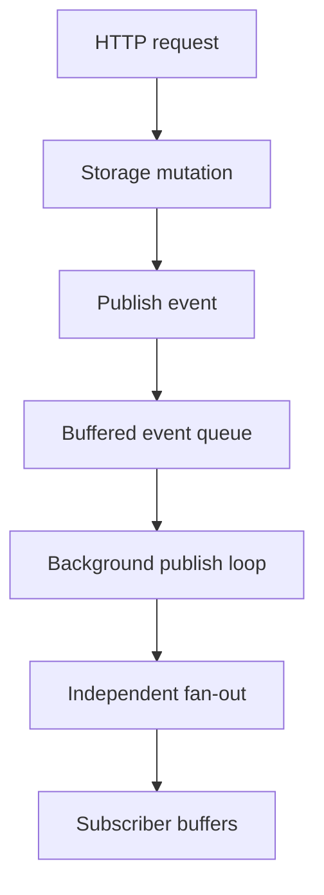

This architecture intentionally separates the synchronous path from the
asynchronous path. The synchronous path handles the operation the user asked
for: creating, updating, or deleting a resource. The asynchronous path handles
everything that happens because of that change: notifying watchers, triggering
controllers, and allowing extensions to react.

This separation is what allows the API server to scale from a simple CRUD
service into an extensible platform. New event consumers can be added without
changing storage, HTTP handlers, or existing resources, because the event bus
acts as a stable boundary between the core API and the components that react to
changes.


**Figure 13.2 — Why publishers never block**

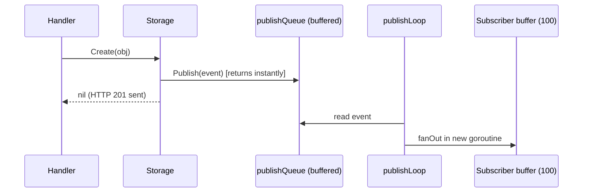

### Checkpoint

Add a test that subscribes, creates an object through storage, and asserts an
`ADDED` event arrives:

```go
func TestStoragePublishes(t *testing.T) {
	bus := NewEventBus()
	sub := bus.Subscribe("widgets")
	ms := NewMemoryStorage().(*MemoryStorage)
	ms.SetEventBus(bus, "widgets")

	_ = ms.Create(map[string]any{"id": "w1"})
	select {
	case ev := <-sub.Events:
		if ev.Type != Added {
			t.Fatalf("want ADDED, got %s", ev.Type)
		}
	case <-time.After(time.Second):
		t.Fatal("no event")
	}
}
```

```bash
go test ./pkg/api -run Publish -v
```

Events now flow. Next we let clients watch them.

---

## Chapter 14: The Watch API

### Goal

Stream events to HTTP clients using Server-Sent Events (SSE) via `?watch=true`,
and teach `apictl` to consume that stream.


### Server side: the watch handler

The Watch API is the point where the event system becomes visible to API
clients. Up to this point, events have existed entirely inside the server:
storage published them, and the event bus distributed them to subscribers. The
watch endpoint exposes that stream over HTTP so external clients can observe
resource changes as they happen.

The implementation uses Server-Sent Events (SSE), a standard browser and
HTTP-friendly streaming format. Unlike normal REST requests, where a client
sends a request and receives a single response, an SSE connection remains open.
The server can continue writing new messages to the same connection whenever an
event occurs.

A client starts watching by requesting a resource with the `watch=true` query
parameter:

```
GET /api/orders?watch=true
```

Instead of returning the current list of orders and closing the connection, the
server creates a subscription to the event bus for the `orders` resource. From
that moment onward, every create, update, or delete event for orders can be sent
directly to the client.

The handler begins by verifying that the HTTP response writer supports
streaming. Go's HTTP server exposes this capability through the `http.Flusher`
interface. Without flushing, data may remain buffered and the client would not
receive events immediately. SSE depends on each event being written and flushed
as soon as it is available.

After confirming streaming support, the handler subscribes to the event bus
using the resource name. This is the same event stream used internally by
controllers and other framework components. The watch endpoint does not create
its own notification system; it is simply another consumer of the existing event
bus.

The subscription is removed with `defer` when the handler exits. This cleanup is
important because HTTP clients can disappear at any time: a user may close a
terminal, a browser tab may be closed, or a network connection may be
interrupted. Removing the subscription prevents abandoned watchers from
accumulating in memory.

The response headers tell the client that this is an SSE stream rather than a
normal JSON response. The `text/event-stream` content type is required by the
SSE specification. Disabling caching ensures that intermediaries do not replay
old events, and keeping the connection alive allows the stream to remain open
for as long as the client is watching.

Once the headers are configured, the handler sends an initial comment:

```
:connected to watch stream for orders
```

SSE comments are ignored by clients, but they serve two useful purposes. They
confirm that the connection has been established and they force an initial
flush, allowing the client to detect that the watch request succeeded.

The main loop then waits for three possible events:

1. A resource event arrives from the subscription.
2. The keep-alive timer fires.
3. The client disconnects.

When a resource event arrives, it is serialized as JSON and written using the
SSE format:

```
event: ADDED
data: {"type":"ADDED","resource":"orders",...}

```

The `event` line identifies the event type. Clients can use this value to handle
different changes differently, such as displaying new objects for `ADDED` events
or refreshing state after `MODIFIED` events. The `data` line contains the actual
event payload. A blank line marks the end of one SSE message.

The handler flushes after every event. This is what makes the API a real-time
stream rather than a buffered response. As soon as storage publishes an event,
the event travels through the event bus and appears on the connected client.

Long-lived HTTP connections can be closed by proxies, load balancers, or network
equipment when no data is transferred for an extended period. To prevent this,
the handler sends a keep-alive comment every five seconds:

```
:keep-alive
```

Comments do not represent application events and are ignored by SSE clients, but
they keep the connection active and demonstrate that the server is still alive.

The final case monitors the request context. When the client disconnects, Go
cancels the request context, allowing the handler to exit cleanly. This closes
the watch loop and triggers the deferred unsubscribe operation.

The complete flow is therefore:

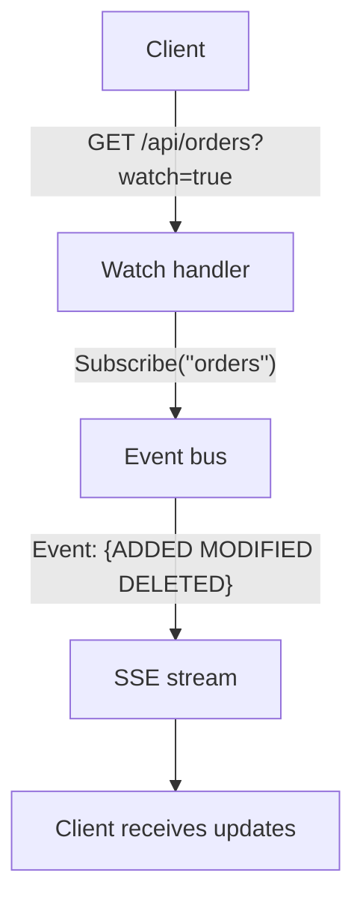

The important architectural point is that the Watch API does not poll storage. A
polling implementation would repeatedly ask, "has anything changed?" and would
either waste resources or introduce delays. The SSE watch path is fully
event-driven: storage announces changes once, and every interested client
receives those changes immediately.

This same mechanism also provides the foundation for future controllers and
automation. A controller can subscribe directly to the event bus inside the
server, while external tools such as `apictl` can consume the same stream
through HTTP. The event model remains the same regardless of whether the
consumer is internal or external.


**Listing 14.1 — `pkg/api/router.go` (watch)**

```go
// watch handles GET /api/{resource}?watch=true
// Streams events as they occur using Server-Sent Events (SSE).
//
// This is the Watch API in action:
// 1. Client connects with ?watch=true
// 2. Handler subscribes to the event bus for this resource
// 3. Events are streamed to client as they occur
// 4. No polling needed - truly event-driven
func (r *Router) watch(w http.ResponseWriter, req *http.Request, resource Resource) {
	// Check if client supports Server-Sent Events (requires HTTP/1.1)
	flusher, ok := w.(http.Flusher)
	if !ok {
		http.Error(w, "streaming not supported", http.StatusNotAcceptable)
		return
	}

	// Subscribe to events for this resource
	sub := r.eventBus.Subscribe(resource.Name())
	defer r.eventBus.Unsubscribe(sub)

	// Set headers for Server-Sent Events
	w.Header().Set("Content-Type", "text/event-stream")
	w.Header().Set("Cache-Control", "no-cache")
	w.Header().Set("Connection", "keep-alive")
	w.Header().Set("Access-Control-Allow-Origin", "*")

	// Notify client that watch is starting
	fmt.Fprintf(w, ":connected to watch stream for %s\n\n", resource.Name())
	flusher.Flush()

	// Keep-alive ticker: send comment every 5 seconds to prevent timeout
	keepAliveTicker := time.NewTicker(5 * time.Second)
	defer keepAliveTicker.Stop()

	// Stream events until client disconnects
	for {
		select {
		case event := <-sub.Events:
			// Serialize event to JSON
			eventJSON, err := json.Marshal(event)
			if err != nil {
				log.Printf("error marshalling event: %v", err)
				continue
			}

			// Send as SSE
			fmt.Fprintf(w, "event: %s\n", event.Type)
			fmt.Fprintf(w, "data: %s\n\n", string(eventJSON))
			flusher.Flush()

		case <-keepAliveTicker.C:
			// Send keep-alive comment to prevent timeout
			// SSE spec: lines starting with ':' are comments and ignored by clients
			fmt.Fprintf(w, ":keep-alive\n\n")
			flusher.Flush()

		case <-req.Context().Done():
			// Client disconnected
			return
		}
	}
}

```

### Client side: consuming SSE

The server-side watch endpoint turns resource changes into a continuous HTTP
stream. The client needs the opposite piece of functionality: it must keep the
connection open, understand the SSE wire format, and convert incoming messages
into a form that application code can consume.

The `Watch` method adds streaming support to the client library without exposing
the details of HTTP connections, buffering, or SSE parsing to callers. A caller
simply requests a watch for a resource and receives channels containing parsed
events.

The implementation deliberately uses `bufio.Reader` rather than `bufio.Scanner`.
Although `Scanner` is convenient for reading line-oriented protocols, it has a
default maximum token size of 64 KiB. That limit is usually fine for simple text
files, but it is a poor fit for an API streaming protocol where an event payload
may contain a large object, a complex custom resource, or embedded data. A large
JSON document could exceed the scanner limit and cause an otherwise valid watch
connection to fail.

`bufio.Reader` provides more control because it reads directly from the stream
and allows the client to process lines without imposing the scanner's fixed
token limit. This makes the watch client more suitable for the dynamic resources
supported by the framework.

The client starts by creating a normal HTTP GET request with the `watch=true`
query parameter:

```text
GET /api/orders?watch=true
Accept: text/event-stream
```

The `Accept` header tells the server that the client expects an SSE response.
Unlike normal API calls, the response does not complete after a single JSON
document. The HTTP connection remains open while the server sends events.

Before starting the reader goroutine, the method checks the HTTP response
status. Connection failures and HTTP errors are returned immediately because
there is no useful stream to consume in those cases. This keeps startup errors
separate from errors that happen later while processing an active stream.

Once the connection is established, the method creates two channels:

* `Events` carries successfully parsed watch events.
* `Errors` carries asynchronous problems that occur after the stream has started.

This channel-based design lets callers integrate watching into normal Go
concurrency patterns. A program can process events in one goroutine, monitor
errors in another, or combine the watch stream with other channels using a
`select` statement.

The actual stream processing happens in a background goroutine. This prevents
the caller from being blocked inside the HTTP reader and allows the application
to continue performing other work while events arrive.

The reader processes the SSE stream one line at a time. SSE messages are simple:
a message contains fields such as:

```text
event: ADDED
data: {"type":"ADDED","resource":"orders",...}

```

The client keeps track of the most recent `event:` line in `currentType`. When a
`data:` line arrives, it combines the event type and payload into a `WatchEvent`
value and sends it to the event channel.

Empty lines separate SSE messages and are ignored. Lines beginning with `:` are
comments generated by the server's keep-alive mechanism. These comments are
important for maintaining the connection but do not represent application
events, so the client discards them.

The reader also handles connection lifecycle events. If the server closes the
connection normally, the goroutine exits and closes both channels. If a network
failure or parsing problem occurs, the error is sent through the error channel
so the caller can decide whether to retry, log the issue, or terminate.

Event delivery uses a buffered channel with a small timeout. This prevents the
reader goroutine from becoming permanently blocked if the application consuming
events stops reading. Similar to the server-side event bus, the client favors
continued operation over allowing one slow consumer to stall the entire
pipeline. If the application cannot keep up, an error notification is generated
instead of freezing the watch connection.

The overall client-side flow is:

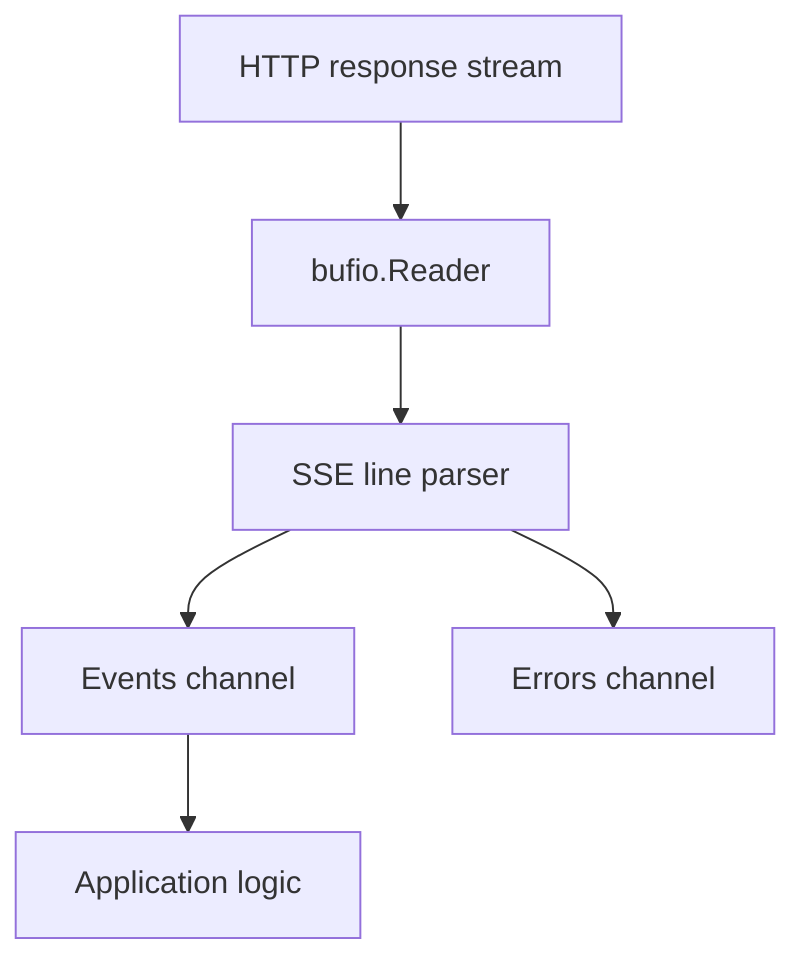

This keeps the SSE implementation isolated inside the client library. Command
implementations, automation tools, and future controllers do not need to know
anything about HTTP streaming or text parsing. They receive structured
`WatchEvent` values and can focus only on what should happen when a resource
changes.

With this addition, the framework now supports the complete event path:

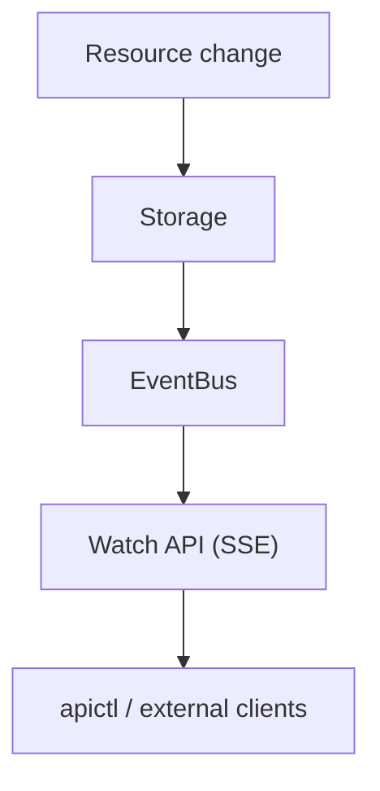

The server can now notify clients in real time, and clients can consume those
notifications using the same discovery-driven model used for all other API
operations.


**Listing 14.2 — `cmd/apictl/client.go` (Watch)**

```go
// add these imports to client.go: "bufio", "strings", "time"

// WatchEvent represents a single event from the watch stream.
type WatchEvent struct {
	Type string          `json:"type"`
	Data json.RawMessage `json:"data"`
}

// WatchResult bundles event and error channels for watch streaming.
// Callers should range over Events and check Errors for problems.
type WatchResult struct {
	Events <-chan WatchEvent
	Errors <-chan error
}

// Watch streams events for a resource.
// Returns event and error channels.
// The caller should range over Events and check Errors for issues:
//
//	result := client.Watch("orders")
//	for {
//		select {
//		case event := <-result.Events:
//			// Handle event
//		case err := <-result.Errors:
//			// Handle error (connection closed, parse error, etc.)
//			return
//		}
//	}
//
// Errors include:
// - Connection failures
// - Server errors
// - Parse errors
// - Line size overruns (no 64 KiB limit)
func (c *Client) Watch(resource string) (*WatchResult, error) {
	url := c.baseURL + fmt.Sprintf("/api/%s?watch=true", resource)

	req, err := http.NewRequest("GET", url, nil)
	if err != nil {
		return nil, err
	}

	req.Header.Set("Accept", "text/event-stream")

	resp, err := c.http.Do(req)
	if err != nil {
		return nil, err
	}

	if resp.StatusCode >= 400 {
		defer resp.Body.Close()
		body, _ := io.ReadAll(resp.Body)
		return nil, fmt.Errorf("HTTP %d: %s", resp.StatusCode, string(body))
	}

	// Create channels for events and errors
	events := make(chan WatchEvent, 10)
	errors := make(chan error, 1)

	// Start goroutine to read events using bufio.Reader instead of Scanner
	// This avoids the 64 KiB token limit and gives us better control
	go func() {
		defer resp.Body.Close()
		defer close(events)
		defer close(errors)

		reader := bufio.NewReader(resp.Body)
		var currentType string

		for {
			// Read line with no size limit (unlike Scanner's 64 KiB default)
			line, err := reader.ReadString('\n')
			if err != nil {
				if err == io.EOF {
					// Normal connection close
					return
				}
				// Network or parsing error
				select {
				case errors <- fmt.Errorf("read error: %w", err):
				default:
				}
				return
			}

			// Remove trailing newline
			line = strings.TrimSuffix(line, "\n")
			line = strings.TrimSuffix(line, "\r")

			// SSE format: event: TYPE\ndata: JSON\n\n
			if strings.HasPrefix(line, "event: ") {
				currentType = strings.TrimPrefix(line, "event: ")
			} else if strings.HasPrefix(line, "data: ") {
				data := strings.TrimPrefix(line, "data: ")
				event := WatchEvent{
					Type: currentType,
					Data: json.RawMessage(data),
				}
				select {
				case events <- event:
				case <-time.After(100 * time.Millisecond):
					// Event channel full, drop and log
					select {
					case errors <- fmt.Errorf("event channel full, dropping event"):
					default:
					}
				}
			} else if line != "" {
				// Non-comment lines (not starting with ':') are skipped
				_ = strings.HasPrefix(line, ":")
			}
			// Ignore empty lines and comments (lines starting with :)
		}
	}()

	return &WatchResult{
		Events: events,
		Errors: errors,
	}, nil
}

```

### Client side: the watch command

The final piece of the watch feature is the command-line interface. The server
can now publish events and the client library can consume the SSE stream, but
users still need a convenient way to access that functionality. The `watch`
command connects these two pieces together.

Unlike commands such as `get` or `list`, which perform a single request and
exit, `watch` is a long-running command. It establishes a connection to the API
server and remains active while events continue to arrive. This makes it useful
for observing resource changes in real time, debugging controllers, or
monitoring activity on a particular resource type.

The command first validates that a resource name was provided. Watching without
a resource would not be meaningful because the server subscribes to events for a
specific resource stream. After validation, it creates a watch connection
through the client's `Watch` method and receives the pair of channels returned
by that method: one for incoming events and one for errors.

Once connected, the command enters a `select` loop. This is important because
events and errors are delivered asynchronously. The event channel may receive
multiple resource changes over time, while the error channel reports connection
failures or parsing problems. By waiting on both channels, the CLI remains
responsive and can terminate cleanly when the server closes the connection.

When an event arrives, the command prints the event type first. Event types such
as `ADDED`, `MODIFIED`, and `DELETED` provide immediate context about what
changed. The event payload is then decoded from JSON and printed using
`json.MarshalIndent`, producing readable multi-line output instead of a single
compact JSON object. This makes the watch stream practical for humans using the
terminal.

For example, creating a new object while another terminal is running a watch
command produces an immediate notification:

```text
$ apictl watch invoices
Watching events for invoices (Ctrl+C to stop)...

EVENT: ADDED
{
  "id": "inv-001",
  "customer": "Acme Corp",
  "amount": 5000,
  "status": "sent"
}
```

The command does not need to know the structure of the resource being watched.
Just like the rest of the discovery-driven client, it treats events generically.
A built-in resource, a CRD-backed object, or a plugin-provided type all flow
through the same event path.

This completes the event pipeline introduced in this chapter:

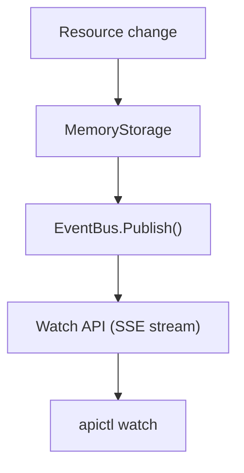

The result is a fully event-driven client experience. Instead of repeatedly
polling the server for changes, users and automation tools can subscribe once
and receive updates as they happen. This same mechanism also provides the
foundation for future controllers and operators, which can consume the same
event stream and react automatically to changes in cluster state.

**Listing 14.3 — `cmd/apictl/commands.go` (cmdWatch)**

```go
// cmdWatch streams events for a resource
func cmdWatch(c *Client, args []string) {
	if len(args) == 0 {
		fmt.Fprintf(os.Stderr, "Usage: apictl watch <resource>\n")
		os.Exit(1)
	}

	resource := args[0]

	fmt.Printf("Watching events for %s (Ctrl+C to stop)...\n\n", resource)

	result, err := c.Watch(resource)
	if err != nil {
		fmt.Fprintf(os.Stderr, "Error: %v\n", err)
		os.Exit(1)
	}

	for {
		select {
		case event, ok := <-result.Events:
			if !ok {
				// Events channel closed
				return
			}

			// Print event type
			fmt.Printf("EVENT: %s\n", event.Type)

			// Parse and pretty-print the object
			var obj interface{}
			if err := json.Unmarshal(event.Data, &obj); err != nil {
				fmt.Printf("Error parsing event data: %v\n", err)
				continue
			}

			data, _ := json.MarshalIndent(obj, "", "  ")
			fmt.Printf("%s\n\n", string(data))

		case err, ok := <-result.Errors:
			if !ok {
				// Errors channel closed
				return
			}
			if err != nil {
				fmt.Fprintf(os.Stderr, "Connection error: %v\n", err)
				os.Exit(1)
			}
		}
	}
}

```

### Checkpoint

At this point, the complete event pipeline can be tested from the command line.
The easiest way to verify that the watch system is working is to run the watcher
and the operation that generates events in separate terminals.

In the first terminal, start a watch stream for a resource type:

```bash
# terminal 1
./apictl watch orders
```

The command does not make repeated requests to the server. Instead, it opens a
long-lived SSE connection and waits for the event bus to publish changes. The
terminal remains attached to the resource stream until the user stops it with
`Ctrl+C` or the server closes the connection.

In a second terminal, create a new object:

```bash
# terminal 2
./apictl create -f examples/order-1.json
```

The create request follows the normal API path: the router receives the request,
the resource storage persists the object, and the storage layer publishes an
`ADDED` event through the event bus. The watch handler receives that event from
its subscription and immediately forwards it to the connected client.

Within milliseconds, the first terminal displays the new event:

```text
EVENT: ADDED
{
  "id": "order-001",
  "kind": "Order",
  "customer_id": "alice",
  "total": 99.99,
  "status": "draft",
  "created_at": "2026-07-15T10:30:00Z"
}
```

The important detail is that no component in this flow is polling. The client
does not repeatedly ask whether anything changed, and the server does not need
to maintain a list of clients waiting for updates. Instead, the event bus acts
as the connection point between resource changes and interested consumers.

The same test can be repeated with other operations:

```bash
./apictl delete orders order-001
./apictl create -f examples/order-1.json
```

A delete operation produces a `DELETED` event, while another create produces a
new `ADDED` event. If the resource supports updates, modifications would appear
as `MODIFIED` events.

The example object below represents a typical resource instance. It
intentionally contains only application data and the metadata needed by the API
framework. The watch system does not require a compiled `Order` type or any
special knowledge of the fields. It simply transports the object associated with
the event.

**Listing 14.4 — `examples/order-1.json`**

```json
{
  "id": "order-001",
  "kind": "Order",
  "customer_id": "alice",
  "total": 99.99,
  "status": "draft",
  "created_at": "2026-07-15T10:30:00Z"
}
```

This checkpoint demonstrates the complete path from a user action to a live
notification:

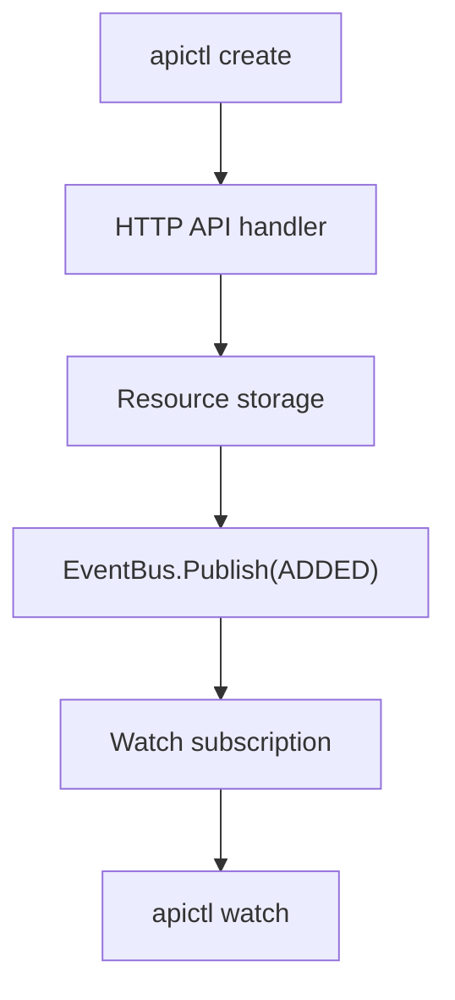

With this in place, the API server has moved beyond request/response behavior
and now supports real-time observation of resource state changes. The same
mechanism can later power controllers, automation agents, dashboards, and other
clients that need to react immediately when the API state changes.

---

## Chapter 15: Controllers

### Goal

The event system introduced in the previous chapter gave clients a way to
observe changes, but observation alone is only the first step toward a reactive
system. The next step is allowing the server itself to respond to those changes.

Controllers provide this missing piece. A controller is a long-running process
inside the API server that watches events, evaluates the current state of
resources, and performs actions to move the system toward the desired state.

This is the same pattern used by systems such as Kubernetes. Instead of placing
all business logic directly inside HTTP handlers, controllers operate
independently and react to state changes. The API layer remains responsible for
accepting requests and storing data, while controllers handle the workflows that
happen after those changes occur.

For example, an order workflow might look like this:


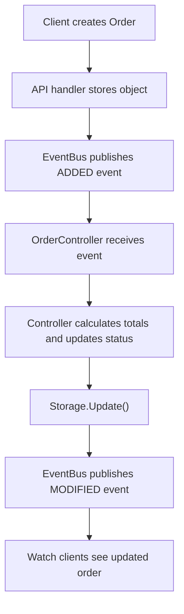


The important design property is that controllers do not bypass the normal API
machinery. When a controller changes a resource, it uses the same storage
interfaces used by regular API operations. Because those changes flow through
storage, they automatically produce new events. This means controllers
participate in the same event pipeline as every other client.

This creates a feedback loop:

1. A resource changes.
2. An event is published.
3. A controller reacts.
4. The controller updates state.
5. The update produces another event.

That loop is the foundation of a controller-based architecture.

Controllers should also be designed around reconciliation rather than individual
commands. A controller does not receive instructions such as "set this field" or
"run this operation." Instead, it receives an event and examines the current
state of the object. It then determines what actions are necessary to make the
actual state match the desired state.

This approach has several advantages:

* Controllers are independent of HTTP requests.
* Business logic can run asynchronously.
* Multiple controllers can observe the same resource.
* Failures can be retried safely.
* New automation can be added without changing API handlers.

### The controller interface

The `Controller` interface defines the contract between the framework and any
controller implementation. Like resources and plugins earlier in the book, this
interface allows the server to host many different controllers without knowing
their internal details.

A controller has three primary responsibilities:

1. Identify itself.
2. Declare which resource it watches.
3. Reconcile events for that resource.

The `Name()` method provides a stable identifier for logging, debugging, and
controller management. In a system running many controllers, meaningful names
make it easier to understand which component is processing an event.

The `Resource()` method connects the controller to the event system. A
controller subscribes to one resource type, such as `orders`, `users`, or
`invoices`. When events for that resource are published, the framework delivers
them to the controller.

The core of the controller is the `Reconcile()` method. This method receives an
event and contains the business logic required to respond to it.

A reconciliation function should be **idempotent**. This means that running the
same reconciliation multiple times should produce the same result as running it
once. Event-driven systems may deliver events more than once, controllers may
restart, and failures may cause retries. Idempotency ensures that these
situations do not corrupt application state.

For example, an order controller might receive an `ADDED` event:

1. Read the current order state.
2. Calculate any missing values.
3. Update the order status from `draft` to `processing`.
4. Save the updated object through storage.
5. Allow the normal event pipeline to notify other consumers.

The controller does not directly notify watchers or manually publish events. It
only changes the resource. The existing storage and event infrastructure handles
the rest.

The `Run()` method defines the controller lifecycle. Controllers are
long-running background processes, so they must support clean startup and
shutdown. The `context.Context` parameter provides a standard Go mechanism for
cancellation. When the server shuts down, it can cancel the context and allow
every controller to stop gracefully.

**Listing 15.1 — `pkg/controllers/controller.go`**

```go
package controllers

import (
	"context"

	"github.com/pergus/api-server/pkg/api"
)

// Controller is the interface for a reconciliation controller.
//
// Controllers are the "brain" of the system - they watch events and
// perform business logic in response.
//
// Example controllers:
// - OrderController reconciles orders (e.g., calculate totals, update status)
// - Future: InvoiceController, UserController, etc.
//
// The key insight: Controllers do NOT respond to HTTP requests.
// They respond to events. This decouples business logic from API handling.
type Controller interface {
	// Name returns the name of this controller.
	// Used for logging and debugging.
	Name() string

	// Resource returns the name of the resource this controller watches.
	// (e.g., "orders", "invoices", "users")
	Resource() string

	// Reconcile processes an event and performs reconciliation.
	// Called when a resource is Added, Modified, or Deleted.
	//
	// Reconciliation is the process of observing the current state
	// and taking action to achieve the desired state.
	//
	// Example: When an Order is created, the controller might:
	// 1. Calculate totals
	// 2. Update order status to "processing"
	// 3. Call storage.Update() which generates another event
	// 4. Other systems react to the modified event
	//
	// Reconcile should be idempotent - calling it multiple times
	// with the same object should be safe.
	Reconcile(event api.Event) error

	// Run starts the controller.
	// Should block until context is cancelled.
	Run(ctx context.Context) error
}

```


This interface is intentionally small. The framework does not need to know
whether a controller updates a database, calls an external service, creates
another resource, or simply records metrics. It only needs to know that the
controller can start, receive events, and reconcile state.

With this abstraction in place, controllers become another extension point of
the platform, alongside CRDs and plugins. New behavior can be added by
implementing a small interface rather than modifying the core API server.


### The order controller

The order controller is the first concrete example of a reconciliation loop in
the framework. It demonstrates how a controller consumes events, evaluates
resource state, and makes changes through the normal storage layer.

The controller watches the `orders` resource and reacts whenever an order
changes. It does not receive HTTP requests and it does not know anything about
the client that created the order. Its only input is the stream of events
generated by the event bus.

The workflow is intentionally simple:

1. A client creates an order.
2. Storage saves the new object.
3. Storage publishes an `ADDED` event.
4. The order controller receives the event.
5. The controller calculates missing values and updates the order.
6. Storage publishes a `MODIFIED` event.
7. Watch clients and other controllers receive the updated state.

This illustrates the core reconciliation pattern: controllers observe state and
then act to move that state toward a desired condition.

For an order, the desired state is that every newly created order should be
ready for processing. When the controller sees an `ADDED` event, it performs
three operations:

* It ensures the order has a status.
* It ensures a total value exists.
* It persists the updated order.

The controller does not call the event bus directly. Instead, it uses the
resource storage interface to update the object. This distinction is important.
Storage remains the single source of truth for resource changes. Because the
update goes through storage, the existing event infrastructure automatically
creates the corresponding `MODIFIED` event.

The controller therefore participates in the same lifecycle as any other client:


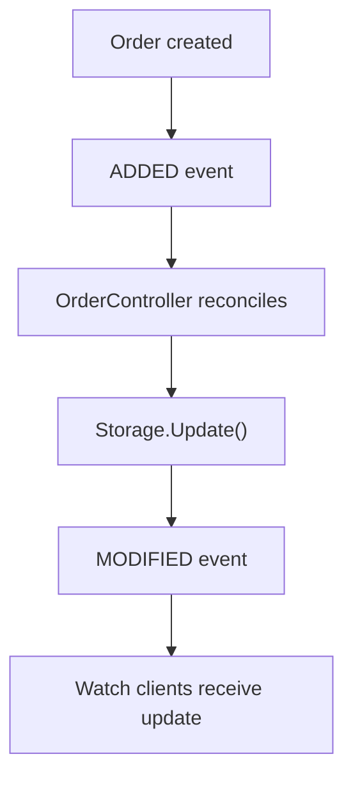

The implementation uses a generic `map[string]interface{}` representation rather
than a dedicated update type. This keeps the controller compatible with the
dynamic nature of the API server. The same pattern could later be applied to
CRD-backed resources or plugin-provided types without requiring changes to the
controller framework.

The `OrderController` embeds `baseController`, which provides the common event
subscription and run-loop behavior shared by controllers. The order-specific
logic only needs to implement reconciliation decisions.

When an event arrives, `Reconcile` dispatches based on the event type:

* `ADDED` triggers order initialization.
* `MODIFIED` records that the order changed.
* `DELETED` records that the order was removed.

This separation keeps the controller readable. The event routing logic remains
small, while each state transition has its own focused handler.

The `reconcileAdded` method performs the main business operation. It first
converts the incoming object into a generic map so fields can be inspected and
changed. It then updates the order's status to `processing` and supplies a
default total if one was not provided.

In a production system, this step might contain much more complex behavior:

* Reserving inventory.
* Calculating taxes.
* Validating payment information.
* Calling external fulfillment services.
* Creating related resources.
* Updating metrics or analytics systems.

The important part is not the specific business rule. The important part is the
architecture: the business rule runs independently from the API request that
created the object.

After modifying the object, the controller looks up the `orders` resource from
the registry and calls `Storage().Update()`. This is where the reconciliation
loop connects back into the rest of the framework. The update becomes a normal
resource mutation, which means the event bus publishes a new event
automatically.

The `reconcileModified` and `reconcileDeleted` methods intentionally perform
only logging. They demonstrate how controllers can observe later state changes
without necessarily making further changes.

This is also an important design consideration. A controller that updates every
`MODIFIED` event without checking whether an update is actually required can
create an endless loop:


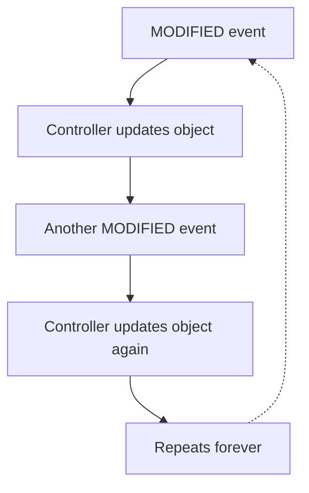

Controllers must therefore be written with idempotency in mind. A reconciliation
function should check the current state before making changes. If the object
already satisfies the desired condition, the controller should do nothing.

For example, instead of always setting:

```text
status = processing
```

on every modification, a safer controller would check:

```text
if status != processing:
    update status
else:
    no action required
```

This makes reconciliation stable even when events are duplicated, delayed, or
replayed.

The order controller provides the first complete example of the server becoming
an active participant in resource management. The API server is no longer just a
place where clients store and retrieve objects. It can now observe changes,
apply business rules, and continuously drive resources toward their desired
state.

**Listing 15.2 — `pkg/controllers/orders.go`**

```go
package controllers

import (
	"context"
	"encoding/json"
	"log"

	"github.com/pergus/api-server/pkg/api"
)
// OrderController watches order events and performs reconciliation.
//
// Business Logic:
// - When an order is ADDED: Calculate totals, set status to "processing"
// - When an order is MODIFIED: Log the change
// - When an order is DELETED: Log the deletion
//
// This demonstrates the reconciliation pattern:
// 1. Watch for events
// 2. React to state changes
// 3. Update state (which generates more events)
// 4. Other systems react to your updates
//
// In a real system, this might also:
// - Update inventory
// - Send notifications
// - Trigger payment processing
// - Update analytics
type OrderController struct {
	baseController
	registry api.Registry
}

// NewOrderController creates a new order controller.
// The registry is used to update orders during reconciliation.
func NewOrderController(eventBus api.EventBus, registry api.Registry) *OrderController {
	return &OrderController{
		baseController: baseController{
			name:     "OrderController",
			resource: "orders",
			eventBus: eventBus,
		},
		registry: registry,
	}
}

// Name returns the controller name.
func (oc *OrderController) Name() string {
	return oc.baseController.name
}

// Resource returns the resource this controller watches.
func (oc *OrderController) Resource() string {
	return oc.baseController.resource
}

// Reconcile handles an order event.
// Implements the business logic for order processing.
func (oc *OrderController) Reconcile(event api.Event) error {
	switch event.Type {
	case api.Added:
		return oc.reconcileAdded(event)
	case api.Modified:
		return oc.reconcileModified(event)
	case api.Deleted:
		return oc.reconcileDeleted(event)
	}
	return nil
}

// reconcileAdded handles newly created orders.
// Sets status to "processing" and calculates totals.
func (oc *OrderController) reconcileAdded(event api.Event) error {
	log.Printf("[%s] NEW ORDER - calculating totals and setting status", oc.Name())

	// Parse the order object
	orderData, err := json.Marshal(event.Object)
	if err != nil {
		return err
	}

	var order map[string]interface{}
	if err := json.Unmarshal(orderData, &order); err != nil {
		return err
	}

	// Extract order ID
	id := order["id"].(string)

	// Set status to processing
	order["status"] = "processing"

	// Calculate total if not already set
	// (In a real system, this might sum item prices)
	if _, hasTotal := order["total"]; !hasTotal {
		order["total"] = 0
	}

	log.Printf("[%s] Order %s: status=processing, total=$%.2f", oc.Name(), id, order["total"])

	// Update the order in storage
	// This will generate a MODIFIED event which other watchers will see
	resource, ok := oc.registry.Lookup("orders")
	if !ok {
		log.Printf("[%s] orders resource not found", oc.Name())
		return nil // Resource not registered yet (CRD deletion scenario)
	}

	if err := resource.Storage().Update(id, order); err != nil {
		log.Printf("[%s] error updating order %s: %v", oc.Name(), id, err)
		return nil // Continue processing other events
	}

	log.Printf("[%s] Order %s RECONCILED (status updated)", oc.Name(), id)
	return nil
}

// reconcileModified handles updated orders.
// Logs the modification for debugging.
func (oc *OrderController) reconcileModified(event api.Event) error {
	orderData, _ := json.Marshal(event.Object)
	var order map[string]interface{}
	json.Unmarshal(orderData, &order)

	log.Printf("[%s] Order %s MODIFIED (status=%s)", oc.Name(), order["id"], order["status"])
	return nil
}

// reconcileDeleted handles deleted orders.
// Logs the deletion for debugging.
func (oc *OrderController) reconcileDeleted(event api.Event) error {
	orderData, _ := json.Marshal(event.Object)
	var order map[string]interface{}
	json.Unmarshal(orderData, &order)

	log.Printf("[%s] Order %s DELETED", oc.Name(), order["id"])
	return nil
}

// Run starts the order controller.
// Blocks until context is cancelled.
// Calls reconcile for each event.
func (oc *OrderController) Run(ctx context.Context) error {
	return oc.baseController.runLoop(ctx, oc.Reconcile)
}
```


> **Idempotency caution:** The controller updates an object in response to an
> `ADDED` event, which creates a `MODIFIED` event that the same controller also
> receives. In this implementation, `reconcileModified` only logs the change, so
> the loop stops naturally. Controllers that modify objects during `MODIFIED`
> reconciliation must guard against unnecessary writes by checking whether the
> desired state has already been reached before updating.


### Wiring controllers into main()

With the controller implementation complete, the final step is connecting it to
the running API server. Controllers are long-lived background processes, so they
need to be created during server startup and given access to the same
infrastructure used by the rest of the system.

The controller manager acts as the lifecycle owner for controllers. Rather than
starting each controller independently in `main()`, the server registers
controllers with the manager and allows it to handle startup, event
subscriptions, and shutdown behavior. This keeps the entrypoint focused on
assembling the application rather than managing individual background workers.
The current implementation uses `controllers.New(server.EventBus())` and then
registers the order controller before launching the manager in a goroutine.

The controller manager requires access to the server's event bus because
controllers are event consumers. They do not poll resources looking for changes.
Instead, they subscribe to the event stream and react whenever storage publishes
an update.

The order controller also receives the resource registry. The registry allows it
to locate the `orders` resource and perform reconciliation updates. When the
controller changes an order through storage, the normal resource lifecycle
continues:

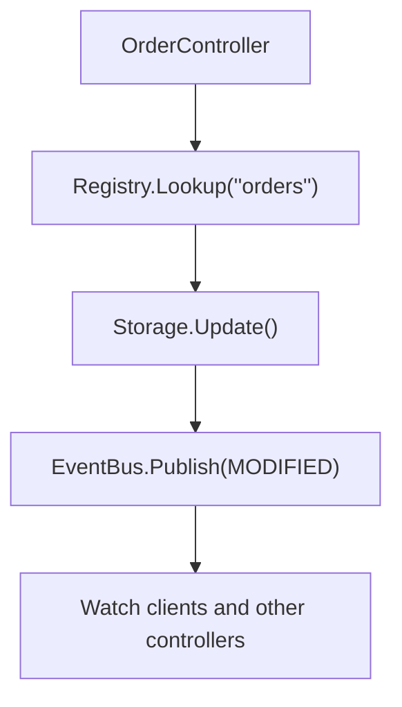

This preserves the framework's central design rule: all resource changes flow
through the same storage and event infrastructure. Controllers are not a
separate path around the API server; they are participants in the same
lifecycle.

The registration step also makes adding future controllers straightforward. A
future invoice controller, notification controller, or inventory controller can
be added by creating the controller implementation and registering it with the
manager. The server startup code does not need to know how those controllers
work.

Controllers run concurrently with the HTTP server. The manager is started inside
a goroutine so the API server can continue starting normally and accept requests
while controllers wait for events in the background.

Using a context for the controller manager also prepares the system for graceful
shutdown. A production implementation would replace the background context with
a server-owned context that is cancelled when the process receives a shutdown
signal. This allows controllers to finish in-flight reconciliation work before
exiting.

After this change, the server contains all of the major pieces of a
controller-driven architecture:

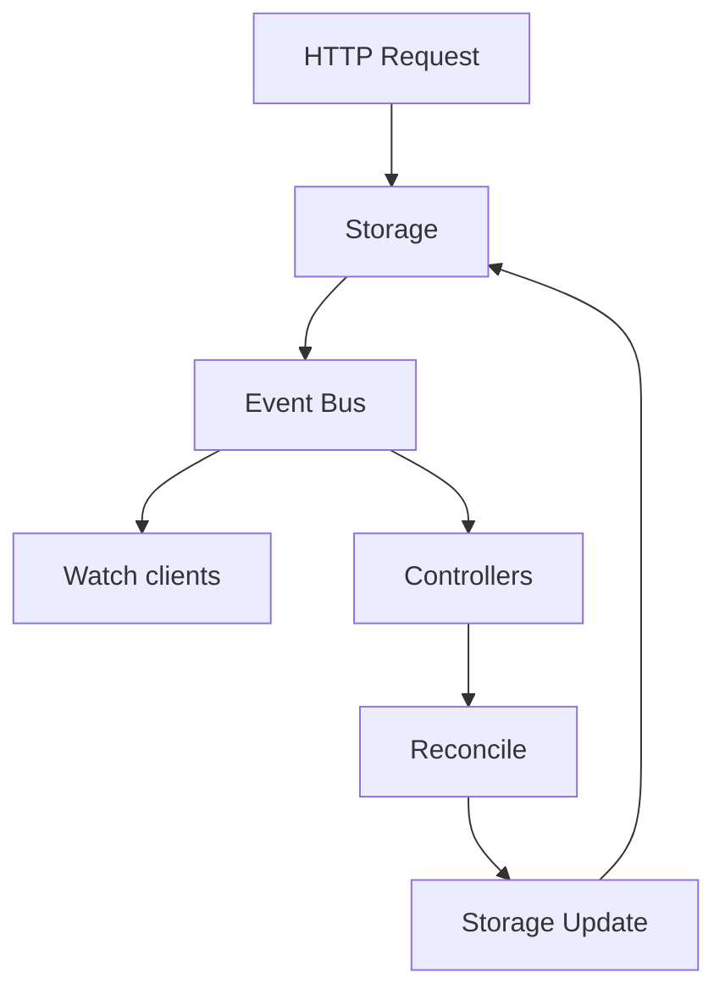

The API server can now do more than store and retrieve objects. It can observe
changes, execute automated reactions, and continuously maintain resource state. 

**Listing 15.3 — `cmd/api-server/main.go` (controller additions)**

```go
	// Initialize the controller manager and register controllers
	log.Println("Initializing controller manager...")
	manager := controllers.New(server.EventBus())
	
	// Register the order controller
	// It will watch for order events and perform reconciliation
	if err := manager.Register(controllers.NewOrderController(server.EventBus(), server.Registry())); err != nil {
		log.Printf("Warning: failed to register OrderController: %v", err)
	}
	
	// Start the controller manager in a goroutine
	// Controllers run concurrently and respond to events
	go func() {
		ctx := context.Background()
		if err := manager.Run(ctx); err != nil {
			log.Printf("Controller manager error: %v", err)
		}
	}()
```

Import:

```go
"github.com/pergus/api-server/pkg/controllers"
```

At startup, the server now initializes resources, loads plugins, starts
discovery, activates the event system, and launches controllers. The result is a
complete extensible API platform where new resource types, plugins, event
consumers, and automation logic can be added without changing the core
request-handling path.

### The reconciliation loop

The reconciliation loop demonstrates the complete flow of an event-driven
resource lifecycle. Instead of placing business logic inside the HTTP handler,
the API server only records the requested state change and publishes an event.
Controllers then observe those events and decide whether additional actions are
required.

**Figure 15.1 — The reconciliation loop**

```mermaid
sequenceDiagram
    participant U as apictl create
    participant API as Server
    participant EB as EventBus
    participant OC as OrderController
    participant W as apictl watch
    U->>API: POST /api/orders (status=draft)
    API->>EB: ADDED
    EB->>W: ADDED (status=draft)
    EB->>OC: ADDED
    OC->>API: Update (status=processing)
    API->>EB: MODIFIED
    EB->>W: MODIFIED (status=processing)
```

The sequence begins when a client creates an order using `apictl`. The initial
object contains the state requested by the user — in this example, an order with
a `draft` status. The API server accepts the request, stores the object, and
publishes an `ADDED` event through the event bus.

At this point, the event bus fans the event out to every interested subscriber.
A watch client receives the event immediately and displays the object exactly as
it was created. At the same time, the `OrderController` receives the same event
and begins its reconciliation process.

The controller does not modify the original request. Instead, it evaluates the
current state and applies the desired transition. For a newly created order, the
controller decides that the order should move from `draft` to `processing`. It
writes that updated state back through the normal resource storage layer.

Because the controller uses the same storage path as any other update, the
change is not invisible internal state. The storage layer publishes another
event, this time a `MODIFIED` event. The event bus again distributes that event
to all subscribers, including watch clients and any other controllers interested
in orders.

This creates a feedback loop:

1. A user creates or changes an object.
2. The API server stores the new state and publishes an event.
3. Controllers observe the event and compare the current state with the desired
   state.
4. Controllers make changes when reconciliation is required.
5. Those changes produce new events that continue the loop.

The important property of this design is separation of responsibilities. The API
server remains generic: it knows how to store resources and publish changes, but
it does not need to understand order processing rules. The controller owns the
business logic and can evolve independently. New behaviors can be added by
introducing new controllers rather than modifying the API layer.

This pattern is the foundation of many large-scale orchestration systems. The
system does not execute a fixed workflow after every request. Instead, it
continuously works toward the desired state by reacting to changes as they
occur.

### Checkpoint

The following test demonstrates the complete controller flow in practice:

```bash
# terminal 1
./api-server

# terminal 2
./apictl watch orders

# terminal 3
./apictl create -f examples/order-1.json
```

When the order is created, the watch client receives the first event immediately:

```text
EVENT: ADDED
{
  "id": "order-001",
  "status": "draft",
  ...
}
```

Shortly afterward, the same watch stream receives a second event:

```text
EVENT: MODIFIED
{
  "id": "order-001",
  "status": "processing",
  ...
}
```

The first event represents the user's requested state. The second event
represents the controller's reconciliation action. No additional API call was
required from the client, and no polling loop was involved. The controller
observed the change, performed its logic, and the resulting state transition
propagated automatically through the event system.

At this point the framework has all of the major building blocks of a dynamic
platform: discovery, runtime resources, plugins, events, watches, and
controllers. Resources can be added dynamically, clients can discover and
observe them, and server-side components can continuously react to changes. The
system has moved from a simple CRUD API into a reactive control plane.

---

# Part VI — Finishing Touches

## Chapter 16: Testing the System

### Goal

By this point, the framework has grown from a simple REST server into a small
platform with discovery, dynamic resources, plugins, events, watches, and
controllers. Each individual feature works through a clear abstraction boundary,
but that also means there are now many moving parts that must continue to
cooperate correctly.

The goal of this chapter is to lock in that behavior with automated tests and a
repeatable smoke test. The tests do more than verify individual functions: they
protect the contracts between the different layers of the system. A storage
change should not silently break event delivery. A router change should not
prevent discovery. A controller change should not introduce an endless
reconciliation loop.

The most valuable tests are placed at the natural seams between components.
Instead of testing implementation details, the test suite should verify the
behavior that other parts of the framework depend on.

### What to test

Each layer has a small set of responsibilities that should be covered
independently and, where appropriate, together.

**Storage**

The storage layer is the foundation for every resource. Tests should verify the
full resource lifecycle:

* Creating an object stores it and makes it retrievable.
* Getting an existing object returns the expected data.
* Updating an object replaces the stored state correctly.
* Deleting an object removes it permanently.
* Objects without IDs are rejected.
* Attempts to create duplicate IDs return errors rather than silently replacing
  existing data.

These tests ensure that all higher-level features, including events and
controllers, are built on predictable behavior.

**Registry and Scheme**

The registry and scheme provide the dynamic type system of the framework. They
should be tested independently because nearly every runtime extension depends on
them.

Important cases include:

* Registering a resource makes it discoverable.
* Registering the same resource twice fails.
* Lookup returns the correct resource implementation.
* Unregister removes the resource.
* Type factories return the expected object type.

These tests protect the mechanisms that allow built-in resources, CRDs, and
plugins to coexist.

**Router**

The HTTP layer should be tested using Go's `net/http/httptest` package. This
avoids starting a real server process while still exercising the complete
request path.

Router tests should cover:

* Creating resources through HTTP.
* Retrieving objects.
* Listing resources.
* Updating resources.
* Deleting resources.
* API discovery endpoints.
* Error responses for invalid requests.

Testing the router at this level verifies that HTTP requests are correctly
translated into registry lookups, storage operations, and API responses.

A representative CRUD test looks like this:

**Listing 16.1**

```go
func TestRouterCRUD(t *testing.T) {
	server := api.NewServer(api.Config{Port: 0})
	_ = server.RegisterResource(resources.NewUserResource())
	_ = server.RegisterType("users", func() any { return &resources.User{} })

	// Build the same handler chain the server uses.
	h := api.Chain(serverRouter(server), api.RecoveryMiddleware)

	rec := httptest.NewRecorder()
	body := strings.NewReader(`{"id":"alice","name":"Alice"}`)
	req := httptest.NewRequest("POST", "/api/users", body)
	h.ServeHTTP(rec, req)

	if rec.Code != http.StatusCreated {
		t.Fatalf("want 201, got %d", rec.Code)
	}
}
```

This test does not need to open a network port. Instead, `httptest` provides an
in-memory request and response environment that behaves like a real HTTP
exchange. The server receives the request, processes it through the normal
router path, and returns a response that the test can inspect.

One small adjustment may be required depending on the server structure. If the
router is currently private, expose a testing accessor from the server or
construct the router directly:

**Listing 16.2**

```go
router := api.NewRouter(server.Registry(), server.Scheme(), server.EventBus(), server.CRDRegistry())
router.Setup()
```

The important part is that tests should use the same routing and middleware path
as production. Otherwise, a test can pass while the actual server behavior is
broken.

**EventBus**

The event system should be tested around its concurrency guarantees. The most
important properties are:

* Publishing an event reaches subscribers.
* Multiple subscribers receive the same event.
* A closed subscription stops receiving events.
* Closing the bus shuts down subscriptions cleanly.
* A slow subscriber does not prevent other subscribers from receiving events.

These tests validate the decoupling that makes watches and controllers possible.

**CRD lifecycle**

Custom resources introduce behavior that does not exist for built-in resources,
so they require their own integration tests.

A complete CRD test should:

1. Register a CRD.
2. Confirm the resource appears in discovery.
3. Create an object using the new resource type.
4. Retrieve or list the object.
5. Delete the CRD.
6. Confirm that the resource is no longer available.

This verifies that runtime extension works from registration through removal.

**Controllers**

Controllers should be tested by publishing events directly rather than requiring
a full HTTP workflow for every case.

For example:

1. Create a controller with a test registry.
2. Publish an `ADDED` event.
3. Wait for reconciliation.
4. Confirm that the controller performed its update.
5. Confirm that the update generated the expected `MODIFIED` event.

This ensures that controllers correctly react to state changes and that their
actions flow through the same event pipeline as normal API operations.

### Why these tests matter

The architecture of the framework depends heavily on loose coupling. That is one
of its strengths, but it also means failures can appear far away from their
source. A small change in one package may affect discovery, events, or dynamic
resources without producing a compile-time error.

A good test suite becomes the executable description of the framework's
contracts. It documents what each layer promises and provides confidence when
new features are added.

The final goal is not simply higher code coverage. The goal is confidence that
the system behaves as a complete platform: resources can be stored, discovered,
extended, watched, and reconciled without breaking the pieces that already work.


### Run everything

```bash
go test ./...
go test -bench=. ./pkg/api   # if you added EventBus benchmarks
```

### Manual smoke test

```bash
go build -o api-server ./cmd/api-server
go build -o apictl ./cmd/apictl
./api-server &                       # or a separate terminal

./apictl api-resources
./apictl create -f examples/user-1.json
./apictl get users
./apictl apply -f examples/invoice-crd.yaml
./apictl create -f examples/invoice-1.json
./apictl get invoices
./apictl delete crd invoices.example.io
```

**Listing 16.3 — `examples/user-1.json`**

```json
{
  "kind": "User",
  "id": "alice",
  "name": "Alice Johnson",
  "email": "alice@example.com",
  "is_active": true
}
```

### Checkpoint

`go test ./...` is green and the manual flow behaves as described. You have a
tested, working system.

---

## Chapter 17: From Demo to Production

### What you built

Over the course of this project, the framework evolved from a small CRUD API
into a dynamic API platform. The important achievement is not any single
feature, but the way the pieces fit together.

The server now has a generic request path that does not need to be rewritten
every time a new resource appears. The router does not contain special cases for
users, orders, invoices, or future resources. Instead, it discovers what exists
through the registry and delegates operations through common interfaces. New
capabilities can be added at runtime without changing the core HTTP handling
code.

The foundation of this design is a clean separation between the major subsystems:

* The **registry** answers the question: "What resources exist?"
* The **scheme** answers the question: "How do I create objects of those types?"
* The **router** translates HTTP requests into generic API operations.
* The **storage layer** owns persistence behavior.
* The **event bus** distributes changes to interested consumers.
* The **controllers** react to changes and drive reconciliation.

Because these responsibilities are separated, each layer can evolve
independently. Storage can change without affecting the router. New resource
types can appear without modifying API handlers. Controllers can add business
behavior without coupling that logic to HTTP requests.

The framework also supports two different approaches for extending the API.

The first is declarative extension through **Custom Resource Definitions
(CRDs)**. A user can describe a new resource type at runtime by providing its
group, version, kind, plural name, and schema. The server can then expose that
resource through the same discovery and API mechanisms used by built-in
resources.

The second is compiled extension through **plugins**. Plugins allow developers
to package custom Go code that registers resources, types, and behavior directly
with the server. This approach is useful when a resource requires specialized
logic that cannot be expressed through a schema alone.

Together, these two extension mechanisms provide flexibility at different
levels: CRDs allow users to introduce new data models, while plugins allow
developers to add new capabilities.

The watch API and controller framework complete the event-driven architecture.
Clients no longer need to repeatedly poll for changes. They can subscribe to a
stream and receive updates as they happen. Controllers use the same event
mechanism to observe changes and reconcile resources toward a desired state.

Finally, the command-line client became discovery-driven rather than hardcoded.
Instead of knowing every possible resource in advance, `apictl` asks the server
what is available and adapts automatically. This means the client can work with
resources that did not exist when the client binary was compiled.

The result is a small but complete example of a modern control-plane
architecture: dynamic resources, discovery, extensibility, event propagation,
and reconciliation.

### What to harden next

The current implementation intentionally favors clarity over operational
complexity. An in-memory server is ideal for learning the architecture because
every component is easy to inspect and the feedback loop is immediate. However,
production systems require stronger guarantees around persistence, security,
reliability, and operations.

The next step is replacing the prototype pieces with production-grade
implementations while preserving the same interfaces.

**1. Persistent storage**

The current memory storage backend is intentionally simple. It stores objects
inside the process and loses all data when the server exits.

A production deployment would implement the `Storage` interface using a durable
backend such as Postgres, etcd, or another database system. The rest of the
framework does not need to know which backend is used because storage access
already happens through an abstraction boundary.

This is the value of the interface design: changing persistence should not
require rewriting controllers, routers, clients, or resources.

**2. Authentication and authorization**

A real API server must control who can access which resources.

Authentication verifies identity: who is making the request. Authorization
decides what that identity is allowed to do.

Production hardening typically adds middleware that checks:

* User or service identity.
* Allowed resources.
* Allowed operations.
* Namespace or tenant boundaries.
* Administrative privileges.

An audit system should record important actions such as resource creation,
modification, deletion, and access attempts. This provides visibility into what
changed, when it changed, and who initiated the action.

**3. Schema validation**

The current CRD system stores schema information but does not yet enforce it.

A production implementation should validate objects against their declared
schema before accepting writes. This prevents invalid objects from entering the
system and allows clients to receive useful validation errors immediately.

Validation can include:

* Required fields.
* Field types.
* String formats.
* Numeric ranges.
* Enumerated values.
* Nested object validation.

Schema validation turns CRDs from documentation into enforceable contracts.

**4. Event durability**

The current event bus is optimized for simplicity and low latency. Events exist
only while the process is running, and subscribers must keep up with the stream.

Production event systems often require stronger guarantees:

* Persistent event history.
* Replay after failure.
* At-least-once delivery.
* Consumer offsets.
* Retry handling.
* Backpressure policies.

A durable event layer could be built using systems such as Kafka or NATS. The
event bus abstraction makes this possible because the rest of the framework does
not need to know whether events are delivered through memory channels or a
distributed log.

Additional protections are also needed around queue growth. A production system
must define what happens when consumers are slower than producers: buffering,
dropping, blocking, retrying, or applying flow control.

**5. Observability**

A production platform needs to explain what it is doing.

The next step is adding metrics and traces throughout the system:

* Request latency.
* Resource operation counts.
* Event delivery rates.
* Controller reconciliation duration.
* Failed operations.
* Queue depth.
* Plugin loading status.

Distributed tracing can connect a user request with the events and controller
actions that follow it. This is especially valuable in event-driven systems
where a single API request may trigger many asynchronous operations.

**6. Plugin safety**

The plugin system demonstrates runtime extensibility, but Go plugins have an
important limitation: they execute inside the same process as the API server.

A faulty or malicious plugin can affect the entire server by:

* Crashing the process.
* Consuming excessive resources.
* Accessing internal memory.
* Blocking execution.

For trusted internal extensions, in-process plugins may be acceptable. For
untrusted or third-party extensions, a safer design is usually an out-of-process
model using subprocesses and RPC communication.

The tradeoff is additional complexity in exchange for stronger isolation.

**7. Versioning and conversion**

As APIs mature, resource definitions change. A field may be renamed, a structure
may be redesigned, or new versions may need to coexist with old clients.

A production API platform should support:

* Multiple versions within the same API group.
* Version-specific schemas.
* Conversion between versions.
* Deprecation policies.
* Compatibility guarantees.

This allows APIs to evolve without forcing every client and controller to
upgrade simultaneously.

### Checkpoint

The system you built is intentionally small, but it contains the same
architectural ideas found in much larger platforms.

You can start from an empty directory, build the server, explain the purpose of
each layer, and follow the complete lifecycle of a resource:

1. A resource is registered or discovered.
2. A client creates or modifies an object.
3. Storage persists the change.
4. The event bus publishes the transition.
5. Watch clients receive updates.
6. Controllers react and reconcile state.
7. New state changes flow through the same pipeline.

The important lesson is that production systems are rarely built by adding
features directly into a central handler. They are built by creating stable
interfaces and letting capabilities grow around them.

The framework now has a clear path forward. The in-memory implementation can
become persistent storage. The local event bus can become a distributed event
system. The simple plugin loader can become a secure extension framework. The
prototype has the architecture needed to grow into a production system.


# Appendices

## Appendix A: Complete File Map

Every file you wrote, and the chapter that introduced it.

| File | Chapter | Purpose |
| --- | --- | --- |
| `go.mod` | 2 | Module and the single YAML dependency |
| `pkg/api/resource.go` | 3 | `Resource` interface |
| `pkg/api/storage.go` | 3, 13 | `Storage` interface, `MemoryStorage`, event publishing |
| `pkg/api/registry.go` | 4 | Runtime resource registry |
| `pkg/api/scheme.go` | 4 | Type factory |
| `pkg/api/types.go` | 5 | JSON response envelopes |
| `pkg/api/router.go` | 5, 10, 11, 14 | Generic router, CRD/discovery/watch handlers |
| `pkg/api/middleware.go` | 6 | Logging, recovery, timing, CORS |
| `pkg/api/server.go` | 6 | Server lifecycle and wiring |
| `pkg/api/crd.go` | 10 | CRD registry |
| `pkg/api/dynamic.go` | 10 | Dynamic objects and dynamic resource |
| `pkg/api/event.go` | 13 | Event model and subscription |
| `pkg/api/eventbus.go` | 13 | Non-blocking pub/sub bus |
| `pkg/resources/users.go` | 7 | Built-in users resource |
| `pkg/resources/products.go` | 7 | Built-in products resource |
| `pkg/resources/orders.go` | 7 | Built-in orders resource |
| `pkg/plugins/interface.go` | 12 | `Plugin` interface |
| `pkg/plugins/loader.go` | 12 | Plugin loader and watcher |
| `pkg/controllers/controller.go` | 15 | `Controller` interface |
| `pkg/controllers/manager.go` | 15 | Controller manager + base controller |
| `pkg/controllers/orders.go` | 15 | Example order controller |
| `cmd/api-server/main.go` | 7, 11, 12, 15 | Server entrypoint |
| `cmd/apictl/main.go` | 8, 9, 14 | CLI dispatcher |
| `cmd/apictl/client.go` | 8, 14 | HTTP + SSE client library |
| `cmd/apictl/commands.go` | 9, 14 | CLI command implementations |
| `plugins/invoices/main.go` | 12 | Example plugin |
| `plugins/build.sh` | 12 | Plugin build script |
| `examples/*.json`, `*.yaml` | 10, 14, 16 | Sample payloads |

## Appendix B: The Full Demo Script

A single script that exercises everything. Save as `demo.sh`.

```bash
#!/bin/bash
set -e

echo "==> Building"
go build -o api-server ./cmd/api-server
go build -o apictl ./cmd/apictl

echo "==> Starting server"
./api-server &
SERVER_PID=$!
sleep 1

echo "==> Built-in resources"
./apictl api-resources

echo "==> Create a user"
cat > /tmp/user.json <<'EOF'
{"kind":"User","id":"alice","name":"Alice Johnson","email":"alice@example.com","is_active":true}
EOF
./apictl create -f /tmp/user.json
./apictl get users

echo "==> Define a CRD and use it"
./apictl apply -f examples/invoice-crd.yaml
./apictl api-resources
./apictl create -f examples/invoice-1.json
./apictl get invoices

echo "==> Watch + controller demo (5 seconds)"
./apictl watch orders &
WATCH_PID=$!
sleep 1
./apictl create -f examples/order-1.json
sleep 3
kill $WATCH_PID 2>/dev/null || true

echo "==> Cleanup"
./apictl delete crd invoices.example.io
kill $SERVER_PID 2>/dev/null || true
echo "Done."
```

```bash
chmod +x demo.sh
./demo.sh
```

You should see: built-in resources, a created user, `invoices` appearing after the
CRD, an invoice stored and listed, and an order that is `ADDED` then automatically
`MODIFIED` to `processing` by the controller — all without ever restarting the
server.

---

*You have now designed and implemented a runtime-extensible API platform and its
client, from an empty directory to a working, event-driven system — with a running
program at the end of every chapter.*
